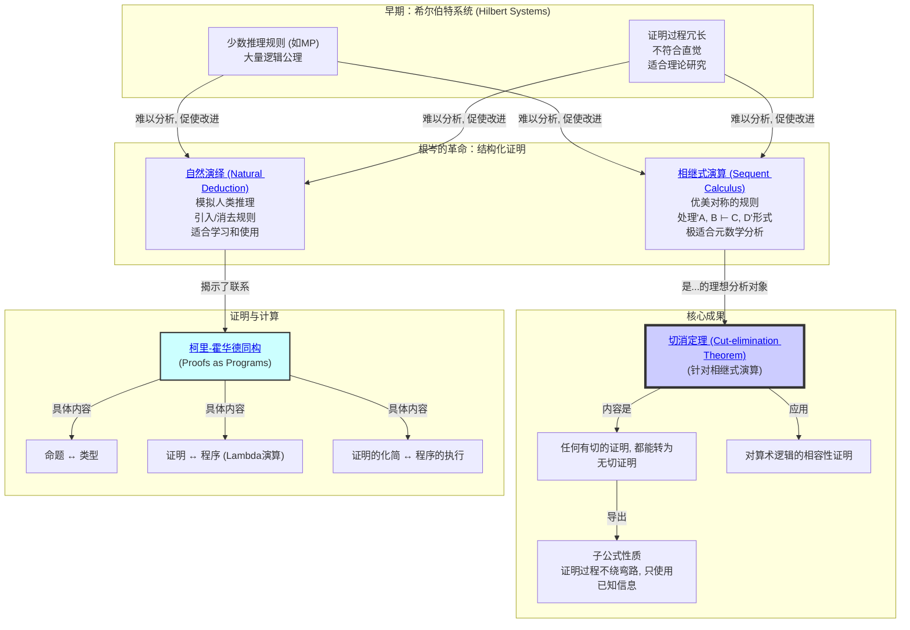

# 1. 证明论总览

## 本地目录

- [1. 证明论总览](#1-证明论总览)
  - [本地目录](#本地目录)
  - [1.1. 引言：作为数学对象的"证明"](#11-引言作为数学对象的证明)
  - [1.1.1. 知识点国际标准定义补全](#111-知识点国际标准定义补全)
    - [证明论（Proof Theory）](#证明论proof-theory)
    - [证明系统/演算（Proof Calculus / Formal System）](#证明系统演算proof-calculus--formal-system)
    - [可证性（Provability）](#可证性provability)
    - [一致性（Consistency）](#一致性consistency)
    - [归约（Reduction）](#归约reduction)
  - [1.2. 知识地图 (Mermaid)](#12-知识地图-mermaid)
  - [1.3. 探索路径](#13-探索路径)
  - [1.4. 本地知识图谱](#14-本地知识图谱)
  - [哲学批判与反思](#哲学批判与反思)
  - [引文与参考（严格体例）](#引文与参考严格体例)

**版本**: 1.0
**日期**: 2025-07-02

---

## 1.1. 引言：作为数学对象的"证明"

**证明论 (Proof Theory)** 是数理逻辑的核心分支之一，它将 **"证明"** 本身视为一个形式化的、可被精确分析的数学对象（或称组合对象，syntactic object）。

与模型论研究"真理 (Truth)"不同，证明论研究的是 **"可证性 (Provability)"**。它不关心一个命题在某个模型中是否为真，而是关心我们能否在一个给定的形式系统（公理+推理规则）中，通过有限的、机械的步骤，构造出一个关于该命题的证明。

本模块的核心目标是探索不同的 **证明演算 (Proof Calculus)** 系统，并理解它们各自的优缺点。最终，我们将触及证明论最深刻、最核心的结果——根岑 (Gentzen) 的 **切消定理**，它揭示了"分析性证明"的本质，并对逻辑的相容性（无矛盾性）提供了构造性的理解。

## 1.1.1. 知识点国际标准定义补全

### 证明论（Proof Theory）

- **英文名**：Proof Theory
- **国际标准表述**：The branch of mathematical logic that treats proofs as formal mathematical objects, facilitating their analysis by mathematical techniques.
- **符号**：无专用符号
- **简明解释**：将证明本身作为对象进行形式化和分析的逻辑分支。
- **典型应用**：逻辑基础、自动定理证明、可构造性分析。
- **相关定理引用**：切消定理、一致性证明。

### 证明系统/演算（Proof Calculus / Formal System）

- **英文名**：Proof Calculus / Formal System
- **国际标准表述**：A set of axioms and inference rules for deriving theorems from premises in a formal language.
- **符号**：如$\langle \text{Axioms}, \text{Rules} \rangle$
- **简明解释**：由公理和推理规则组成的形式推理体系。
- **典型应用**：希尔伯特系统、自然演绎、序列演算。
- **相关定理引用**：可证性、归约。

### 可证性（Provability）

- **英文名**：Provability
- **国际标准表述**：A statement is provable in a formal system if there exists a finite sequence of applications of inference rules and axioms leading to it.
- **符号**：$\vdash \varphi$
- **简明解释**：能在形式系统中有限步推出的命题。
- **典型应用**：定理证明、自动推理。
- **相关定理引用**：一致性、归约。

### 一致性（Consistency）

- **英文名**：Consistency
- **国际标准表述**：A formal system is consistent if it does not derive both a statement and its negation.
- **符号**：$\nexists \varphi: \vdash \varphi \wedge \vdash \neg \varphi$
- **简明解释**：系统中不存在可同时证明的命题及其否定。
- **典型应用**：基础数学、系统安全性。
- **相关定理引用**：切消定理、不完备性定理。

### 归约（Reduction）

- **英文名**：Reduction
- **国际标准表述**：A process of transforming proofs or formulas into simpler or more canonical forms, often to analyze or compare proofs.
- **符号**：如$\to$、$\Rightarrow$等归约箭头
- **简明解释**：将证明或公式化简为更简单或标准形式的过程。
- **典型应用**：归约证明、归约范式、切消过程。
- **相关定理引用**：切消定理、归约范式。

## 1.2. 知识地图 (Mermaid)



## 1.3. 探索路径

1. **[01-三大证明演算系统.md](./01-三大证明演算系统.md)**: 我们将对比学习三种主流的证明演算系统。
    - **希尔伯特系统**: 最早期的公理化风格，公理多、规则少，证明冗长但理论上简洁。
    - **自然演绎**: 我们在数理逻辑模块中学习过的系统，规则直观，适合"写"证明。
    - **相继式演算**: 根岑的杰作，规则高度对称，将证明的"假设"和"结论"同等对待，最适合"分析"证明。
2. **[02-切消定理与一致性.md](./02-切消定理与一致性.md)**: 这是证明论的中心定理。
    我们将深入理解 **切 (Cut) 规则** 的本质——它相当于在证明中使用了未经证明的引理 (Lemma)。
    **切消定理** 表明，任何使用了"切"的证明，都可以被机械地转化为一个等价的、但 **没有"切"** 的证明。
    这种"无切证明"具有 **子公式性质**，意味着证明过程是完全分析性的，没有引入任何外来概念。
    这个强大的性质使得根岑能够为皮亚诺算术的一个子系统提供一个构造性的 **一致性（无矛盾性）证明**。
3. **[03-柯里-霍华德同构.md](./03-柯里-霍华德同构.md)**: 探索证明论与计算机科学之间惊人的深刻联系。
    这个同构揭示了：
    - 一个逻辑命题，可以被看作一个 **数据类型**。
    - 该命题的一个证明，可以被看作一个以该类型为返回值的 **程序**。
    - 证明的"化简"过程（如切消），完全对应于程序的 **执行/求值** 过程。
    这个发现是现代函数式编程语言（如Haskell, Coq）和类型论的理论基石。

## 1.3.1. 最小学习路径

### 快速入门路径（2-3小时）

1. **基础概念** (30分钟)
   - 理解"证明"作为数学对象的概念
   - 区分"可证性"与"真理性"
   - 掌握三种演算系统的基本思想

2. **核心定理** (1小时)
   - 切消定理的直观理解
   - 子公式性质的重要性
   - 一致性的构造性证明

3. **应用联系** (30分钟)
   - 柯里-霍华德同构的基本思想
   - 证明与程序的关系

### 深入学习路径（1-2周）

1. **第一周：系统对比**
   - 深入理解三种演算系统的优缺点
   - 掌握各自的推理规则
   - 练习在不同系统中构造证明

2. **第二周：切消定理**
   - 理解切消定理的证明思路
   - 掌握归约算法
   - 应用子公式性质

## 1.3.2. 规则速查表

### 自然演绎核心规则

| 联结词 | 引入规则 | 消去规则 |
|--------|----------|----------|
| $\land$ | $\frac{A \quad B}{A \land B}$ | $\frac{A \land B}{A}$ $\frac{A \land B}{B}$ |
| $\lor$ | $\frac{A}{A \lor B}$ $\frac{B}{A \lor B}$ | $\frac{A \lor B \quad [A] \vdash C \quad [B] \vdash C}{C}$ |
| $\to$ | $\frac{[A] \vdash B}{A \to B}$ | $\frac{A \to B \quad A}{B}$ |
| $\neg$ | $\frac{[A] \vdash \bot}{\neg A}$ | $\frac{\neg A \quad A}{\bot}$ |

### 相继式演算核心规则

| 联结词 | 左侧规则 (L) | 右侧规则 (R) |
|--------|--------------|--------------|
| $\land$ | $\frac{\Gamma, A, B \vdash \Delta}{\Gamma, A \land B \vdash \Delta}$ | $\frac{\Gamma \vdash A, \Delta \quad \Gamma \vdash B, \Delta}{\Gamma \vdash A \land B, \Delta}$ |
| $\lor$ | $\frac{\Gamma, A \vdash \Delta \quad \Gamma, B \vdash \Delta}{\Gamma, A \lor B \vdash \Delta}$ | $\frac{\Gamma \vdash A, B, \Delta}{\Gamma \vdash A \lor B, \Delta}$ |
| $\to$ | $\frac{\Gamma \vdash A, \Delta \quad \Gamma, B \vdash \Delta}{\Gamma, A \to B \vdash \Delta}$ | $\frac{\Gamma, A \vdash B, \Delta}{\Gamma \vdash A \to B, \Delta}$ |

### 切消规则

```text
Γ ⊢ A    Δ,A ⊢ B
──────────────── (Cut)
   Γ,Δ ⊢ B
```

### 关键性质对比

| 性质 | 希尔伯特系统 | 自然演绎 | 相继式演算 |
|------|-------------|----------|------------|
| 公理数量 | 多 | 少 | 少 |
| 规则数量 | 少 | 多 | 多 |
| 证明直观性 | 低 | 高 | 中等 |
| 分析便利性 | 低 | 中等 | 高 |
| 切消定理 | 不适用 | 适用 | 适用 |

## 1.4. 本地知识图谱

- [01-三大证明演算系统.md](./01-三大证明演算系统.md)
- [02-切消定理与一致性.md](./02-切消定理与一致性.md)
- [03-柯里-霍华德同构.md](./03-柯里-霍华德同构.md)
- [../00-数学基础与逻辑总览.md](../00-数学基础与逻辑总览.md)
- [../../01-数学哲学-元数学与形式化/00-数学哲学与元数学总览.md](../../01-数学哲学-元数学与形式化/00-数学哲学与元数学总览.md)
- [../../09-项目总览/00-项目总览.md](../../09-项目总览/00-项目总览.md)

---

## 哲学批判与反思

- **历史人物与思想年表**：

  | 年代 | 人物 | 主要思想/事件 | 影响 |
  |------|------|---------------|------|
  | 1920s | 希尔伯特 | 形式化证明体系 | 证明论奠基 |
  | 1930s | 根岑 | 相继式演算、切消定理 | 证明结构分析革命 |
  | 20世纪 | 柯里、霍华德 | 证明-程序同构 | 逻辑与计算深度融合 |

- **主要争议事件与哲学分歧**：
  - 证明的“形式性”与“内容性”之争。
  - 证明论能否穷尽数学创造与发现？
  - 证明的“可验证性”与“可理解性”张力。
  - 证明与计算、认知、语言的关系。

- **哲学认知与哲科批判性分析**：
  - 证明论揭示了“可证性”与“真理”的分离，挑战了传统知识观。
  - 证明的“机械化”推动了自动证明、AI等领域，但也引发了对“理解”的哲学追问。
  - 证明的社会性、协作性、教育性等维度，提示我们超越纯形式视角。
  - 哲学批判性要求我们反思：证明的“唯一性”是否只是规范选择？多元证明观是否更贴合认知实际？

- **认知科学视角**：
  - 证明能力的发展与人类认知结构、教育经验密切相关。
  - 认知科学发现，数学证明常常依赖图像、直觉、类比等多模态思维，而非纯符号推理。
  - 证明的“可理解性”与“可传授性”是认知与社会互动的产物。
  - AI与认知科学的结合，正在推动“可解释证明”“人机协作证明”等新范式。

[历史版本变迁说明与归档索引见主线末尾归档区块]

[返回上一级: 02-数学基础与逻辑总览](../00-数学基础与逻辑总览.md) | [返回项目总览](../../09-项目总览/00-项目总览.md)

---

## 引文与参考（严格体例）

- Hilbert, D., & Ackermann, W. (1928). Grundzüge der theoretischen Logik. Springer.（现代数理逻辑纲要）
- Gentzen, G. (1934–1935). Untersuchungen über das logische Schließen I–II. Mathematische Zeitschrift, 39, 176–210; 40, 295–341.（切消定理，I:pp.176–210; II:pp.295–341）
- Gentzen, G. (1936). Die Widerspruchsfreiheit der reinen Zahlentheorie. Mathematische Annalen, 112, 493–565.（算术一致性证明）
- Kleene, S. C. (1952). Introduction to Metamathematics. North-Holland.（元数学经典）
- Troelstra, A. S., Schwichtenberg, H. (2000). Basic Proof Theory (2nd ed.). Cambridge.（现代证明论教材）

> 相关专题：`../04-模型论/`（完备/紧致对偶视角）、`../05-递归论/`（可计算性与证明的边界）。
