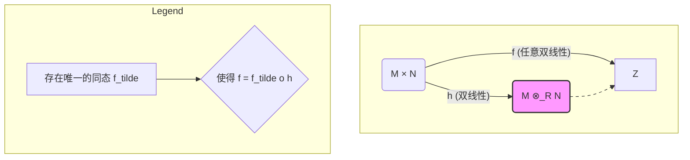

# 04-张量积 (Tensor Product)

## 1. 核心思想: 将双线性转化为线性

**问题背景**: 在线性代数中，我们处理的是线性映射。
但在很多情况下，我们会遇到"双线性"或"多重线性"的映射。
例如，内积就是一个双线性映射。
我们希望有一种系统性的方法，能将对**双线性映射**的研究，转化为对我们更熟悉的**线性映射**的研究。

**解决方案**: 张量积 $M \otimes_R N$ 是一个 R-模，它作为"双线性映射的中转站"。任何从 $M \times N$ 出发的双线性映射，都可以唯一地"分解"成一个通过 $M \otimes_R N$ 的线性映射。

## 2. 定义

### 2.1. 双线性映射 (Bilinear Map)

设 $M, N, P$ 都是 R-模。一个映射 $f: M \times N \to P$ 被称为是 **R-双线性映射**，如果它满足：

1. **第一变量线性**: $f(m_1+m_2, n) = f(m_1, n) + f(m_2, n)$ 和 $f(rm, n) = rf(m, n)$
2. **第二变量线性**: $f(m, n_1+n_2) = f(m, n_1) + f(m, n_2)$ 和 $f(m, rn) = rf(m, n)$

### 2.2. 张量积的普适性质 (Universal Property)

设 $M, N$ 是两个 R-模。它们的**张量积**是一个 R-模 $M \otimes_R N$，以及一个双线性映射 $\otimes: M \times N \to M \otimes_R N$，记作 $(m,n) \mapsto m \otimes n$，它们满足如下的**普适性质**：

> 对于任何 R-模 $P$ 和任何双线性映射 $f: M \times N \to P$，都存在一个**唯一**的 R-模同态（线性映射）$\tilde{f}: M \otimes_R N \to P$，使得 $f = \tilde{f} \circ \otimes$。

```mermaid
graph TD
    subgraph "双线性世界"
        MN["M × N"] -- "f (任意双线性映射)" --> P
    end
    
    subgraph "线性世界"
        MN -- "⊗ (典范双线性映射)" --> T["M ⊗_R N"]
        T -.->| "∃! f_tilde (唯一线性映射)" | P
    end

    classDef set fill:#DAE8FC,stroke:#6C8EBF,stroke-width:2px;
    class MN, P, T set;
```

- **关键**: 普适性质是张量积的本质定义。它保证了 $M \otimes_R N$ 是处理来自 $M \times N$ 的双线性映射的"最普适"或"最有效"的工具。

### 2.3. 元素的性质

- 形如 $m \otimes n$ 的元素被称为**纯张量 (Pure Tensor)**。
- 张量积 $M \otimes_R N$ 中的一般元素是纯张量的**有限和**，形如 $\sum_{i=1}^k (m_i \otimes n_i)$。
- **注意**: 不是所有元素都是纯张量！
- **运算规则** (由双线性直接导出):
  - $(m_1+m_2) \otimes n = m_1 \otimes n + m_2 \otimes n$
  - $m \otimes (n_1+n_2) = m \otimes n_1 + m \otimes n_2$
  - $(rm) \otimes n = m \otimes (rn) = r(m \otimes n)$

## 3. 重要示例与性质

### 3.1. 向量空间的张量积

- 如果 $V, W$ 是域 $F$ 上的向量空间，基分别为 $\{v_i\}_{i \in I}$ 和 $\{w_j\}_{j \in J}$。
- 则 $V \otimes_F W$ 是一个向量空间，其基为 $\{v_i \otimes w_j\}_{(i,j) \in I \times J}$。
- **维数**: $\dim(V \otimes_F W) = \dim(V) \cdot \dim(W)$。

### 3.2. 环的扩张

- **系数扩张 (Extension of Scalars)**: 设 $M$ 是一个 R-模，并且 $R$ 是环 $S$ 的子环。那么 $S \otimes_R M$ 就成了一个 S-模。这个过程可以将一个 R-模"提升"为一个 S-模，在代数几何和代数数论中非常重要。

### 3.3. 具体计算

- $\mathbb{Z}_m \otimes_{\mathbb{Z}} \mathbb{Z}_n \cong \mathbb{Z}_{\text{gcd}(m,n)}$
  - 例如, $\mathbb{Z}_2 \otimes_{\mathbb{Z}} \mathbb{Z}_3 \cong \mathbb{Z}_1 = \{0\}$。
  - 这是因为在 $\mathbb{Z}_2 \otimes \mathbb{Z}_3$ 中，对任意 $a \otimes b$，$a \otimes b = a \otimes (1 \cdot b) = (a \cdot 1) \otimes b$。同时 $3(a \otimes b) = a \otimes 3b = a \otimes 0 = 0$，$2(a \otimes b) = 2a \otimes b = 0 \otimes b = 0$。因此 $a \otimes b = (3-2)(a \otimes b) = 0$。
- $\mathbb{Q} \otimes_{\mathbb{Z}} \mathbb{Z}_n = \{0\}$
- 对于 R-模 M, $R \otimes_R M \cong M$

## 4. 内部链接

- [[03-自由模、射影模与内射模]]
- [[05-主理想整环上的有限生成模结构定理]]

## 模的张量积

张量积 (Tensor Product) 是多重线性代数中的核心概念，也是从已有的模构造新模的一种基本方法。它将多个模中的元素以一种特定的"多重线性"方式结合起来，其结果是一个新的模。张量积在代数、几何和物理的许多领域都有着深刻的应用。

### 1. 张量积的构造与普适性质

直接通过元素来定义张量积是相当繁琐的。更现代、更强大的方法是通过其**普适性质 (Universal Property)** 来定义它。这个性质唯一地（在同构意义下）确定了张量积。

---
**定义 4.1 (双线性映射)**:

设 $M$ (右R-模), $N$ (左R-模) 和 $A$ (阿贝尔群) 都是 R-模。一个映射 $f: M \times N \to A$ 被称为是 **R-双线性映射 (R-bilinear map)**，如果它满足：

1. 对第一个变量是 R-线性的:
    - $f(m_1 + m_2, n) = f(m_1, n) + f(m_2, n)$
    - $f(mr, n) = f(m, rn)$
2. 对第二个变量是 R-线性的:
    - $f(m, n_1 + n_2) = f(m, n_1) + f(m, n_2)$

---
**定义 4.2 (张量积的普适性质)**:

给定一个右 R-模 $M$ 和一个左 R-模 $N$，它们的**张量积**是一个阿贝尔群 $M \otimes_R N$ 和一个 R-双线性映射 $h: M \times N \to M \otimes_R N$，它们满足以下的普适性质：

对于**任何**阿贝尔群 $A$ 和**任何** R-双线性映射 $f: M \times N \to A$，都**存在唯一**一个群同态 $\tilde{f}: M \otimes_R N \to A$，使得 $f = \tilde{f} \circ h$。



这个性质的本质是说，任何双线性映射都可以"分解"并通过张量积 $M \otimes_R N$ 这个"中转站"来实现。$M \otimes_R N$ 是处理来自 $M \times N$ 的双线性问题的最普适、最通用的工具。

#### 1.1. 元素构造

虽然普适性质是定义，但理解其元素构造也很有帮助。

1. 首先构造一个以符号 $m \otimes n$ ($m \in M, n \in N$) 为基的巨大自由阿贝尔群 $F$。
2. 然后，我们对这个群模去一个子群 $S$，这个子群 $S$是由所有形如以下关系的元素生成的：
    - $(m_1+m_2) \otimes n - (m_1 \otimes n) - (m_2 \otimes n)$
    - $m \otimes (n_1+n_2) - (m \otimes n_1) - (m \otimes n_2)$
    - $(mr) \otimes n - m \otimes (rn)$
3. 最终的张量积定义为商群 $M \otimes_R N := F/S$。

$m \otimes n$ 这样的元素被称为**纯张量 (pure tensor)**。张量积中的一般元素是纯张量的**有限和**，例如 $m_1 \otimes n_1 + m_2 \otimes n_2$。

**重要警示**: 并非所有张量积中的元素都是纯张量！

### 2. 张量积的性质

- **幺元**: $M \otimes_R R \cong M$ (对于左R-模M) and $R \otimes_R N \cong N$ (对于右R-模N)。
- **交换性**: $M \otimes_R N$ 不一定同构于 $N \otimes_R M$。
- **结合性**: $(M \otimes_R N) \otimes_S P \cong M \otimes_R (N \otimes_S P)$ (在合适的双模结构下)。
- **分配性**: $M \otimes_R (\bigoplus_i N_i) \cong \bigoplus_i (M \otimes_R N_i)$。张量积与任意直和可交换。

### 3. 标量扩张 (Extension of Scalars)

张量积的一个重要应用是**标量扩张**。如果 $f: R \to S$ 是一个环同态，那么任何 R-模 $M$ 都可以通过张量积"提升"为一个 S-模。

具体来说，$S$ 可以看作一个右 R-模 (通过 $s \cdot r = sf(r)$)。那么，张量积 $S \otimes_R M$ 就自然地成为了一个左 S-模，其标量乘法定义为 $s' \cdot (s \otimes m) = (s's) \otimes m$。

这个过程允许我们将一个较小环上的理论问题，转化到另一个可能性质更好的更大环上进行研究。例如，将实向量空间 $V$ 通过 $\mathbb{C} \otimes_\mathbb{R} V$ 转化为复向量空间，这个过程称为**复化**。

## 4. 张量积与平坦模

张量积运算并不总是保持单同态。一个 R-模 $F$ 被称为**平坦模**，正是当 `_ ⊗_R F` 这个函子是**正合函子**时，即它将短正合序列映为短正合序列。这等价于它保持单同态。

所有投射模（因此所有自由模）都是平坦模。
