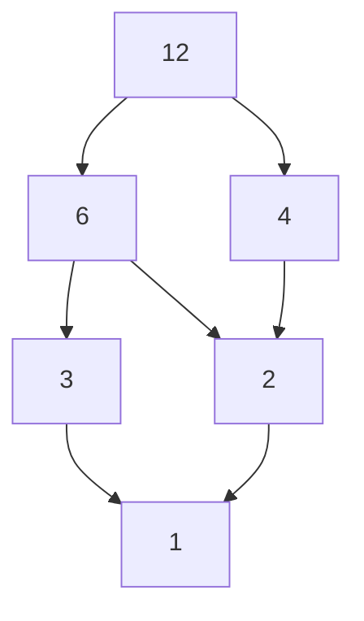

# 1. 格的基本概念

**版本**: 1.0
**日期**: 2025-07-02

---

## 1.1. 偏序集 (Partially Ordered Set, Poset)

格论的研究始于序关系，最基本的序结构是偏序集。

**定义 1.1.1 (偏序关系)**:

一个集合 $P$ 上的 **偏序关系** 是一个二元关系 $\le$，它满足以下三个公理：

1. **自反性 (Reflexivity)**: $\forall a \in P, a \le a$
2. **反对称性 (Antisymmetry)**: $\forall a, b \in P$, 如果 $a \le b$ 且 $b \le a$，则 $a=b$
3. **传递性 (Transitivity)**: $\forall a, b, c \in P$, 如果 $a \le b$ 且 $b \le c$，则 $a \le c$

一个配备了偏序关系的集合 $(P, \le)$ 称为 **偏序集**。

* **"偏序"的含义**: 关系是"偏"的，因为不要求集合中任意两个元素都是可比较的。例如，在"整除"关系下，2和3就无法比较大小。如果任意两个元素都可比，则称其为 **全序集 (Totally Ordered Set)**。

**定义 1.1.2 (哈斯图 Hasse Diagram)**
哈斯图是可视化 **有限** 偏序集的简洁方法。它省略了由自反性和传递性所蕴含的冗余关系，只画出直接的"覆盖"关系，并约定上方的元素大于下方的元素。

**示例**: 集合 $\{1,2,3,4,6,12\}$ 在"整除"关系下的哈斯图。

## 1.2. 偏序集中的基本概念

在一个偏序集 $(P, \le)$ 中，对于一个子集 $S \subseteq P$:

* **上界 (Upper Bound)**: $u \in P$ 是 $S$ 的一个上界，如果 $\forall s \in S, s \le u$。
* **下界 (Lower Bound)**: $l \in P$ 是 $S$ 的一个下界，如果 $\forall s \in S, l \le s$。
* **最小上界 (Supremum / Join)**: 如果 $S$ 的所有上界中存在一个最小的元素，则称其为 $S$ 的最小上界，记为 $\sup(S)$ 或 $\bigvee S$。
* **最大下界 (Infimum / Meet)**: 如果 $S$ 的所有下界中存在一个最大的元素，则称其为 $S$ 的最大下界，记为 $\inf(S)$ 或 $\bigwedge S$。

* **最大元 (Maximum)**: 如果 $m \in S$ 且是 $S$ 的上界，则称 $m$ 是 $S$ 的最大元。
* **最小元 (Minimum)**: 如果 $m \in S$ 且是 $S$ 的下界，则称 $m$ 是 $S$ 的最小元。
* **极大元 (Maximal)**: 如果 $m \in S$ 且不存在 $s \in S$ 使得 $m < s$，则称 $m$ 是 $S$ 的极大元。
* **极小元 (Minimal)**: 如果 $m \in S$ 且不存在 $s \in S$ 使得 $s < m$，则称 $m$ 是 $S$ 的极小元。

> **注意**: 最大/小元是唯一的，而极大/小元可能不唯一。

## 1.3. 格 (Lattice) 的定义

**定义 1.3.1 (格的序理论定义)**:

一个 **格 (Lattice)** 是一个非空偏序集 $(L, \le)$，其中 **任意两个元素** 组成的子集 $\{a, b\}$ 都存在唯一的最小上界和最大下界。

* $a$ 和 $b$ 的最小上界称为它们的 **并 (join)**，记作 $a \vee b$。
* $a$ 和 $b$ 的最大下界称为它们的 **交 (meet)**，记作 $a \wedge b$。

**定义 1.3.2 (格的代数定义)**:

一个 **格** 是一个非空集合 $L$，配备了两个二元运算 $\vee$ (并) 和 $\wedge$ (交)，它们满足对于所有 $a, b, c \in L$:

1. **交换律**: $a \vee b = b \vee a$,  $a \wedge b = b \wedge a$
2. **结合律**: $a \vee (b \vee c) = (a \vee b) \vee c$,  $a \wedge (b \wedge c) = (a \wedge b) \wedge c$
3. **吸收律**: $a \vee (a \wedge b) = a$,  $a \wedge (a \vee b) = a$

这两个定义是等价的。可以从序关系定义出交和并运算，也可以从交和并运算定义出序关系 ($a \le b \iff a \vee b = b \iff a \wedge b = a$)。

## 1.4. 格的示例

1. **幂集格**: 给定一个集合 $S$，其幂集 $\mathcal{P}(S)$ 在集合的包含关系 $\subseteq$ 下构成一个格。任意两个子集 $A, B$ 的交是 $A \cap B$，并是 $A \cup B$。
2. **整除格**: 正整数集合 $\mathbb{Z}^+$ 在整除关系 `|` 下构成一个格。任意两个数 $a,b$ 的交是它们的最大公约数 $\text{gcd}(a,b)$，并是它们的最小公倍数 $\text{lcm}(a,b)$。
3. **全序集**: 任何一个全序集（如 $(\mathbb{R}, \le)$）都是一个格。任意两个数 $a,b$ 的交是 $\min(a,b)$，并是 $\max(a,b)$。

---
[前往下一节: 02-分配格与模格.md](./02-分配格与模格.md) | [返回总览](./00-格论总览.md)
