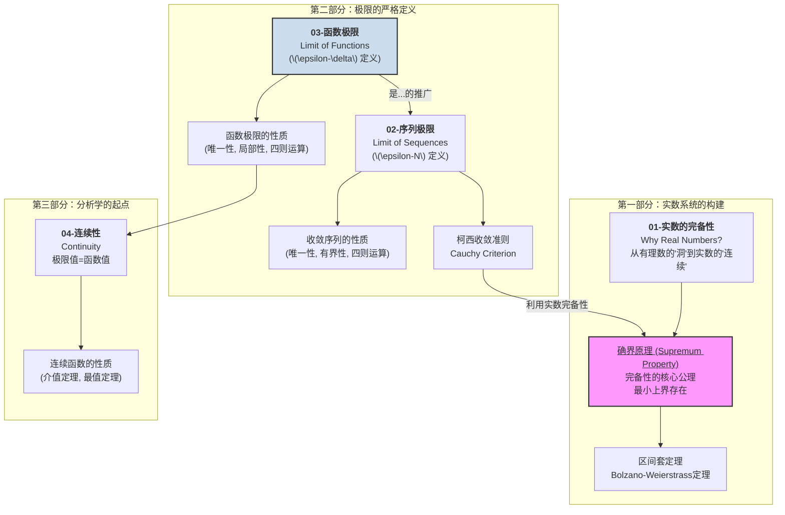

# 00-模块总览：实数与极限

## 1. 模块导言：为微积分寻找坚实的逻辑基石

微积分的宏伟大厦，无论是微分的瞬时变化率还是积分的无穷小求和，都建立在一个核心概念之上：**极限 (Limit)**。然而，极限概念本身依赖于我们对"数"的深刻理解，特别是**实数 (Real Numbers)** 的性质。

有理数 \(\mathbb{Q}\) 是不"完备"的，它充满了"漏洞"，例如 \(\sqrt{2}\) 的位置。为了让极限运算能够可靠地进行，我们需要一个没有"缝隙"的、连续的数轴。这就是实数系统 \(\mathbb{R}\) 的重要性。

本模块是整个分析学的逻辑起点。我们将：

1. **构造实数**：理解实数系统为何是连续的、没有"漏洞"的，其核心在于**完备性公理 (Completeness Axiom)**。
2. **定义极限**：使用严格的" \(\epsilon-\delta\) "语言来精确定义序列和函数的极限，彻底摆脱"无限接近"这种模糊的直觉描述。

只有完成了这两步，我们才能充满信心地进入微积分的世界。

## 2. 知识地图 (Knowledge Map)

## 3. 学习路径 (Learning Path)

1. **`01-实数的完备性.md`**: 我们将从"为何需要实数"出发，理解有理数集的缺陷。然后，我们将引入实数的核心性质——**完备性公理**（即确界原理），并探讨其等价形式，如单调有界定理和区间套定理。这是分析学得以建立的逻辑地基。
2. **`02-序列极限.md`**: 这是我们第一次接触严格的极限定义。我们将学习使用 **\(\epsilon-N\) 语言** 来描述无穷序列的收敛行为，并掌握判断序列收敛的强大工具——**柯西收敛准则**，它将极限问题转化为了序列自身的"内部"性质。
3. **`03-函数极限.md`**: 我们将序列极限的思想推广到函数，学习经典的 **\(\epsilon-\delta\) 语言**。这是理解导数和积分定义的关键一步。我们将探讨函数极限的性质以及如何计算它们。
4. **`04-连续性.md`**: "连续"是函数最重要、最美好的性质之一。一个函数是连续的，直观上意味着它的图像没有中断。我们将用极限给出连续性的精确定义，并学习连续函数所拥有的一些深刻性质，如介值定理和闭区间上连续函数的最值定理。
