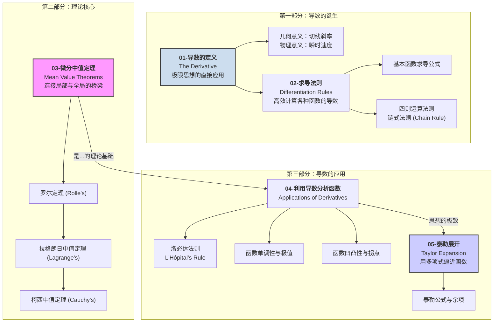

# 00-模块总览：一元微分学

## 1. 模块导言：研究“瞬时变化率”的科学

在建立了极限与连续性的概念之后，我们终于可以开始回答微积分的第一个核心问题：**一个量在某一个瞬间的变化到底有多快？** 这就是**微分学 (Differential Calculus)** 的研究主题。

其核心工具是**导数 (Derivative)**。导数是函数在某一点上对自变量变化的敏感程度的度量。它在几何上表现为函数图像在该点切线的斜率；在物理上，它可以是速度（位置对时间的变化率）或加速度（速度对时间的变化率）。

微分学为我们提供了一套强大的分析工具，使我们能够：

- 精确计算复杂函数的变化率。
- 找到函数的极大值和极小值，解决最优化问题。
- 深刻理解函数本身的形态，如单调性（上升/下降）和凹凸性（弯曲方向）。
- 用简单的多项式来逼近复杂的函数。

本模块将系统地介绍导数的概念、计算方法、核心理论及其应用。

## 2. 知识地图 (Knowledge Map)

## 3. 学习路径 (Learning Path)

1. **`01-导数的定义与几何意义.md`**: 我们将回归导数的本源，使用极限来严格定义导数和微分。重点理解导数作为函数在该点切线斜率的几何解释，以及作为瞬时变化率的物理/现实解释。
2. **`02-求导法则.md`**: 为了高效地计算导数，我们将系统学习并推导各种基本函数的求导公式，以及处理函数和、差、积、商的求导法则，特别是其中最重要、最强大的**链式法则**。
3. **`03-微分中值定理.md`**: 这是连接导数的“局部”信息和函数“全局”性质的理论桥梁。我们将依次学习罗尔定理、拉格朗日中值定理和柯西中值定理，并理解它们之间的递进关系。这些定理是后续所有应用的基础。
4. **`04-利用导数分析函数.md`**: 这是导数应用的集中体现。我们将学习如何使用导数（一阶和二阶）来判断函数的单调性、寻找极值、判断凹凸性、找到拐点。同时，我们将学习一个利用导数求极限的强大工具——**洛必达法则**。
5. **`05-泰勒展开.md`**: 这是微分学思想的巅峰。**泰勒公式**告诉我们，如果一个函数足够平滑，那么在某一点附近，它可以用一个多项式函数来无限逼近。这是现代科学和工程中近似计算和理论分析的基石。
