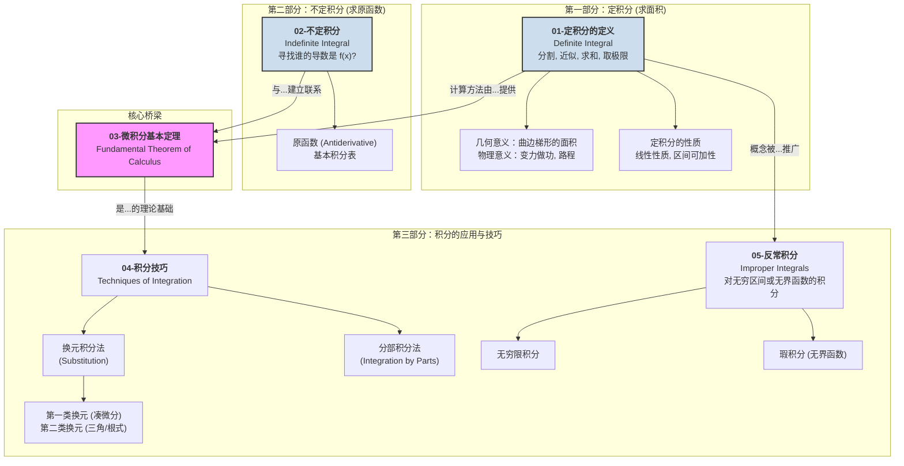

# 00-模块总览：一元积分学

## 1. 模块导言：从"求和"到"求逆"的艺术

与微分学研究"瞬时变化"相反，**积分学 (Integral Calculus)** 起源于一个古老而具体的问题：**如何精确计算一个由曲线围成的图形的面积？**

古希腊人通过"穷竭法"——用无数个小的、规则的图形（如矩形）去逼近不规则图形——孕育了积分思想的雏形。黎曼将其发展为严格的数学理论，通过"分割、近似、求和、取极限"的步骤来定义**定积分 (Definite Integral)**，使其成为计算面积、体积、弧长等几何量的普适工具。

然而，积分学的真正威力并不仅仅在于求和。微积分最深刻、最奇妙的发现是，看似无关的"求面积"问题，与"求导数的逆运算"问题，竟然是同一个问题的两个侧面。这个惊人的联系，就是**微积分基本定理 (Fundamental Theorem of Calculus)**。它将微分和积分这两大分支紧密地焊接在一起，使得我们可以通过寻找**原函数 (Antiderivative)** 来极其高效地计算定积分。

本模块将带领我们走过这条从"求和"到"求逆"的发现之旅。

## 2. 知识地图 (Knowledge Map)

## 3. 学习路径 (Learning Path)

1. **`01-定积分的定义与性质.md`**: 我们将从"计算曲边梯形面积"这一经典问题出发，严格学习定积分的"黎曼和"定义。重点理解"分割-近似-求和-取极限"这一核心思想，并掌握定积分的基本性质。
2. **`02-不定积分与原函数.md`**: 我们将暂时放下"面积"，转向一个纯代数的问题：给定一个函数 \(f(x)\)，如何找到一个函数 \(F(x)\)，使得 \(F'(x) = f(x)\)？这个 \(F(x)\) 就是**原函数**，所有原函数的集合就是**不定积分**。我们将建立一张基本积分表。
3. **`03-微积分基本定理.md`**: 这是微积分的顶峰和灵魂。该定理将揭示定积分和不定积分之间深刻的内在联系。我们将学习其两个形式：**牛顿-莱布尼茨公式**（用原函数计算定积分）和**变上限积分求导**。
4. **`04-积分技巧.md`**: 有了基本定理，计算积分的关键就变成了寻找原函数。我们将系统学习两大核心积分技巧：**换元积分法**（对应求导的链式法则）和**分部积分法**（对应求导的乘法法则），以及其他一些特殊技巧。
5. **`05-反常积分.md`**: 最后，我们将把定积分的概念推广到两种"反常"情况：在**无穷区间**上求面积，或者对一个在区间内**无界**（垂直渐近线）的函数求面积。我们将学习如何判断和计算这两类反常积分。
