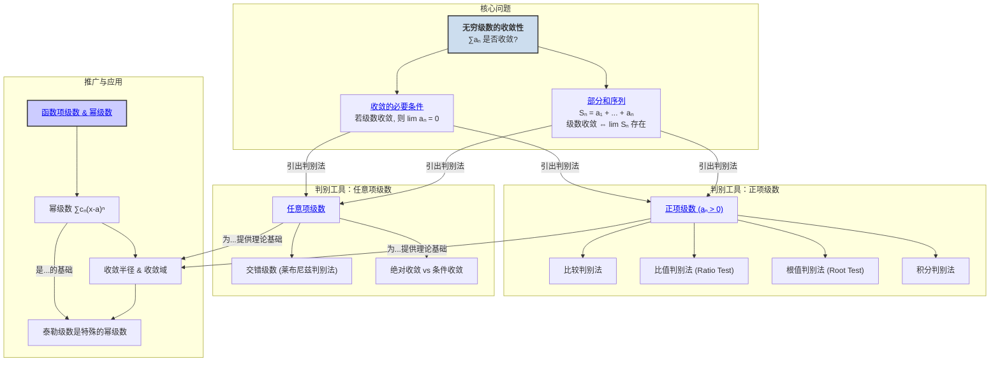

# 1. 级数理论总览

**版本**: 1.0
**日期**: 2025-07-02

---

## 1.1. 引言：无穷个数的求和

我们已经知道如何将有限个数相加，也知道了如何通过积分来"累加"无穷小的量。现在，我们面临一个新问题：我们能否将 **无穷多个、离散的数** 加在一起，并得到一个有限的结果？

这就是 **级数理论 (Theory of Series)** 所要研究的核心问题。例如，著名的芝诺悖论"阿喀琉斯追不上乌龟"就隐含了一个级数：
\[ \frac{1}{2} + \frac{1}{4} + \frac{1}{8} + \frac{1}{16} + \dots \]
直觉告诉我们，这个和最终会趋近于 1。级数理论就是要为这种直觉提供严格的数学基础，并回答核心问题：一个无穷级数，在什么条件下是 **收敛的 (Convergent)**，在什么条件下又是 **发散的 (Divergent)**？

本模块将从最基本的数项级数开始，发展出一系列判别收敛性的强大工具，并最终将级数的概念推广到函数，引出分析学中极其重要的 **幂级数**。

## 1.2. 知识地图 (Mermaid)

## 1.3. 探索路径

1.  **[01-级数的收敛与发散.md](./01-级数的收敛与发散.md)**: 我们将首先建立级数理论的基本框架。核心思想是，将一个无穷级数的收敛问题，**转化** 为其 **部分和序列** 的极限问题。我们还会学习一个非常重要的"必要非充分"条件：如果级数收敛，那么其通项必须趋于0。

2.  **[02-正项级数判别法.md](./02-正项级数判别法.md)**: 对于每一项都是正数的级数，其部分和序列是单调递增的，这使得判别收敛性变得相对简单。我们将学习一系列强大的判别法，如直观的 **比较判别法**，以及更精妙的 **比值判别法** 和 **根值判别法**。

3.  **[03-任意项级数.md](./03-任意项级数.md)**: 当级数项有正有负时，情况变得更加复杂。我们将首先研究正负交替出现的 **交错级数**，并学习其简洁的 **莱布尼兹判别法**。然后，我们将引入 **绝对收敛** 和 **条件收敛** 这两个重要概念，来更深刻地理解收敛性。

4.  **[04-函数项级数与幂级数.md](./04-函数项级数与幂级数.md)**: 这是级数理论与函数分析的交汇点。我们将把级数的项从常数推广为函数。其中最重要的一类是 **幂级数** \(\sum c_n (x-a)^n\)。我们将重点研究如何确定一个幂级数的 **收敛半径** 和 **收敛域**，这正是泰勒级数能够成立的理论基础，也为我们用级数来定义新函数（如贝塞尔函数）打开了大门。

---
[返回上一级: ../00-分析学总览.md](./00-分析学总览.md) 