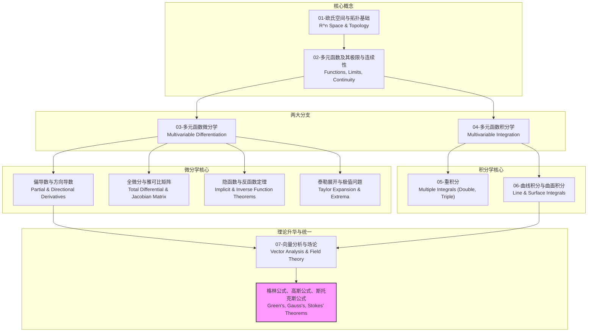

# 00-模块总览：多元微积分

## 1. 模块导言：从线到体，从一元到多元的升华

一元微积分，究其本质，是研究"直线"上的变化的数学。它通过导数和积分，完美地刻画了单变量函数在数轴上某一点的瞬时变化率和在某一区间的累积效应。然而，我们所处的世界是三维的，我们所研究的系统（如物理场、经济模型、数据集）往往涉及众多相互关联的变量。将微积分从一维的"线"的疆域，拓展到二维的"面"、三维的"体"乃至更高维的"空间"，正是**多元微积分 (Multivariable Calculus)** 的核心使命。

这不仅仅是变量数量的简单增加，更是一次思想上的深刻升华。它引入了诸如**偏导数、方向导数、梯度、散度、旋度**等全新概念，用以描述在特定方向上的变化以及"场"的内在属性。它将积分的概念从"面积"推广到**体积（重积分）、弧长（曲线积分）、曲面面积（曲面积分）**。

最终，通过**格林公式、高斯公式和斯托克斯公式**这三大支柱，多元微积分将"局部"的微分与"全局"的积分以一种惊人深刻和优美的方式统一起来，揭示了"场"的内部变化（旋度和散度）与其边界行为之间的内在联系。这不仅是数学上的巨大成就，更是理解和描述从电磁场到流体力学等几乎所有物理定律的基石语言。

本模块旨在系统性地建立多元微积分的知识体系，不仅学习其计算工具，更注重理解其几何直观和物理应用，感受从一元到多元的维度跃迁所带来的思想解放。

## 2. 知识地图 (Knowledge Map)

## 3. 学习路径 (Learning Path)

本模块将遵循以下顺序进行内容构建，确保知识的逻辑连贯性和递进性：

1. **`01-欧氏空间与拓扑基础.md`**: 介绍n维欧氏空间 \(R^n\) 的基本结构，包括内积、范数、距离、开集、闭集等拓扑概念，为多元函数的定义域和性质讨论打下基础。
2. **`02-多元函数及其极限与连续性.md`**: 定义多元函数、标量场和向量场。重点讨论多元函数极限的复杂性（路径相关性）以及连续性的概念。
3. **`03-多元函数微分学.md`**: 引入偏导数和方向导数，理解其几何意义。建立全微分的概念，并将其与偏导数通过雅可比矩阵联系起来。探讨隐函数定理和极值问题。
4. **`04-多元函数积分学.md`**: 这是对积分概念的第一次扩展，引入重积分（二重积分、三重积分）来计算高维区域的"体积"或"质量"。
5. **`05-重积分.md`**: 详细讨论重积分的计算方法，特别是通过傅比尼定理（Fubini's Theorem）化为累次积分，以及在不同坐标系（极坐标、柱坐标、球坐标）下的变量替换。
6. **`06-曲线积分与曲面积分.md`**: 这是对积分概念的第二次扩展，将函数沿一维曲线和二维曲面进行积分。区分并联系第一类（对弧长/面积）和第二类（对坐标）曲线/曲面积分。
7. **`07-向量分析与场论.md`**: 引入梯度、散度、旋度等描述向量场性质的核心算子。最终，通过格林公式、高斯公式和斯托克斯公式将微分与积分、场与边界联系起来，达到本模块的理论高潮。
