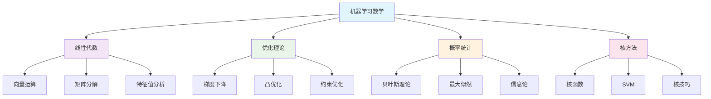
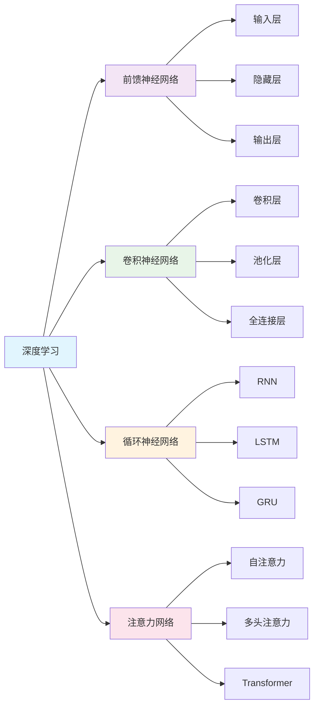
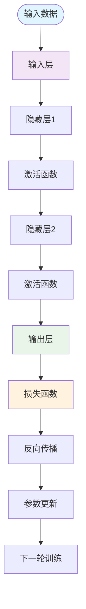
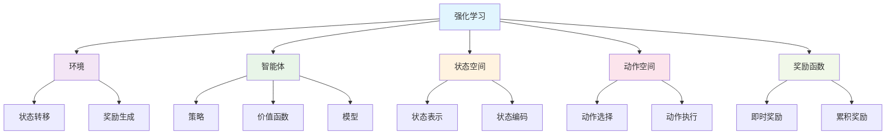
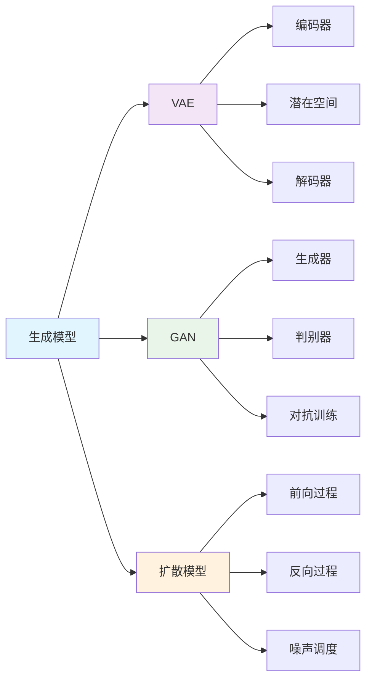
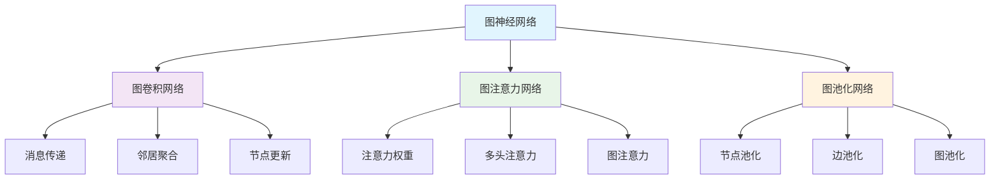

# 数学与人工智能 | 机器学习数学·深度学习理论·智能算法（条目与练习）

---

## 1. 学习导引 | Cognitive Primer

- 先修：线性代数、微积分、概率统计、编程基础
- 主线：数学基础→机器学习→深度学习→智能算法→前沿应用
- 认知提示：数学是人工智能的理论基础，理解数学原理有助于深入理解AI算法，掌握数学工具能更好地设计和优化AI系统

---

## 2. 机器学习数学 | Mathematics of Machine Learning

- 线性代数基础：向量、矩阵、特征值分解
- 优化理论：梯度下降、凸优化、约束优化
- 概率统计：贝叶斯理论、最大似然估计、信息论
- 核方法：核函数、支持向量机、核技巧

---

## 3. 深度学习理论 | Deep Learning Theory

- 神经网络数学：前向传播、反向传播、激活函数
- 卷积神经网络：卷积运算、池化、特征提取
- 循环神经网络：序列建模、LSTM、GRU
- 注意力机制：自注意力、多头注意力、Transformer

---

## 4. 智能算法 | Intelligent Algorithms

- 强化学习：马尔可夫决策过程、Q学习、策略梯度
- 生成模型：变分自编码器、生成对抗网络、扩散模型
- 图神经网络：图卷积、图注意力、图池化
- 元学习：少样本学习、模型无关元学习

---

## 5. 可视化内容 | Visualization Content

### 5.1 机器学习数学框架图

### 5.2 深度学习架构图

### 5.3 神经网络前向传播流程图

### 5.4 强化学习框架图

### 5.5 生成模型对比图

### 5.6 图神经网络架构图

---

## 6. 典例 | Worked Examples

### 6.1 机器学习数学典例

**线性回归的数学原理**：

- **数学建模**：
  - 模型：$y = \mathbf{w}^T \mathbf{x} + b$
  - 损失函数：$L(\mathbf{w}, b) = \frac{1}{2n} \sum_{i=1}^n (y_i - \hat{y}_i)^2$
  - 优化目标：$\min_{\mathbf{w}, b} L(\mathbf{w}, b)$

- **梯度下降求解**：
  - 梯度计算：$\nabla_{\mathbf{w}} L = -\frac{1}{n} \sum_{i=1}^n (y_i - \hat{y}_i) \mathbf{x}_i$
  - 参数更新：$\mathbf{w} \leftarrow \mathbf{w} - \alpha \nabla_{\mathbf{w}} L$
  - 收敛条件：梯度范数小于阈值

- **实际应用**：
  - 房价预测：基于房屋特征预测房价
  - 股票预测：基于历史数据预测股价
  - 销售预测：基于市场数据预测销量

**支持向量机的核技巧**：

- **线性可分情况**：
  - 决策函数：$f(\mathbf{x}) = \mathbf{w}^T \mathbf{x} + b$
  - 优化问题：$\min_{\mathbf{w}, b} \frac{1}{2} \|\mathbf{w}\|^2$
  - 约束条件：$y_i(\mathbf{w}^T \mathbf{x}_i + b) \geq 1$

- **核技巧应用**：
  - 核函数：$K(\mathbf{x}_i, \mathbf{x}_j) = \phi(\mathbf{x}_i)^T \phi(\mathbf{x}_j)$
  - 决策函数：$f(\mathbf{x}) = \sum_{i=1}^n \alpha_i y_i K(\mathbf{x}_i, \mathbf{x}) + b$
  - 常用核函数：RBF核、多项式核、线性核

### 6.2 深度学习理论典例

**卷积神经网络的特征提取**：

- **卷积运算**：
  - 数学定义：$(f * g)(t) = \int_{-\infty}^{\infty} f(\tau) g(t - \tau) d\tau$
  - 离散形式：$[f * g](n) = \sum_{m} f[m] g[n - m]$
  - 图像卷积：使用卷积核提取图像特征

- **池化操作**：
  - 最大池化：$y_{i,j} = \max_{(p,q) \in R_{i,j}} x_{p,q}$
  - 平均池化：$y_{i,j} = \frac{1}{|R_{i,j}|} \sum_{(p,q) \in R_{i,j}} x_{p,q}$
  - 作用：降维、提取主要特征、提高鲁棒性

- **实际应用**：
  - 图像分类：识别图像中的物体
  - 目标检测：定位图像中的目标
  - 图像分割：像素级别的分类

**注意力机制的数学原理**：

- **自注意力计算**：
  - 查询矩阵：$Q = XW_Q$
  - 键矩阵：$K = XW_K$
  - 值矩阵：$V = XW_V$
  - 注意力权重：$A = \text{softmax}(\frac{QK^T}{\sqrt{d_k}})$
  - 输出：$\text{Attention}(Q, K, V) = AV$

- **多头注意力**：
  - 多头计算：$\text{MultiHead} = \text{Concat}(\text{head}_1, ..., \text{head}_h)W^O$
  - 每个头：$\text{head}_i = \text{Attention}(QW_i^Q, KW_i^K, VW_i^V)$
  - 作用：关注不同的特征子空间

### 6.3 智能算法典例

**Q学习的算法实现**：

- **Q值更新**：
  - Q值定义：$Q(s, a)$表示在状态$s$下采取动作$a$的价值
  - 更新公式：$Q(s, a) \leftarrow Q(s, a) + \alpha[r + \gamma \max_{a'} Q(s', a') - Q(s, a)]$
  - 参数说明：$\alpha$是学习率，$\gamma$是折扣因子

- **策略选择**：
  - ε-贪婪策略：以概率$\epsilon$随机选择，以概率$1-\epsilon$选择最优动作
  - 策略改进：随着训练进行，逐渐减小$\epsilon$值

- **收敛条件**：
  - 理论保证：在满足一定条件下，Q学习算法会收敛到最优策略
  - 实际判断：Q值变化小于阈值或达到最大迭代次数

**生成对抗网络的训练过程**：

- **生成器目标**：
  - 目标函数：$\min_G \max_D V(D, G) = \mathbb{E}_{x \sim p_{data}(x)}[\log D(x)] + \mathbb{E}_{z \sim p_z(z)}[\log(1 - D(G(z)))]$
  - 训练策略：固定判别器，训练生成器

- **判别器目标**：
  - 目标函数：最大化真实样本的判别概率，最小化生成样本的判别概率
  - 训练策略：固定生成器，训练判别器

- **训练平衡**：
  - 交替训练：生成器和判别器交替训练
  - 平衡策略：避免一方过于强大导致训练失败

---

## 7. 练习（6题） | Exercises (6)

1) **数学推导练习**：推导线性回归的梯度
   - 任务：推导线性回归损失函数对参数的梯度
   - 要求：使用链式法则，写出完整的推导过程
   - 评估：推导的准确性和完整性

2) **算法实现练习**：实现简单的神经网络
   - 任务：使用Python实现一个简单的前馈神经网络
   - 要求：包含前向传播和反向传播
   - 评估：代码的正确性和效率

3) **模型设计练习**：设计卷积神经网络
   - 任务：为图像分类任务设计CNN架构
   - 要求：考虑网络深度、卷积核大小、池化策略
   - 评估：设计的合理性和创新性

4) **理论分析练习**：分析注意力机制
   - 任务：分析自注意力机制的数学原理
   - 要求：解释注意力权重的计算和意义
   - 评估：理解的深度和准确性

5) **应用实践练习**：强化学习应用
   - 任务：使用强化学习解决简单控制问题
   - 要求：实现Q学习算法并测试效果
   - 评估：算法的有效性和性能

6) **前沿探索练习**：生成模型研究
   - 任务：研究最新的生成模型技术
   - 要求：比较不同生成模型的优缺点
   - 评估：研究的深度和前瞻性

---

## 8. 认知提示与误区警示 | Tips & Pitfalls

### 8.1 认知提示

- **数学是AI的理论基础**：深入理解数学原理有助于掌握AI算法
- **理论与实践相结合**：理论学习需要配合实际编程实践
- **理解算法原理**：不要只关注调参，要理解算法背后的数学原理
- **关注前沿发展**：AI领域发展迅速，需要持续关注最新进展
- **跨学科思维**：AI涉及多个学科，需要综合运用不同领域的知识

### 8.2 误区警示

- **忽视数学基础**：不能只关注编程而忽视数学理论
- **过分依赖调参**：不能只关注参数调整而忽视算法原理
- **忽视数据质量**：不能只关注模型而忽视数据的重要性
- **过度复杂化**：不能为了复杂而复杂，要追求简洁有效
- **忽视伦理问题**：不能只关注技术而忽视AI的伦理影响

### 8.3 实践建议

- **循序渐进**：从基础数学开始，逐步深入AI理论
- **动手实践**：理论学习要配合编程实践
- **项目驱动**：通过实际项目来学习和应用
- **持续学习**：AI领域发展迅速，需要持续学习
- **关注应用**：关注AI在实际问题中的应用

---

## 9. 参考 | References

- `https://en.wikipedia.org/wiki/Machine_learning`
- `https://en.wikipedia.org/wiki/Deep_learning`
- `https://en.wikipedia.org/wiki/Artificial_intelligence`
- `https://en.wikipedia.org/wiki/Neural_network`
- `https://en.wikipedia.org/wiki/Reinforcement_learning`
- `https://en.wikipedia.org/wiki/Generative_model`
