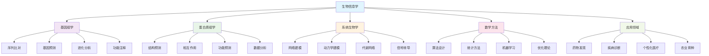
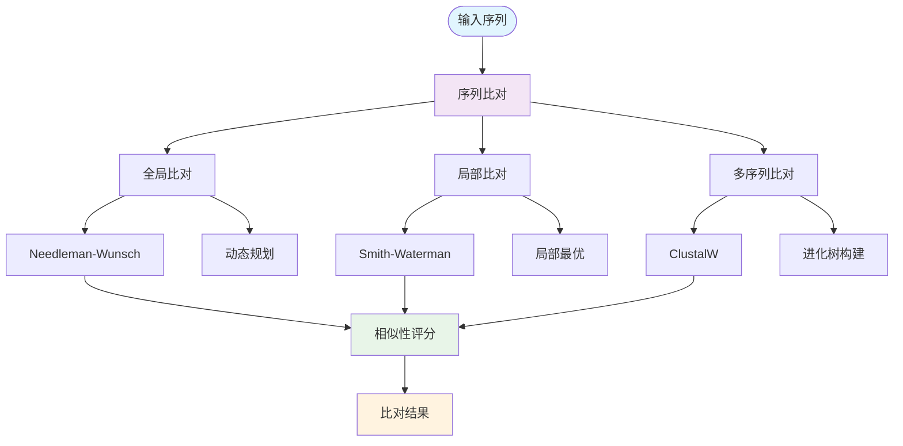
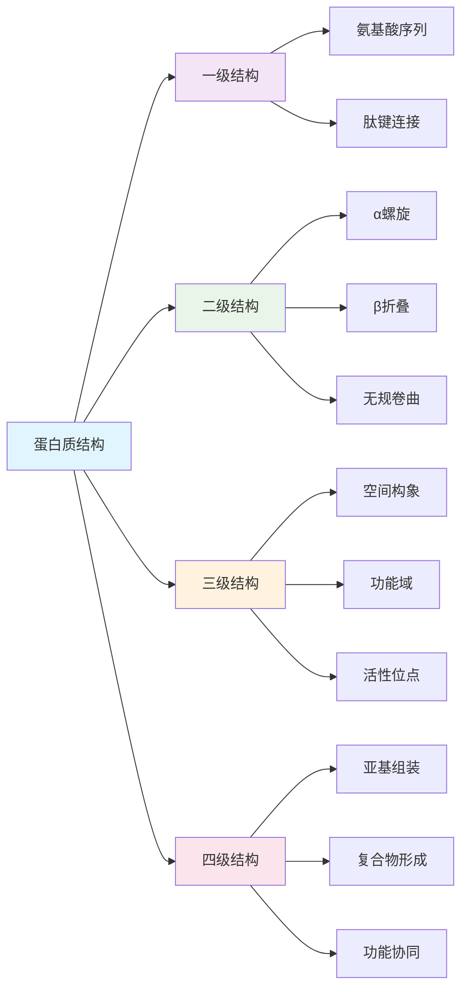
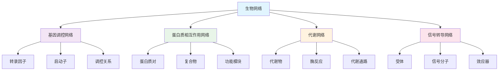
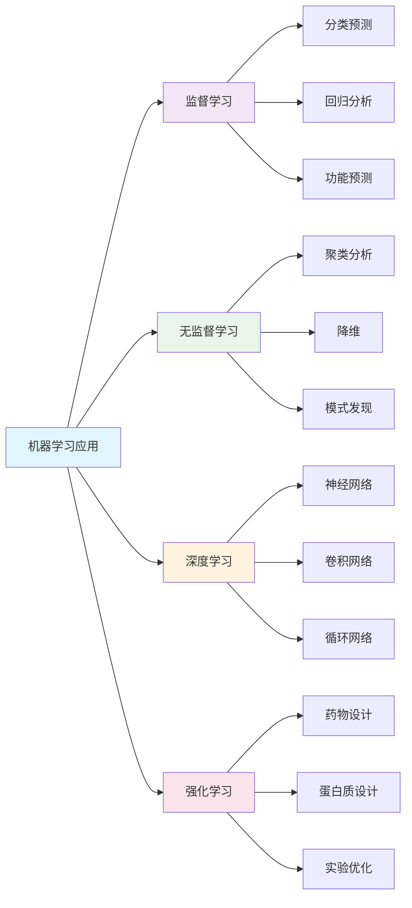
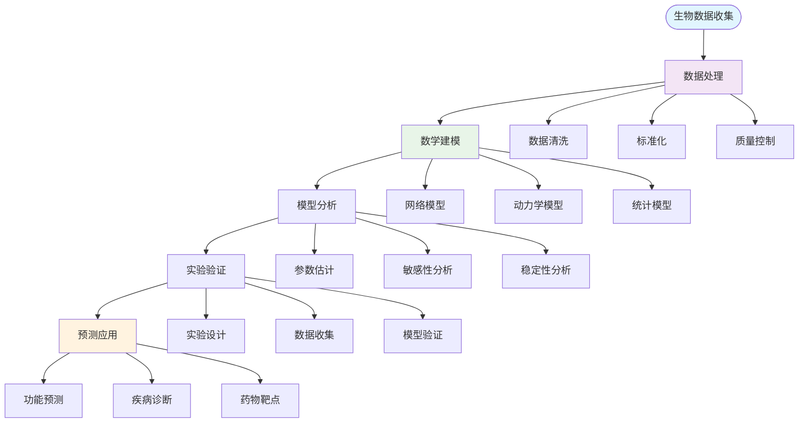

# 数学与生物信息学 | 基因组学·蛋白质组学·系统生物学（条目与练习）

---

## 1. 学习导引 | Cognitive Primer

- 先修：线性代数、概率统计、算法设计、生物学基础
- 主线：生物学数据→数学建模→算法设计→生物信息学应用→系统生物学
- 认知提示：生物信息学是数学与生命科学的交叉领域，理解数学建模方法有助于分析复杂的生物数据，系统生物学将推动生命科学的革命性发展

---

## 2. 基因组学 | Genomics

- 序列比对：DNA序列的相似性分析
- 基因预测：从DNA序列中识别基因
- 进化分析：物种间的进化关系研究
- 功能注释：基因功能的预测和分析

---

## 3. 蛋白质组学 | Proteomics

- 蛋白质结构预测：从序列预测蛋白质结构
- 蛋白质相互作用：蛋白质间的相互作用网络
- 蛋白质功能预测：基于序列和结构的功能预测
- 蛋白质组数据分析：大规模蛋白质数据的分析

---

## 4. 系统生物学 | Systems Biology

- 网络建模：生物网络的数学建模
- 动力学建模：生物系统的动力学行为
- 代谢网络：细胞代谢网络的建模和分析
- 信号转导：细胞信号转导网络的建模

---

## 5. 可视化内容 | Visualization Content

### 5.1 生物信息学整体框架图

### 5.2 序列比对算法流程图

### 5.3 蛋白质结构层次图

### 5.4 生物网络建模图

### 5.5 机器学习在生物信息学中的应用图

### 5.6 系统生物学工作流程图

---

## 6. 典例 | Worked Examples

### 6.1 基因组学典例

**序列比对算法：Needleman-Wunsch算法**：

- **算法原理**：
  - 目标：找到两个序列的最优全局比对
  - 核心思想：使用动态规划构建得分矩阵
  - 复杂度：$O(mn)$，其中$m$和$n$是序列长度

- **数学描述**：
  - 得分矩阵：$S(i,j) = \max\{S(i-1,j-1) + \delta(i,j), S(i-1,j) + g, S(i,j-1) + g\}$
  - 匹配得分：$\delta(i,j) = \begin{cases} 1 & \text{if } s_i = t_j \\ -1 & \text{otherwise} \end{cases}$
  - 空位罚分：$g = -2$

- **实际应用**：
  - 基因序列比较：比较不同物种的同源基因
  - 蛋白质序列比对：分析蛋白质的进化关系
  - 功能预测：基于序列相似性预测功能

**基因预测：隐马尔可夫模型**：

- **模型原理**：
  - 目标：从DNA序列中识别基因结构
  - 核心思想：使用HMM建模基因的不同区域
  - 状态：外显子、内含子、启动子、终止子等

- **数学描述**：
  - 状态转移概率：$P(s_{i+1}|s_i)$
  - 发射概率：$P(x_i|s_i)$
  - 维特比算法：$V_t(i) = \max_{j} V_{t-1}(j) \cdot P(s_i|s_j) \cdot P(x_t|s_i)$

- **应用场景**：
  - 新基因发现：从基因组序列中发现新基因
  - 基因注释：预测基因的结构和功能
  - 比较基因组学：比较不同物种的基因结构

### 6.2 蛋白质组学典例

**蛋白质结构预测：同源建模**：

- **预测原理**：
  - 目标：基于已知结构预测未知蛋白质的结构
  - 核心思想：利用序列相似性和结构保守性
  - 方法：模板搜索、序列比对、结构建模、优化

- **数学方法**：
  - 序列相似性：使用BLAST等算法搜索模板
  - 结构比对：使用TM-score等指标评估结构相似性
  - 能量优化：使用分子力学力场优化结构

- **应用价值**：
  - 药物设计：基于蛋白质结构设计药物
  - 功能研究：理解蛋白质的功能机制
  - 进化分析：研究蛋白质的进化关系

**蛋白质相互作用网络分析**：

- **网络建模**：
  - 节点：蛋白质
  - 边：相互作用关系
  - 权重：相互作用的强度或置信度

- **网络分析**：
  - 度分布：$P(k) \sim k^{-\gamma}$
  - 聚类系数：$C = \frac{3 \times \text{三角形数}}{\text{连通三元组数}}$
  - 最短路径：$L = \frac{1}{N(N-1)} \sum_{i \neq j} d_{ij}$

- **功能模块识别**：
  - 社区检测：识别功能相关的蛋白质模块
  - 中心性分析：识别网络中的关键蛋白质
  - 通路分析：分析蛋白质参与的生物学通路

### 6.3 系统生物学典例

**基因调控网络建模**：

- **网络结构**：
  - 节点：基因或蛋白质
  - 边：调控关系（激活或抑制）
  - 权重：调控强度

- **动力学建模**：
  - 微分方程：$\frac{dx_i}{dt} = f_i(x_1, x_2, ..., x_n)$
  - 布尔网络：$x_i(t+1) = f_i(x_1(t), x_2(t), ..., x_n(t))$
  - 贝叶斯网络：$P(x_i|\text{parents}(x_i))$

- **稳定性分析**：
  - 雅可比矩阵：$J_{ij} = \frac{\partial f_i}{\partial x_j}$
  - 特征值分析：$\det(J - \lambda I) = 0$
  - 李雅普诺夫稳定性：分析系统的稳定性

**代谢网络分析**：

- **网络表示**：
  - 节点：代谢物
  - 边：酶催化的反应
  - 权重：反应速率

- **通量平衡分析**：
  - 约束条件：$S \cdot v = 0$
  - 目标函数：$\max Z = c^T v$
  - 线性规划：求解最优通量分布

- **应用场景**：
  - 代谢工程：优化细胞代谢以提高产物产量
  - 疾病研究：分析代谢异常与疾病的关系
  - 药物靶点：识别代谢网络中的药物靶点

---

## 7. 练习（6题） | Exercises (6)

1) **序列比对练习**：实现Needleman-Wunsch算法
   - 任务：编写程序实现全局序列比对算法
   - 要求：使用动态规划方法，包含回溯过程
   - 评估：算法的正确性和效率

2) **基因预测练习**：使用HMM进行基因预测
   - 任务：构建隐马尔可夫模型预测基因结构
   - 要求：包含状态转移和发射概率的估计
   - 评估：预测的准确性和模型的有效性

3) **蛋白质结构分析练习**：分析蛋白质结构特征
   - 任务：分析给定蛋白质的二级结构和三级结构
   - 要求：使用生物信息学工具和统计方法
   - 评估：分析的深度和准确性

4) **网络分析练习**：分析蛋白质相互作用网络
   - 任务：分析蛋白质相互作用网络的拓扑特征
   - 要求：计算度分布、聚类系数、最短路径等指标
   - 评估：分析的全面性和理解深度

5) **系统建模练习**：构建基因调控网络模型
   - 任务：构建简单的基因调控网络动力学模型
   - 要求：包含微分方程建模和稳定性分析
   - 评估：模型的合理性和分析的正确性

6) **前沿探索练习**：机器学习在生物信息学中的应用
   - 任务：研究机器学习在生物信息学中的最新应用
   - 要求：比较不同方法的优缺点和适用场景
   - 评估：研究的深度和前瞻性

---

## 8. 认知提示与误区警示 | Tips & Pitfalls

### 8.1 认知提示

- **跨学科思维**：生物信息学需要数学、计算机和生物学的综合知识
- **数据驱动**：生物信息学是基于大规模数据分析的学科
- **模型验证**：数学模型需要实验验证才能确认其有效性
- **计算复杂性**：生物数据的复杂性要求高效的算法设计
- **生物学意义**：数学分析的结果必须有生物学意义

### 8.2 误区警示

- **忽视生物学背景**：不能只关注数学方法而忽视生物学原理
- **过度简化模型**：生物系统复杂，过度简化可能导致错误结论
- **忽视数据质量**：生物数据质量直接影响分析结果的可靠性
- **缺乏实验验证**：数学模型必须通过实验验证才能确认
- **忽视伦理问题**：生物信息学研究需要考虑伦理和隐私问题

### 8.3 实践建议

- **扎实基础**：从生物学和数学基础开始，逐步深入
- **动手实践**：使用生物信息学工具和编程语言进行实践
- **关注前沿**：生物信息学发展迅速，需要持续关注最新进展
- **跨学科合作**：与生物学家、计算机科学家等合作
- **实际应用**：关注生物信息学在实际问题中的应用

---

## 9. 参考 | References

- `https://en.wikipedia.org/wiki/Bioinformatics`
- `https://en.wikipedia.org/wiki/Genomics`
- `https://en.wikipedia.org/wiki/Proteomics`
- `https://en.wikipedia.org/wiki/Systems_biology`
- `https://en.wikipedia.org/wiki/Sequence_alignment`
- `https://en.wikipedia.org/wiki/Protein_structure_prediction`
