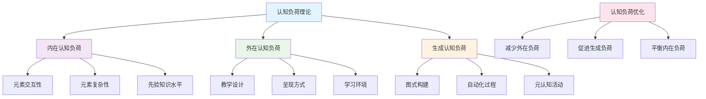
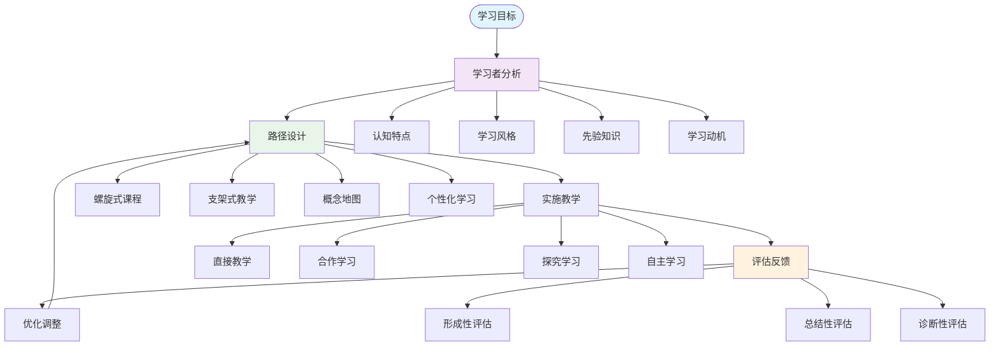
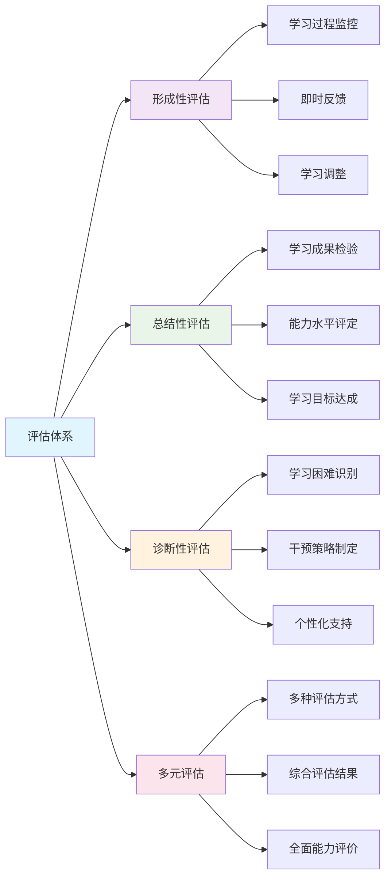
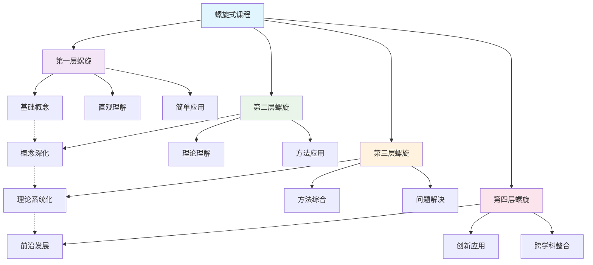
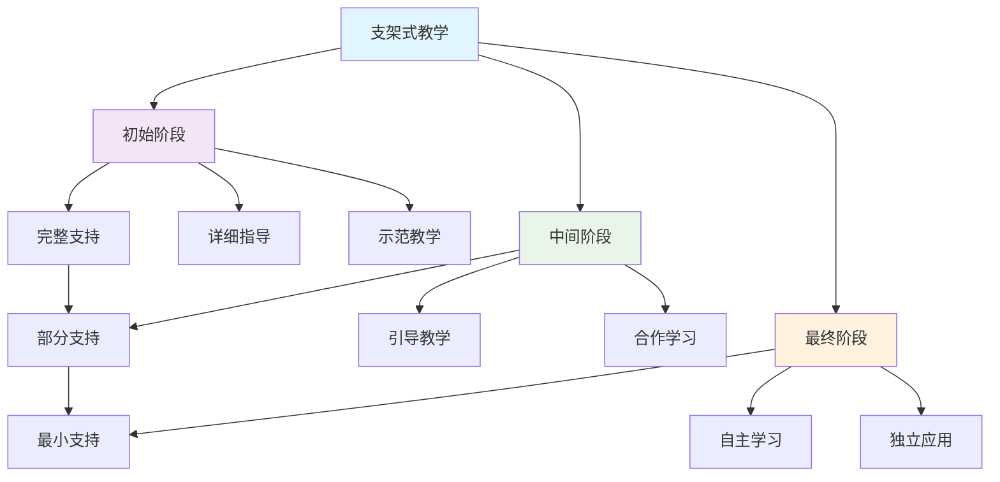
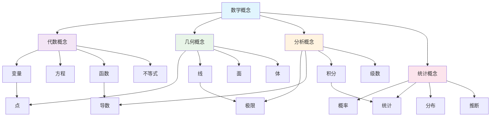

# 数学教育理论 | 认知负荷理论·学习路径设计·评估体系（条目与练习）

---

## 1. 学习导引 | Cognitive Primer

- 先修：认知科学基础、教育心理学、数学基础
- 主线：认知理论→教学设计→评估反馈→优化
- 认知提示：数学教育理论为数学教学提供科学指导，认知负荷理论帮助优化教学设计，个性化学习路径能显著提高学习效果

---

## 2. 认知负荷理论 | Cognitive Load Theory

- 内在认知负荷：学习材料的固有复杂性
- 外在认知负荷：教学设计的额外负担
- 生成认知负荷：学习者主动构建知识的努力
- 认知负荷优化：减少外在负荷，促进生成负荷

---

## 3. 学习路径设计 | Learning Path Design

- 螺旋式课程：概念在不同层次重复出现
- 支架式教学：逐步减少支持的学习过程
- 概念地图：知识结构的可视化表示
- 个性化学习：基于学习者特点的定制路径

---

## 4. 评估体系 | Assessment System

- 形成性评估：学习过程中的持续反馈
- 总结性评估：学习成果的最终检验
- 诊断性评估：学习困难的识别与干预
- 多元评估：多种评估方式的综合运用

---

## 5. 可视化内容 | Visualization Content

### 5.1 认知负荷理论框架图

### 5.2 学习路径设计流程图

### 5.3 评估体系结构图

### 5.4 螺旋式课程设计图

### 5.5 支架式教学模型图

### 5.6 概念地图示例

---

## 6. 典例 | Worked Examples

### 6.1 认知负荷理论典例

**微积分概念教学：从直观到形式化**：

- **内在负荷管理**：
  - 策略：将复杂概念分解为简单步骤
  - 方法：从几何直观到代数表达，再到严格定义
  - 案例：导数概念教学，从切线斜率到极限定义

- **外在负荷减少**：
  - 策略：简化教学材料，减少无关信息
  - 方法：使用清晰的图表，避免冗余文字
  - 案例：极限概念教学，使用简洁的ε-δ语言

- **生成负荷促进**：
  - 策略：鼓励学习者主动构建知识
  - 方法：提供探索性任务，促进深度思考
  - 案例：积分概念教学，让学生发现面积与导数的关系

### 6.2 学习路径设计典例

**几何证明教学：从具体到抽象**：

- **螺旋式课程设计**：
  - 第一层：直观几何，通过观察发现性质
  - 第二层：简单证明，使用基本定理
  - 第三层：复杂证明，综合运用多种方法
  - 案例：三角形全等定理的教学路径

- **支架式教学应用**：
  - 初始阶段：提供完整的证明框架
  - 中间阶段：提供部分证明步骤
  - 最终阶段：学生独立完成证明
  - 案例：勾股定理证明的教学过程

- **概念地图构建**：
  - 核心概念：几何变换、全等、相似
  - 关联概念：角度、长度、面积
  - 应用概念：测量、设计、建模
  - 案例：平面几何知识结构图

### 6.3 评估体系典例

**数学建模教学：从问题到模型**：

- **形成性评估**：
  - 评估内容：建模过程的各个阶段
  - 评估方法：观察、访谈、作品分析
  - 反馈方式：即时反馈、指导建议
  - 案例：人口增长模型构建过程评估

- **总结性评估**：
  - 评估内容：最终建模成果
  - 评估方法：作品评价、答辩、报告
  - 评价标准：准确性、创新性、实用性
  - 案例：环境问题数学建模项目评估

- **诊断性评估**：
  - 评估内容：建模能力、数学基础
  - 评估方法：测试、问卷、访谈
  - 干预策略：个性化指导、补充学习
  - 案例：数学建模能力诊断与干预

---

## 7. 练习（6题） | Exercises (6)

1) **分析练习**：分析教学中的认知负荷
   - 任务：分析一个数学教学片段的认知负荷
   - 要求：识别内在、外在、生成三种负荷
   - 评估：负荷分配的合理性

2) **设计练习**：设计基于认知理论的教学活动
   - 任务：设计一个基于认知负荷理论的教学活动
   - 要求：考虑认知负荷的合理分配
   - 评估：教学活动的有效性

3) **路径练习**：设计个性化学习路径
   - 任务：为特定学习者设计个性化学习路径
   - 要求：考虑学习者特点和需求
   - 评估：路径的合理性和可行性

4) **评估练习**：设计多元评估方案
   - 任务：设计一个数学学习的多元评估方案
   - 要求：包含多种评估方式
   - 评估：评估方案的全面性和有效性

5) **优化练习**：优化教学设计和评估
   - 任务：基于评估结果优化教学设计
   - 要求：改进教学策略和评估方法
   - 评估：优化效果和改进建议

6) **应用练习**：教育理论在实践中的应用
   - 任务：将教育理论应用到实际教学中
   - 要求：设计具体的教学实践方案
   - 评估：实践效果和理论指导价值

---

## 8. 认知提示与误区警示 | Tips & Pitfalls

### 8.1 认知提示

- **认知负荷理论指导教学设计**：合理控制认知负荷能提高学习效果
- **个性化学习路径的重要性**：根据学习者特点设计学习路径
- **多元评估的全面性**：多种评估方式能更全面反映学习情况
- **理论与实践相结合**：教育理论需要在实际教学中验证和应用
- **持续优化和改进**：根据评估结果持续优化教学设计和评估方法

### 8.2 误区警示

- **忽视个体差异**：不能使用统一的教学方法对待所有学习者
- **过分简化认知过程**：认知过程复杂，不能简单化处理
- **评估方式单一**：不能只使用一种评估方式
- **理论与实践脱节**：不能脱离实际教学应用教育理论
- **忽视反馈和改进**：不能忽视评估反馈和持续改进

### 8.3 实践建议

- **科学设计**：以认知科学理论为指导设计教学
- **个性化实施**：根据学习者特点个性化实施教学
- **多元评估**：使用多种方式全面评估学习效果
- **持续改进**：根据评估结果持续改进教学
- **理论验证**：在实际教学中验证和应用教育理论

---

## 9. 参考 | References

- `https://en.wikipedia.org/wiki/Cognitive_load_theory`
- `https://en.wikipedia.org/wiki/Educational_assessment`
- `https://en.wikipedia.org/wiki/Mathematics_education`
- `https://en.wikipedia.org/wiki/Learning_path`
- `https://en.wikipedia.org/wiki/Formative_assessment`
- `https://en.wikipedia.org/wiki/Summative_assessment`
