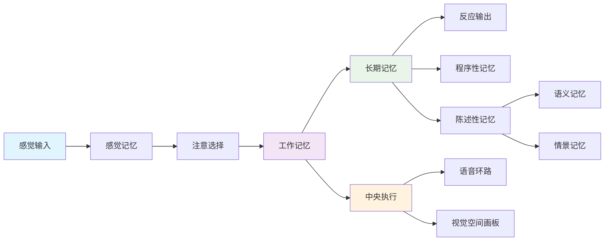
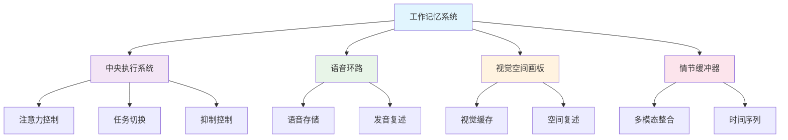
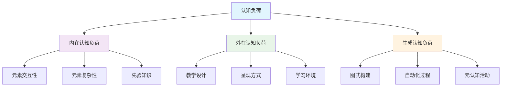
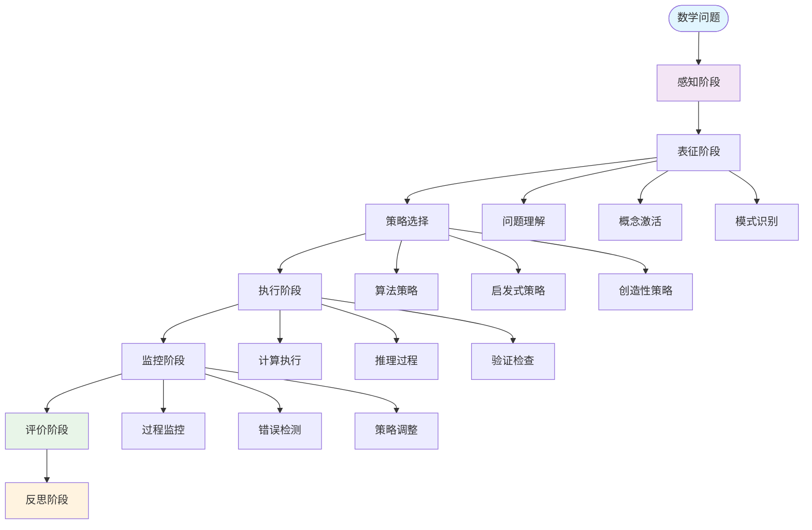
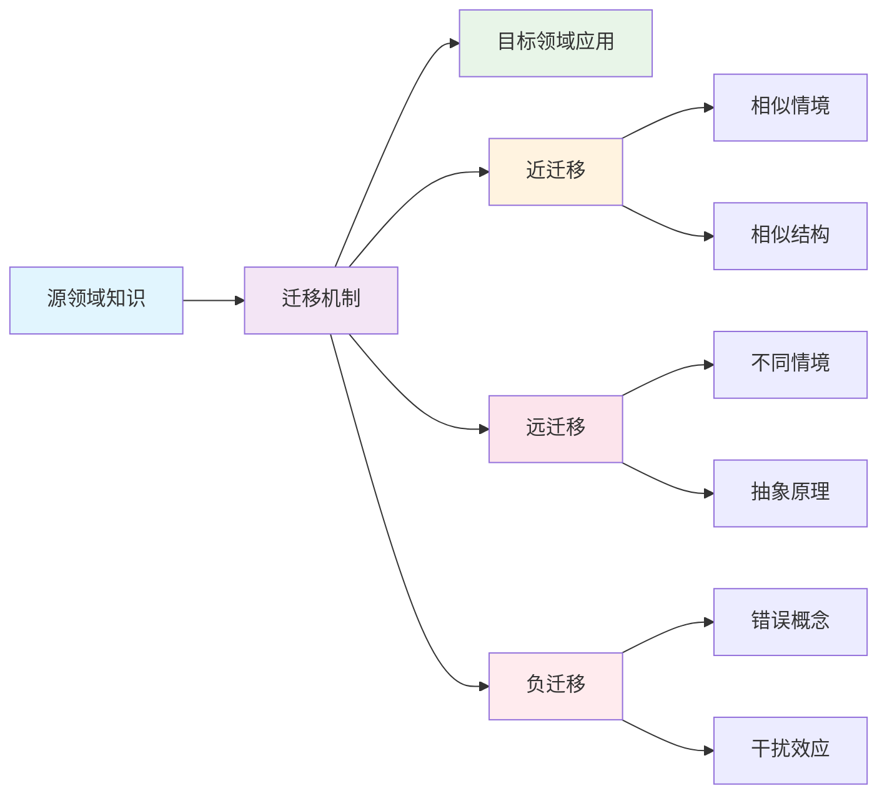
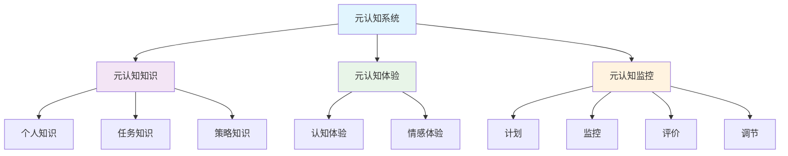

# 数学认知科学 | 认知建模·学习理论·思维过程（条目与练习）

---

## 1. 学习导引 | Cognitive Primer

- 先修：认知心理学、数学教育、统计学基础
- 主线：认知过程→学习机制→思维建模→教育应用
- 认知提示：认知科学为数学教育提供科学基础，理解认知过程有助于设计更有效的教学方法

---

## 2. 认知建模 | Cognitive Modeling

- 信息加工模型：认知过程的数学描述
- 工作记忆模型：记忆容量的数学建模
- 注意力模型：注意力分配的数学理论
- 决策模型：决策过程的数学分析
- 问题解决模型：问题解决策略的数学描述

---

## 3. 学习理论 | Learning Theories

- 建构主义学习：知识建构的数学模型
- 认知负荷理论：学习负荷的量化分析
- 迁移学习：知识迁移的数学机制
- 元认知理论：元认知过程的数学建模
- 深度学习：深度学习的认知基础

---

## 4. 思维过程 | Thinking Processes

- 数学思维：数学思维的认知特征
- 逻辑推理：逻辑推理的数学模型
- 创造性思维：创造性思维的数学描述
- 批判性思维：批判性思维的数学分析
- 问题表征：问题表征的数学理论

---

## 5. 可视化内容 | Visualization Content

### 5.1 认知过程信息加工模型

### 5.2 工作记忆容量模型

### 5.3 认知负荷理论框架

### 5.4 数学思维过程流程图

### 5.5 学习迁移机制图

### 5.6 元认知监控模型

---

## 6. 典例 | Worked Examples

### 6.1 认知建模典例

**工作记忆容量模型**：

- 米勒的"7±2"法则：人类工作记忆容量约为7个信息单元
- 数学应用：设计数学问题时考虑认知负荷，避免信息过载
- 实际案例：几何证明中分步骤呈现，每步不超过7个概念

**注意力分配模型**：

- 选择性注意：在复杂数学问题中聚焦关键信息
- 分配性注意：同时处理多个数学概念的能力
- 应用：设计数学教学时合理安排注意力分配

### 6.2 学习理论典例

**认知负荷测量**：

- 内在负荷：数学概念本身的复杂性
- 外在负荷：教学设计的额外负担
- 生成负荷：学习者主动构建知识的努力
- 测量方法：任务完成时间、错误率、主观评价

**知识迁移机制**：

- 近迁移：相似数学概念间的迁移
- 远迁移：不同数学领域间的迁移
- 负迁移：错误概念对新学习的干扰

### 6.3 思维过程典例

**数学问题解决认知分析**：

- 问题表征阶段：将问题转化为内部心理模型
- 策略选择阶段：选择合适的解题策略
- 执行监控阶段：监控解题过程和结果
- 反思评价阶段：评价解题效果和策略

---

## 7. 练习（6题） | Exercises (6)

1) **建模练习**：构建简单的认知过程模型
   - 任务：为数学概念学习过程建立认知模型
   - 要求：包含感知、理解、应用、评价四个阶段
   - 评估：模型的合理性和可操作性

2) **分析练习**：分析学习过程中的认知负荷
   - 任务：分析一个数学教学片段的认知负荷
   - 要求：识别内在、外在、生成三种负荷
   - 评估：负荷分配的合理性

3) **测量练习**：测量数学思维的不同维度
   - 任务：设计数学思维测量工具
   - 要求：包含逻辑推理、空间想象、抽象思维等维度
   - 评估：测量工具的信度和效度

4) **设计练习**：设计基于认知理论的教学活动
   - 任务：设计一个基于认知负荷理论的教学活动
   - 要求：考虑认知负荷的合理分配
   - 评估：教学活动的有效性

5) **研究练习**：研究数学学习中的迁移现象
   - 任务：研究数学概念间的迁移现象
   - 要求：设计迁移实验，分析迁移效果
   - 评估：研究的科学性和实用性

6) **连接练习**：认知科学与数学教育实践
   - 任务：将认知科学理论应用到数学教学实践中
   - 要求：设计具体的教学策略和方法
   - 评估：实践效果和改进建议

---

## 8. 认知提示与误区警示 | Tips & Pitfalls

### 8.1 认知提示

- **认知科学为数学教育提供理论基础**：理解认知过程有助于设计更有效的教学方法
- **认知建模有助于理解学习过程**：通过建模可以预测和解释学习行为
- **个体差异的重要性**：不同学习者的认知特点存在差异，需要个性化教学
- **认知负荷的平衡**：合理控制认知负荷，避免信息过载
- **元认知的培养**：培养学习者的元认知能力，提高学习效果

### 8.2 误区警示

- **过度简化认知过程**：认知过程复杂，不能简单化处理
- **忽视个体差异**：不同学习者的认知特点不同，不能一刀切
- **过分依赖技术**：技术是辅助工具，不能替代人的认知过程
- **忽视情感因素**：情感因素对认知过程有重要影响
- **静态看待认知发展**：认知能力是动态发展的，需要持续关注

### 8.3 实践建议

- **结合具体情境**：认知理论需要结合具体的数学教学情境
- **持续观察和调整**：根据学习者的表现持续调整教学策略
- **多维度评估**：从多个维度评估学习效果和认知发展
- **跨学科合作**：与认知科学、心理学等学科专家合作
- **实证研究验证**：通过实证研究验证认知理论的应用效果

---

## 9. 参考 | References

- `https://en.wikipedia.org/wiki/Cognitive_science`
- `https://en.wikipedia.org/wiki/Cognitive_load_theory`
- `https://en.wikipedia.org/wiki/Mathematical_cognition`
- `https://en.wikipedia.org/wiki/Working_memory`
- `https://en.wikipedia.org/wiki/Attention`
- `https://en.wikipedia.org/wiki/Problem_solving`
