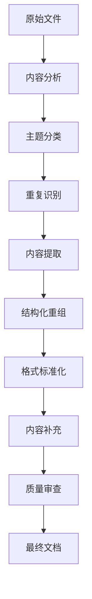

# 数学知识体系重构执行计划

## 1. 执行策略概述

本执行计划详细说明了如何系统化地重构Matter目录中的数学知识内容，并将其整合到Refactor目录中。计划采用分阶段、分主题的方法，确保内容的完整性、一致性和高质量。

> **注**: 本文档为历史归档文档，已迁移至 `01-核心内容/Refactor/` 目录。

### 1.1 总体方法

1. **分析阶段**：分析原始内容，识别主题和重复
2. **规划阶段**：制定详细的重构计划和标准
3. **执行阶段**：按优先级执行内容重构
4. **审查阶段**：质量审查和内容完善
5. **整合阶段**：建立交叉引用和知识网络

### 1.2 工作流程

## 2. 当前阶段任务详细计划

### 2.1 项目总览文档整合（高优先级）

**目标**：整合00-项目总览目录中的重复文档，建立统一的项目管理文档体系。

**具体任务**：

1. **进度跟踪文档整合**
   - [x] 创建统一的`02-进度跟踪.md`
   - [ ] 删除或归档冗余文件：`progress.md`、`持续上下文提醒体系.md`等

2. **知识图谱文档整合**
   - [x] 创建统一的`01-知识图谱分析.md`
   - [ ] 删除或归档冗余文件：`数学知识体系映射.md`等

3. **项目总览文档整合**
   - [x] 创建统一的`00-数学知识体系重构总览.md`
   - [ ] 删除或归档冗余文件：`00-项目总览.md`、`00-重构项目总览.md`等

4. **任务清单文档整合**
   - [x] 创建统一的`03-待办任务清单.md`
   - [ ] 删除或归档冗余文件

**完成标准**：

- 每个核心文档（总览、知识图谱、进度跟踪、任务清单）只保留一个最新版本
- 所有冗余文件移至`00-备份`目录
- 所有保留文档遵循统一的格式和命名规范

### 2.2 数学基础与逻辑结构化（高优先级）

**目标**：完善02-数学基础与逻辑目录的结构和内容。

**现状分析**：

- 已有基本目录结构（01-集合论/、02-数理逻辑/）
- 已有部分基础文档（朴素集合论、公理化集合论、命题逻辑、一阶逻辑等）
- 缺少03-高阶逻辑.md文件

**具体任务**：

1. **完善数理逻辑子目录**
   - [ ] 创建`02-数理逻辑/03-高阶逻辑.md`
   - [ ] 从Matter/数学逻辑.md提取相关内容
   - [ ] 规范化格式和内容

2. **完善模型论、递归论和证明论内容**
   - [ ] 审查现有的03-模型论基础.md、04-递归论基础.md、05-证明论基础.md
   - [ ] 补充缺失内容
   - [ ] 统一格式和引用

3. **建立内部交叉引用系统**
   - [ ] 在00-数学基础与逻辑总览.md中添加正确的文件链接
   - [ ] 在各文档间建立概念交叉引用

**完成标准**：

- 所有计划文档都已创建并包含完整内容
- 内容格式统一，包括LaTeX公式、Mermaid图表等
- 所有内部链接有效且指向正确位置

### 2.3 微积分与分析内容整合（高优先级）

**目标**：从Matter/Calculus整合内容到04-微积分与分析目录。

**现状分析**：

- Matter/Calculus包含大量重复文件，特别是非标准微积分和数系演化相关内容
- 04-微积分与分析目录已有基本结构但内容需要充实

**具体任务**：

1. **非标准微积分内容整合**
   - [ ] 分析Matter/Calculus中的非标准微积分相关文件
   - [ ] 提取核心内容，去除重复
   - [ ] 创建/更新`04-微积分与分析/07-非标准分析.md`

2. **数系演化内容整合**
   - [ ] 分析Matter/Calculus中的数系演化相关文件
   - [ ] 提取核心内容，去除重复
   - [ ] 创建/更新`04-微积分与分析/01-数系演化理论.md`

3. **微积分基础内容整合**
   - [ ] 整合微积分合法性相关内容
   - [ ] 更新`04-微积分与分析/03-微分学基础.md`和`04-积分学基础.md`
   - [ ] 确保内容的学术严谨性和形式化表示

**完成标准**：

- 所有核心概念都有完整、准确的描述
- 重复内容已合并，保留最完整版本
- 内容符合学术标准，包括严谨的定义和证明

## 3. 中期任务计划

### 3.1 代数结构与理论内容深化（中优先级）

**目标**：深化03-代数结构与理论目录的内容，特别是范畴论视角。

**具体任务**：

1. **范畴论视角整合**
   - [ ] 从Matter/Algebra中提取范畴论相关内容
   - [ ] 更新`03-代数结构与理论/06-范畴论基础.md`
   - [ ] 添加范畴论视角下的代数结构统一表示

2. **代数认知结构整合**
   - [ ] 从Matter/Algebra中提取认知结构相关内容
   - [ ] 创建`03-代数结构与理论/07-代数认知结构.md`
   - [ ] 分析代数结构与认知模式的对应关系

3. **代数与编程关联整合**
   - [ ] 整合代数与软件编程的映射关系内容
   - [ ] 创建`03-代数结构与理论/08-代数与编程.md`
   - [ ] 提供Rust和Haskell的代码实现示例

### 3.2 数论与离散数学扩展（中优先级）

**目标**：扩展06-数论与离散数学目录的内容，完成缺失的文档。

**具体任务**：

1. **编码理论文档创建**
   - [ ] 创建`06-数论与离散数学/02-离散数学/04-编码理论.md`
   - [ ] 包含编码理论的基础概念、主要编码方法和应用

2. **密码学基础文档创建**
   - [ ] 创建`06-数论与离散数学/02-离散数学/05-密码学基础.md`
   - [ ] 包含现代密码学的数学基础、主要算法和安全性分析

3. **计算复杂性理论文档创建**
   - [ ] 创建`06-数论与离散数学/02-离散数学/06-计算复杂性理论.md`
   - [ ] 包含复杂性类别、NP完全性和算法分析

### 3.3 哲学与元数学基础深化（中优先级）

**目标**：深化01-哲学与元数学基础目录的内容，整合批判性分析。

**具体任务**：

1. **数学哲学基础内容整合**
   - [ ] 从Matter/批判性分析中提取相关内容
   - [ ] 更新`01-哲学与元数学基础/01-数学哲学基础.md`
   - [ ] 包含主要数学哲学流派和观点

2. **数学认识论内容创建**
   - [ ] 创建`01-哲学与元数学基础/02-数学认识论.md`
   - [ ] 分析数学知识的本质、获取方式和限制

3. **数学本体论内容创建**
   - [ ] 创建`01-哲学与元数学基础/03-数学本体论.md`
   - [ ] 探讨数学对象的存在性质和本体地位

## 4. 长期任务计划

### 4.1 概率统计与随机过程（低优先级）

**目标**：建立07-概率统计与随机过程目录的基础内容。

**具体任务**：

1. **概率论基础文档创建**
   - [ ] 创建`07-概率统计与随机过程/01-概率论基础.md`
   - [ ] 包含概率空间、随机变量和概率分布

2. **统计学基础文档创建**
   - [ ] 创建`07-概率统计与随机过程/02-统计学基础.md`
   - [ ] 包含统计推断、假设检验和回归分析

3. **随机过程基础文档创建**
   - [ ] 创建`07-概率统计与随机过程/03-随机过程基础.md`
   - [ ] 包含马尔可夫过程、泊松过程和布朗运动

### 4.2 跨学科应用与联系（低优先级）

**目标**：建立08-跨学科应用与联系目录的基础内容。

**具体任务**：

1. **数学物理基础文档创建**
   - [ ] 创建`08-跨学科应用与联系/01-数学物理基础.md`
   - [ ] 分析数学在物理学中的应用

2. **计算数学基础文档创建**
   - [ ] 创建`08-跨学科应用与联系/02-计算数学基础.md`
   - [ ] 探讨数值方法和计算算法

3. **数学与AI文档创建**
   - [ ] 创建`08-跨学科应用与联系/03-数学与人工智能.md`
   - [ ] 分析数学在AI中的核心应用

### 4.3 元数学与形式化（低优先级）

**目标**：建立09-元数学与形式化目录的基础内容。

**具体任务**：

1. **形式化数学基础文档创建**
   - [ ] 创建`09-元数学与形式化/01-形式化数学基础.md`
   - [ ] 介绍形式化数学的原理和方法

2. **证明辅助系统文档创建**
   - [ ] 创建`09-元数学与形式化/02-证明辅助系统.md`
   - [ ] 介绍Coq、Isabelle、Lean等系统

3. **类型论基础文档创建**
   - [ ] 创建`09-元数学与形式化/03-类型论基础.md`
   - [ ] 介绍类型论的基础概念和应用

## 5. 质量保证计划

### 5.1 内容质量标准

1. **数学准确性**
   - 所有定义、定理和证明必须数学上准确
   - 使用标准的数学符号和术语
   - 确保逻辑推理的严谨性

2. **形式化表示**
   - 使用LaTeX表示所有数学公式
   - 使用Mermaid图表表示概念关系
   - 提供Rust或Haskell的代码实现

3. **结构一致性**
   - 遵循统一的文档结构模板
   - 使用一致的编号系统
   - 保持章节层次的清晰性

### 5.2 质量审查流程

1. **内容审查**
   - 检查数学内容的准确性和完整性
   - 验证所有定义和定理的正确性
   - 确保证明的严谨性和完整性

2. **格式审查**
   - 检查LaTeX公式的正确性
   - 验证Mermaid图表的可视化效果
   - 确保代码实现的可执行性

3. **一致性审查**
   - 检查术语使用的一致性
   - 验证交叉引用的正确性
   - 确保内容组织的逻辑性

## 6. 执行时间表

### 6.1 短期计划（1-2周）

| 日期 | 任务 | 负责人 | 状态 |
| ---- | ---- | ---- | ---- |
| 2024-06-25 | 项目总览文档整合 | AI助手 | 进行中 |
| 2024-06-26 | 数学基础与逻辑结构化 | AI助手 | 计划中 |
| 2024-06-27 | 微积分与分析内容整合 | AI助手 | 计划中 |

### 6.2 中期计划（2-4周）

| 日期 | 任务 | 负责人 | 状态 |
| ---- | ---- | ---- | ---- |
| 2024-07-01 | 代数结构与理论内容深化 | AI助手 | 计划中 |
| 2024-07-05 | 数论与离散数学扩展 | AI助手 | 计划中 |
| 2024-07-10 | 哲学与元数学基础深化 | AI助手 | 计划中 |

### 6.3 长期计划（1-2月）

| 日期 | 任务 | 负责人 | 状态 |
| ---- | ---- | ---- | ---- |
| 2024-07-15 | 概率统计与随机过程 | AI助手 | 计划中 |
| 2024-07-25 | 跨学科应用与联系 | AI助手 | 计划中 |
| 2024-08-05 | 元数学与形式化 | AI助手 | 计划中 |

## 7. 资源分配

### 7.1 优先资源分配

1. **高优先级任务**
   - 项目总览文档整合
   - 数学基础与逻辑结构化
   - 微积分与分析内容整合

2. **中优先级任务**
   - 代数结构与理论内容深化
   - 数论与离散数学扩展
   - 哲学与元数学基础深化

3. **低优先级任务**
   - 概率统计与随机过程
   - 跨学科应用与联系
   - 元数学与形式化

### 7.2 执行策略

1. **并行工作**
   - 同时处理不同主题的内容
   - 优先完成高优先级任务
   - 在等待反馈时处理低优先级任务

2. **增量交付**
   - 每完成一个主要文档就提交
   - 定期整合和审查已完成内容
   - 持续更新进度跟踪文档

## 8. 风险管理

### 8.1 潜在风险

1. **内容重复**：原始文档中存在大量重复内容，可能导致整合困难
2. **格式不一致**：不同文档使用不同的格式和符号，需要统一
3. **内容缺失**：某些主题可能缺乏足够的原始材料
4. **质量参差不齐**：原始内容的质量和深度可能不一致

### 8.2 风险缓解策略

1. **内容重复**：使用内容相似度分析工具，系统地识别和合并重复内容
2. **格式不一致**：创建详细的格式指南，并在整合过程中统一应用
3. **内容缺失**：基于现有知识和参考资料补充缺失内容
4. **质量参差不齐**：建立质量标准，对所有内容进行统一的质量提升

---

**创建日期**: 2024-06-25
**更新日期**: 2024-06-25
**更新人**: AI助手
**下一次更新**: 2024-06-26
