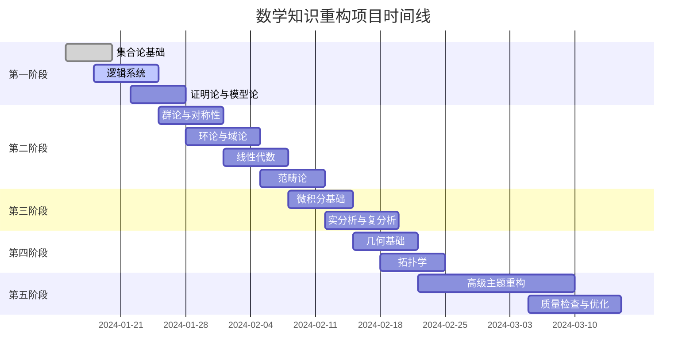

# 数学知识体系梳理总览

## 目录

- [数学知识体系梳理总览](#数学知识体系梳理总览)
  - [目录](#目录)
  - [1. 项目概述](#1-项目概述)
    - [1.1 项目目标](#11-项目目标)
    - [1.2 重构原则](#12-重构原则)
  - [2. 知识体系分析](#2-知识体系分析)
    - [2.1 内容统计](#21-内容统计)
    - [2.2 核心主题识别](#22-核心主题识别)
      - [2.2.1 基础理论层](#221-基础理论层)
      - [2.2.2 代数理论层](#222-代数理论层)
      - [2.2.3 分析理论层](#223-分析理论层)
      - [2.2.4 几何拓扑层](#224-几何拓扑层)
      - [2.2.5 数系演化层](#225-数系演化层)
      - [2.2.6 元数学层](#226-元数学层)
      - [2.2.7 应用联系层](#227-应用联系层)
      - [2.2.8 哲学反思层](#228-哲学反思层)
  - [3. 主题分类与映射](#3-主题分类与映射)
    - [3.1 重构目录结构](#31-重构目录结构)
    - [3.2 内容映射表](#32-内容映射表)
  - [4. 重构计划](#4-重构计划)
    - [4.1 第一阶段：基础理论重构（1-2周）](#41-第一阶段基础理论重构1-2周)
      - [4.1.1 集合论基础（优先级：极高）](#411-集合论基础优先级极高)
      - [4.1.2 逻辑系统（优先级：极高）](#412-逻辑系统优先级极高)
      - [4.1.3 证明论与模型论（优先级：高）](#413-证明论与模型论优先级高)
    - [4.2 第二阶段：代数理论重构（2-3周）](#42-第二阶段代数理论重构2-3周)
      - [4.2.1 群论与对称性（优先级：高）](#421-群论与对称性优先级高)
      - [4.2.2 环论与域论（优先级：高）](#422-环论与域论优先级高)
      - [4.2.3 线性代数（优先级：中）](#423-线性代数优先级中)
      - [4.2.4 范畴论（优先级：中）](#424-范畴论优先级中)
    - [4.3 第三阶段：分析理论重构（2-3周）](#43-第三阶段分析理论重构2-3周)
      - [4.3.1 微积分基础（优先级：极高）](#431-微积分基础优先级极高)
      - [4.3.2 实分析与复分析（优先级：高）](#432-实分析与复分析优先级高)
    - [4.4 第四阶段：几何拓扑重构（1-2周）](#44-第四阶段几何拓扑重构1-2周)
      - [4.4.1 几何基础（优先级：中）](#441-几何基础优先级中)
      - [4.4.2 拓扑学（优先级：中）](#442-拓扑学优先级中)
    - [4.5 第五阶段：高级主题重构（2-3周）](#45-第五阶段高级主题重构2-3周)
      - [4.5.1 数系与结构演化（优先级：中）](#451-数系与结构演化优先级中)
      - [4.5.2 元数学与形式化（优先级：中）](#452-元数学与形式化优先级中)
      - [4.5.3 跨学科应用（优先级：低）](#453-跨学科应用优先级低)
      - [4.5.4 认知与哲学反思（优先级：低）](#454-认知与哲学反思优先级低)
  - [5. 质量保证](#5-质量保证)
    - [5.1 内容质量标准](#51-内容质量标准)
    - [5.2 持续改进机制](#52-持续改进机制)
    - [5.3 进度跟踪](#53-进度跟踪)

---

## 1. 项目概述

### 1.1 项目目标

对 `/Math` 目录下的所有数学知识内容进行：

- **系统性梳理**：识别所有主题和概念
- **批判性分析**：评估内容质量和一致性
- **规范化重构**：建立标准化的知识体系
- **持续演进**：建立可持续的知识管理体系

### 1.2 重构原则

1. **学术规范性**：符合数学学术标准
2. **形式化表达**：严格的数学符号和证明
3. **多表征体系**：文字、符号、图表、算法
4. **知识网络化**：清晰的概念层次和关联
5. **持续改进**：支持中断恢复和版本控制

## 2. 知识体系分析

### 2.1 内容统计

| 目录 | 文件数量 | 主要主题 | 内容深度 |
| ---- | ---- | ---- | ---- |
| 根目录 | 7个核心文件 | 概念分析、逻辑、联系 | 极高 |
| Algebra | 9个文件 | 抽象代数、范畴论 | 极高 |
| Calculus | 30个文件 | 微积分、数系演化 | 极高 |
| Geometry | 15个文件 | 几何学、拓扑学 | 极高 |
| MetaMath | 10个子目录 | 元数学、形式化 | 极高 |
| 批判性分析 | 4个文件 | 哲学反思 | 高 |

### 2.2 核心主题识别

#### 2.2.1 基础理论层

- **逻辑系统**：命题逻辑、谓词逻辑、模态逻辑
- **集合论**：朴素集合论、公理化集合论
- **证明论**：形式化证明、证明助手
- **模型论**：语义学、模型理论

#### 2.2.2 代数理论层

- **群论**：群、子群、同态、对称性
- **环论与域论**：环、域、理想、商环
- **线性代数**：向量空间、矩阵、线性变换
- **范畴论**：范畴、函子、自然变换

#### 2.2.3 分析理论层

- **微积分**：极限、连续性、微分、积分
- **实分析**：实数理论、测度论、泛函分析
- **复分析**：复变函数、解析函数
- **非标准分析**：超实数、非标准微积分

#### 2.2.4 几何拓扑层

- **几何学**：欧几里得几何、非欧几何
- **拓扑学**：拓扑空间、同伦论
- **微分几何**：流形、张量、联络

#### 2.2.5 数系演化层

- **数系发展**：自然数→整数→有理数→实数→复数
- **代数结构**：四元数、八元数、超复数
- **认知结构**：数学概念的心理表征

#### 2.2.6 元数学层

- **形式化系统**：公理化、一致性、完备性
- **计算理论**：可计算性、复杂性
- **概率论**：概率空间、随机变量

#### 2.2.7 应用联系层

- **物理学应用**：量子力学、相对论
- **计算机科学**：算法、数据结构
- **经济学**：博弈论、优化理论

#### 2.2.8 哲学反思层

- **数学哲学**：柏拉图主义、形式主义
- **认知科学**：数学思维、概念形成
- **批判性思维**：数学的边界与局限

## 3. 主题分类与映射

### 3.1 重构目录结构

```text
/01-核心内容/Refactor/
├── 01-数学基础与逻辑/
│   ├── 01-集合论基础/
│   ├── 02-逻辑系统/
│   ├── 03-证明论/
│   └── 04-模型论/
├── 02-代数结构与理论/
│   ├── 01-群论与对称性/
│   ├── 02-环论与域论/
│   ├── 03-线性代数/
│   ├── 04-范畴论/
│   └── 05-抽象代数应用/
├── 03-微积分与分析/
│   ├── 01-极限与连续性/
│   ├── 02-微分学/
│   ├── 03-积分学/
│   ├── 04-多变量微积分/
│   ├── 05-实分析/
│   └── 06-复分析/
├── 04-几何与拓扑/
│   ├── 01-几何基础/
│   ├── 02-拓扑学/
│   ├── 03-微分几何/
│   └── 04-代数几何/
├── 05-数系与结构演化/
│   ├── 01-数系发展史/
│   ├── 02-代数结构演化/
│   ├── 03-认知结构分析/
│   └── 04-形式化演进/
├── 06-元数学与形式化/
│   ├── 01-形式化系统/
│   ├── 02-计算理论/
│   ├── 03-概率论基础/
│   └── 04-信息论/
├── 07-跨学科应用与联系/
│   ├── 01-物理学应用/
│   ├── 02-计算机科学应用/
│   ├── 03-经济学应用/
│   └── 04-其他学科应用/
└── 08-认知与哲学反思/
    ├── 01-数学哲学/
    ├── 02-认知科学/
    ├── 03-批判性思维/
    └── 04-数学教育/
```

### 3.2 内容映射表

| 原文件/目录 | 重构主题 | 优先级 | 状态 |
| ---- | ---- | ---- | ---- |
| 数学核心概念分析.md | 01-数学基础与逻辑 | 高 | 待重构 |
| 数学逻辑.md | 01-数学基础与逻辑 | 高 | 待重构 |
| 数学概念联系.md | 08-认知与哲学反思 | 中 | 待重构 |
| Algebra/ | 02-代数结构与理论 | 高 | 部分完成 |
| Calculus/ | 03-微积分与分析 | 高 | 部分完成 |
| Geometry/ | 04-几何与拓扑 | 中 | 待开始 |
| MetaMath/ | 06-元数学与形式化 | 高 | 待开始 |
| 批判性分析/ | 08-认知与哲学反思 | 中 | 待开始 |

## 4. 重构计划

### 4.1 第一阶段：基础理论重构（1-2周）

**目标**：完成数学基础与逻辑的全面重构

#### 4.1.1 集合论基础（优先级：极高）

- 从 `数学核心概念分析.md` 提取集合论内容
- 从 `MetaMath/Set/` 目录整合集合论材料
- 建立完整的集合论知识体系
- 包含朴素集合论和公理化集合论

#### 4.1.2 逻辑系统（优先级：极高）

- 从 `数学逻辑.md` 提取逻辑内容
- 从 `MetaMath/Logic/` 目录整合逻辑材料
- 建立命题逻辑、谓词逻辑、模态逻辑体系
- 包含形式化证明和推理规则

#### 4.1.3 证明论与模型论（优先级：高）

- 从 `MetaMath/Proof/` 和 `MetaMath/Model/` 整合材料
- 建立形式化证明体系
- 包含证明助手和模型理论

### 4.2 第二阶段：代数理论重构（2-3周）

**目标**：完成代数结构与理论的全面重构

#### 4.2.1 群论与对称性（优先级：高）

- 从 `Algebra/` 目录提取群论内容
- 建立群、子群、同态、对称性理论
- 包含应用案例和计算示例

#### 4.2.2 环论与域论（优先级：高）

- 从 `Algebra/` 目录提取环论和域论内容
- 建立环、域、理想、商环理论
- 包含代数几何基础

#### 4.2.3 线性代数（优先级：中）

- 从 `Algebra/` 目录提取线性代数内容
- 建立向量空间、矩阵、线性变换理论
- 包含数值计算和应用

#### 4.2.4 范畴论（优先级：中）

- 从 `MetaMath/Category/` 目录整合材料
- 建立范畴、函子、自然变换理论
- 包含高阶抽象和现代数学视角

### 4.3 第三阶段：分析理论重构（2-3周）

**目标**：完成微积分与分析的全面重构

#### 4.3.1 微积分基础（优先级：极高）

- 从 `Calculus/` 目录提取微积分内容
- 建立极限、连续性、微分、积分理论
- 包含标准微积分和非标准微积分

#### 4.3.2 实分析与复分析（优先级：高）

- 从 `Calculus/` 目录提取分析内容
- 建立实数理论、测度论、复变函数理论
- 包含泛函分析和解析函数

### 4.4 第四阶段：几何拓扑重构（1-2周）

**目标**：完成几何与拓扑的全面重构

#### 4.4.1 几何基础（优先级：中）

- 从 `Geometry/` 目录提取几何内容
- 建立欧几里得几何和非欧几何理论
- 包含几何变换和对称性

#### 4.4.2 拓扑学（优先级：中）

- 从 `Geometry/` 目录提取拓扑内容
- 建立拓扑空间、同伦论理论
- 包含代数拓扑基础

### 4.5 第五阶段：高级主题重构（2-3周）

**目标**：完成剩余主题的全面重构

#### 4.5.1 数系与结构演化（优先级：中）

- 从 `Calculus/` 目录提取数系演化内容
- 建立数系发展史和代数结构演化理论
- 包含认知结构分析

#### 4.5.2 元数学与形式化（优先级：中）

- 从 `MetaMath/` 目录整合剩余材料
- 建立形式化系统、计算理论、概率论
- 包含信息论和复杂性理论

#### 4.5.3 跨学科应用（优先级：低）

- 从各目录提取应用内容
- 建立物理学、计算机科学、经济学应用
- 包含其他学科的应用案例

#### 4.5.4 认知与哲学反思（优先级：低）

- 从 `批判性分析/` 目录整合材料
- 建立数学哲学、认知科学、批判性思维
- 包含数学教育理论

## 5. 质量保证

### 5.1 内容质量标准

1. **形式化规范**：
   - 数学符号使用标准LaTeX格式
   - 定理证明严格遵循逻辑规则
   - 定义准确、无歧义

2. **知识完整性**：
   - 概念定义完整
   - 定理证明详细
   - 应用案例丰富
   - 历史背景清晰

3. **结构一致性**：
   - 术语使用统一
   - 符号表示一致
   - 引用格式规范
   - 目录结构清晰

4. **多表征表达**：
   - 文字描述清晰
   - 数学符号准确
   - 图表说明直观
   - 算法描述详细

### 5.2 持续改进机制

1. **版本控制**：
   - 每个主题独立版本管理
   - 变更记录详细
   - 回滚机制完善

2. **质量检查**：
   - 内容一致性检查
   - 数学符号验证
   - 链接有效性检查
   - 格式规范性检查

3. **反馈机制**：
   - 用户反馈收集
   - 专家评审意见
   - 持续优化改进

### 5.3 进度跟踪



---

**项目状态**：🚀 激情启动中

**下一步行动**：开始第一阶段的基础理论重构，优先完成集合论和逻辑系统的重构工作。
