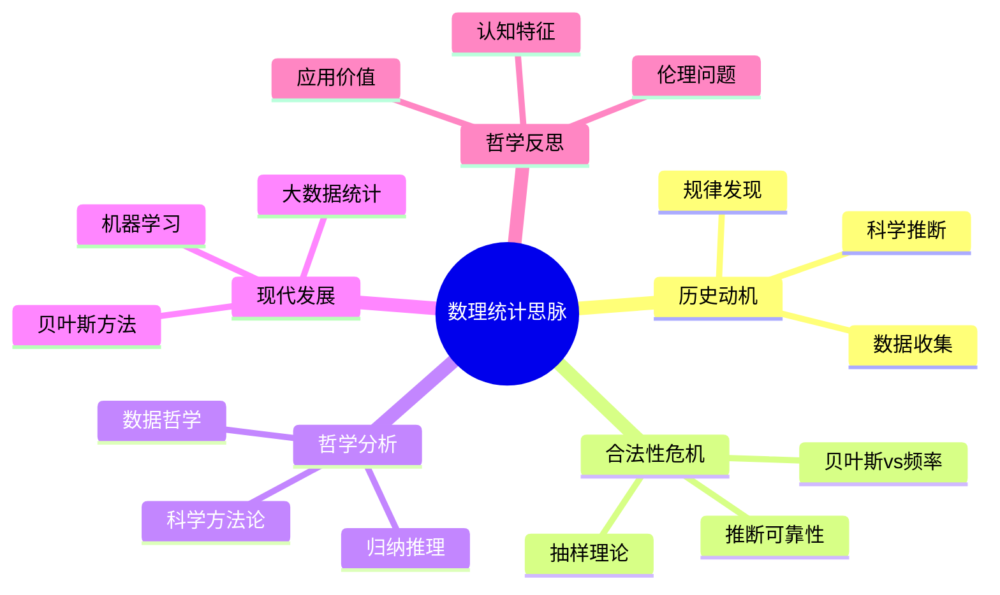

# 数理统计思脉

## 目录

- [数理统计思脉](#数理统计思脉)
  - [目录](#目录)
  - [认知结构分析](#认知结构分析)
  - [思维导图](#思维导图)
  - [多表征补充](#多表征补充)
  - [多视角叙述](#多视角叙述)
  - [1. 历史动机](#1-历史动机)
    - [1.1. 数据收集的需求](#11-数据收集的需求)
    - [1.2. 科学推断的发展](#12-科学推断的发展)
  - [2. 合法性危机](#2-合法性危机)
    - [2.1. 抽样理论的挑战](#21-抽样理论的挑战)
    - [2.2. 推断可靠性的争议](#22-推断可靠性的争议)
  - [3. 哲学分析](#3-哲学分析)
    - [3.1. 归纳推理的哲学](#31-归纳推理的哲学)
    - [3.2. 科学方法论](#32-科学方法论)
  - [4. 现代发展](#4-现代发展)
    - [4.1. 贝叶斯统计](#41-贝叶斯统计)
    - [4.2. 大数据统计](#42-大数据统计)
  - [5. 哲学反思](#5-哲学反思)
    - [5.1. 统计的认知特征](#51-统计的认知特征)
    - [5.2. 统计的应用价值](#52-统计的应用价值)

**版本**: 1.0  
**日期**: 2025-07-04

---

## 认知结构分析

- 感知层：数据图表、统计图表、样本分布。
- 概念层：总体、样本、统计量、估计、检验。
- 结构层：抽样理论、推断统计、贝叶斯统计。
- 元认知层：统计推断的可靠性、统计误用的风险。

## 思维导图

## 多表征补充

- 图像：统计图表、分布图、置信区间图。
- 故事：讲述"从天文观测到现代统计推断"。
- 公式：中心极限定理、贝叶斯公式、假设检验。
- 隐喻：统计如"从样本看总体的望远镜"。
- 认知结构：
  - 感知：通过图表直观感受数据规律
  - 概念：统计推断的基本概念
  - 结构：统计理论体系
  - 元认知：统计推断的哲学基础

## 多视角叙述

- 历史：从天文观测到现代统计推断的发展。
- 哲学：归纳推理和科学方法论。
- 认知科学：人脑如何处理统计信息和认知偏差。
- 教育与应用：统计学在科学研究和社会决策中的应用。

## 1. 历史动机

### 1.1. 数据收集的需求

数理统计起源于对大量数据的收集和分析需求。

### 1.2. 科学推断的发展

从观测数据到科学理论的推断过程。

## 2. 合法性危机

### 2.1. 抽样理论的挑战

如何从样本推断总体？抽样的代表性问题。

### 2.2. 推断可靠性的争议

统计推断的可靠性和置信度问题。

## 3. 哲学分析

### 3.1. 归纳推理的哲学

从特殊到一般的归纳推理的哲学基础。

### 3.2. 科学方法论

统计学在科学方法论中的地位。

## 4. 现代发展

### 4.1. 贝叶斯统计

贝叶斯方法在现代统计中的应用。

### 4.2. 大数据统计

大数据时代的统计方法创新。

## 5. 哲学反思

### 5.1. 统计的认知特征

统计学习中的认知特征和挑战。

### 5.2. 统计的应用价值

统计学在科学和社会中的价值。

---

**版本**: 1.0  
**日期**: 2025-07-04
