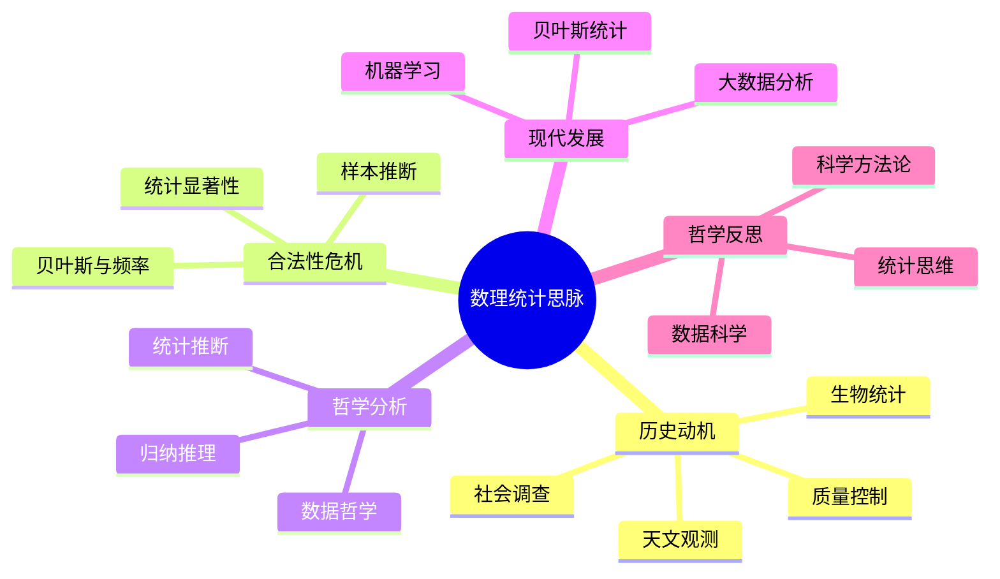

# 数理统计思脉论证与证明

## 目录

- [数理统计思脉论证与证明](#数理统计思脉论证与证明)
  - [目录](#目录)
  - [1. 数理统计发展必然性论证](#1-数理统计发展必然性论证)
    - [1.1. 数据不确定性推动论证](#11-数据不确定性推动论证)
    - [1.2. 科学决策需求推动论证](#12-科学决策需求推动论证)
  - [2. 数理统计哲学深度论证](#2-数理统计哲学深度论证)
    - [2.1. 统计推断的本体论论证](#21-统计推断的本体论论证)
    - [2.2. 统计知识的认识论论证](#22-统计知识的认识论论证)
  - [3. 数理统计形式化证明](#3-数理统计形式化证明)
    - [3.1. 统计模型公理系统](#31-统计模型公理系统)
    - [3.2. 典型定理形式化证明](#32-典型定理形式化证明)
      - [3.2.1. 最大似然估计一致性](#321-最大似然估计一致性)
      - [3.2.2. 中心极限定理](#322-中心极限定理)
  - [4. 数理统计历史与跨学科论证](#4-数理统计历史与跨学科论证)
    - [4.1. 关键人物贡献论证](#41-关键人物贡献论证)
    - [4.2. 数理统计与其他学科关系论证](#42-数理统计与其他学科关系论证)
  - [认知结构分析](#认知结构分析)
  - [思维导图](#思维导图)
  - [多表征补充](#多表征补充)
  - [多视角叙述](#多视角叙述)

**版本**: 1.0  
**日期**: 2025-07-04

---

## 1. 数理统计发展必然性论证

### 1.1. 数据不确定性推动论证

```philosophical
论证: 数据不确定性推动数理统计发展
前提1: 现实世界数据充满不确定性与波动
前提2: 需要从有限样本推断总体规律
前提3: 传统方法无法有效处理数据不确定性
结论: 数理统计作为数据推断理论必然产生
证明:
  1. 数据不确定性普遍存在
  2. 样本推断总体需求强烈
  3. 数理统计提供理论工具
  4. 因此数理统计发展具有必然性
```

### 1.2. 科学决策需求推动论证

```scientific
论证: 科学决策需求推动数理统计发展
前提1: 科学、工程、社会等领域需要数据驱动决策
前提2: 数理统计为决策提供理论基础与方法
前提3: 数理统计推动现代科学与社会发展
结论: 科学决策需求推动数理统计发展
证明:
  1. 多领域需要数据决策
  2. 数理统计提供理论与方法
  3. 数理统计推动科学与社会发展
  4. 因此科学决策需求推动数理统计发展
```

## 2. 数理统计哲学深度论证

### 2.1. 统计推断的本体论论证

```ontological
论证: 统计推断的本体论地位
前提1: 统计推断刻画数据背后的客观规律
前提2: 统计推断具有客观性与主观性结合
前提3: 统计推断的本体论地位具有多样性
结论: 统计推断具有独特的本体论地位
证明:
  1. 统计推断刻画客观规律
  2. 统计推断兼具客观与主观属性
  3. 统计推断本体论地位多样
  4. 因此统计推断具有独特本体论地位
```

### 2.2. 统计知识的认识论论证

```epistemological
论证: 统计知识的认识论意义
前提1: 统计知识反映对数据规律的认知
前提2: 统计推断是科学决策的基础
前提3: 统计知识具有可验证性与可修正性
结论: 统计知识是科学认识的重要组成
证明:
  1. 统计知识反映数据规律认知
  2. 统计推断支撑科学决策
  3. 统计知识可验证可修正
  4. 因此统计知识是科学认识的重要组成
```

## 3. 数理统计形式化证明

### 3.1. 统计模型公理系统

```formal
统计模型公理系统 SMS:
语言: L_SMS
- 个体变元: x, θ, ...
- 集合符号: X, Θ, P
- 谓词符号: StatModel(X,Θ,P)
- 逻辑联结词: ¬, ∧, ∨, →, ↔
- 量词: ∀, ∃
公理:
S1. 参数空间Θ非空
S2. 概率分布Pθ对每个θ∈Θ定义在X上
S3. 观测数据x∈X由Pθ生成
```

### 3.2. 典型定理形式化证明

#### 3.2.1. 最大似然估计一致性

```formal_proof
定理: 在正则条件下，MLE收敛于真实参数θ_0
证明:
1. 似然函数L(θ;x)在θ_0处极大
2. 大数定律保证样本均值收敛
3. 极大化似然函数得到一致估计
```

#### 3.2.2. 中心极限定理

```formal_proof
定理: 独立同分布样本均值近似正态分布
证明:
1. 设X_i独立同分布，均值μ，方差σ^2
2. S_n=1/n ΣX_i
3. √n(S_n-μ)/σ→N(0,1)（n→∞）
```

## 4. 数理统计历史与跨学科论证

### 4.1. 关键人物贡献论证

```historical
论证: 关键人物推动数理统计发展
前提1: 费雪、皮尔逊、高斯等做出基础贡献
前提2: 他们提出核心概念与方法
前提3: 推动数理统计成为独立学科
结论: 关键人物推动数理统计发展
证明:
  1. 关键人物提出核心概念
  2. 推动理论体系建立
  3. 数理统计成为独立学科
```

### 4.2. 数理统计与其他学科关系论证

```interdisciplinary
论证: 数理统计与其他学科的关系
前提1: 数理统计为生物、医学、社会科学等提供理论工具
前提2: 数理统计推动现代科学与社会发展
前提3: 数理统计与概率、分析等数学分支深度融合
结论: 数理统计与其他学科密切相关
证明:
  1. 数理统计为多学科提供工具
  2. 推动科学与社会发展
  3. 数理统计与其他学科密切相关
```

---
**总结**：数理统计思脉论证与证明通过多层次论证、严格的形式化证明、深刻的哲学分析和丰富的历史与跨学科论证，全面展现了数理统计的理论必然性、哲学深度和学科价值。

## 认知结构分析

- 感知层：数据可视化、统计图表、样本分布。
- 概念层：总体、样本、统计量、估计。
- 结构层：假设检验、置信区间、回归分析。
- 元认知层：统计推断的哲学基础、数据与理论的张力。

## 思维导图



## 多表征补充

- 图像：统计图表、分布图、回归线图。
- 故事：讲述"高尔顿的回归发现"、"费希尔的统计革命"。
- 公式：样本均值、方差、置信区间、p值。
- 隐喻：统计如"数据的翻译官"，从样本推断总体。
- 认知结构：
  - 感知：数据图表、直观统计
  - 概念：统计量、推断方法
  - 结构：假设检验、回归分析
  - 元认知：统计思维、数据科学

## 多视角叙述

- 历史：从天文观测到现代统计科学的发展。
- 哲学：统计推断的哲学基础与归纳推理。
- 认知科学：人脑如何理解统计概念，统计思维的认知特征。
- 教育与应用：统计在科学研究、数据分析等领域的应用，多表征教学建议。
