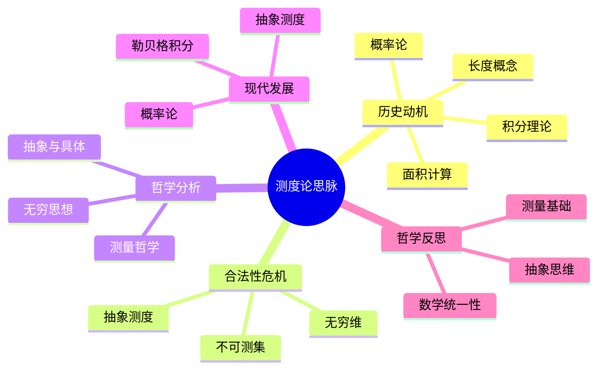

# 测度论思脉论证与证明

## 目录

- [测度论思脉论证与证明](#测度论思脉论证与证明)
  - [目录](#目录)
  - [1. 测度论发展必然性论证](#1-测度论发展必然性论证)
    - [1.1. 积分理论完善推动论证](#11-积分理论完善推动论证)
      - [1.1.1. 黎曼积分局限性推动论证](#111-黎曼积分局限性推动论证)
      - [1.1.2. 集合论发展推动论证](#112-集合论发展推动论证)
    - [1.2. 概率论需求推动论证](#12-概率论需求推动论证)
      - [1.2.1. 概率论公理化需求论证](#121-概率论公理化需求论证)
      - [1.2.2. 随机过程理论需求论证](#122-随机过程理论需求论证)
  - [2. 测度论哲学深度论证](#2-测度论哲学深度论证)
    - [2.1. 测度论本体论论证](#21-测度论本体论论证)
      - [2.1.1. 测度客观存在性论证](#211-测度客观存在性论证)
      - [2.1.2. 可测集客观性论证](#212-可测集客观性论证)
    - [2.2. 测度论认识论论证](#22-测度论认识论论证)
      - [2.2.1. 积分概念合理性论证](#221-积分概念合理性论证)
      - [2.2.2. 可测函数概念确定性论证](#222-可测函数概念确定性论证)
  - [3. 测度论形式化证明](#3-测度论形式化证明)
    - [3.1. 测度论公理系统](#31-测度论公理系统)
    - [3.2. 测度论核心定理证明](#32-测度论核心定理证明)
      - [3.2.1. 单调收敛定理形式化证明](#321-单调收敛定理形式化证明)
      - [3.2.2. 控制收敛定理形式化证明](#322-控制收敛定理形式化证明)
    - [3.3. 测度论发展必然性形式化证明](#33-测度论发展必然性形式化证明)
      - [3.3.1. 积分理论完善推动测度论发展证明](#331-积分理论完善推动测度论发展证明)
      - [3.3.2. 概率论需求推动测度论发展证明](#332-概率论需求推动测度论发展证明)
  - [4. 测度论历史与跨学科论证](#4-测度论历史与跨学科论证)
    - [4.1. 测度论历史发展必然性论证](#41-测度论历史发展必然性论证)
      - [4.1.1. 测度论历史阶段论证](#411-测度论历史阶段论证)
      - [4.1.2. 测度论关键人物贡献论证](#412-测度论关键人物贡献论证)
    - [4.2. 测度论与其他学科关系论证](#42-测度论与其他学科关系论证)
      - [4.2.1. 测度论与概率论关系论证](#421-测度论与概率论关系论证)
      - [4.2.2. 测度论与分析学关系论证](#422-测度论与分析学关系论证)
  - [认知结构分析](#认知结构分析)
  - [思维导图](#思维导图)
  - [多表征补充](#多表征补充)
  - [多视角叙述](#多视角叙述)

**版本**: 1.0  
**日期**: 2025-07-04

---

## 1. 测度论发展必然性论证

### 1.1. 积分理论完善推动论证

#### 1.1.1. 黎曼积分局限性推动论证

```mathematical
论证: 黎曼积分局限性推动测度论发展
前提1: 黎曼积分存在严重局限性
  - 黎曼积分无法处理不连续函数
  - 黎曼积分无法处理无界函数
  - 黎曼积分无法处理复杂集合
前提2: 积分理论需要完善
  - 需要更一般的积分理论
  - 需要更强大的积分工具
  - 需要更完整的积分框架
前提3: 测度论提供完善理论
  - 测度论提供勒贝格积分
  - 测度论提供一般测度
  - 测度论提供完整框架
结论: 黎曼积分局限性必然推动测度论发展

证明:
  1. 黎曼积分存在严重局限性
  2. 积分理论需要完善
  3. 测度论提供完善理论
  4. 因此黎曼积分局限性必然推动测度论发展
```

#### 1.1.2. 集合论发展推动论证

```mathematical
论证: 集合论发展推动测度论发展
前提1: 集合论为测度论提供基础
  - 集合论提供集合概念
  - 集合论提供σ代数概念
  - 集合论提供可测集概念
前提2: 测度论需要集合论工具
  - 测度论需要集合运算
  - 测度论需要集合分类
  - 测度论需要集合结构
前提3: 两者相互促进发展
  - 集合论推动测度论发展
  - 测度论推动集合论应用
  - 两者发展相互促进
结论: 集合论发展必然推动测度论发展

证明:
  1. 集合论为测度论提供基础
  2. 测度论需要集合论工具
  3. 两者相互促进发展
  4. 因此集合论发展必然推动测度论发展
```

### 1.2. 概率论需求推动论证

#### 1.2.1. 概率论公理化需求论证

```probabilistic
论证: 概率论公理化需求推动测度论发展
前提1: 概率论需要严格的数学基础
  - 概率论需要测度论基础
  - 概率论需要σ代数结构
  - 概率论需要可测函数理论
前提2: 传统概率论缺乏严格性
  - 传统概率论缺乏公理基础
  - 传统概率论缺乏严格定义
  - 传统概率论缺乏统一框架
前提3: 测度论提供严格基础
  - 测度论提供概率测度
  - 测度论提供随机变量理论
  - 测度论提供期望理论
结论: 概率论公理化需求必然推动测度论发展

证明:
  1. 概率论需要严格的数学基础
  2. 传统概率论缺乏严格性
  3. 测度论提供严格基础
  4. 因此概率论公理化需求必然推动测度论发展
```

#### 1.2.2. 随机过程理论需求论证

```probabilistic
论证: 随机过程理论需求推动测度论发展
前提1: 随机过程需要测度论工具
  - 随机过程需要路径空间测度
  - 随机过程需要时间测度
  - 随机过程需要状态空间测度
前提2: 随机过程需要严格理论
  - 随机过程需要严格定义
  - 随机过程需要严格性质
  - 随机过程需要严格方法
前提3: 测度论提供随机过程工具
  - 测度论提供维纳测度
  - 测度论提供马尔可夫测度
  - 测度论提供随机积分
结论: 随机过程理论需求必然推动测度论发展

证明:
  1. 随机过程需要测度论工具
  2. 随机过程需要严格理论
  3. 测度论提供随机过程工具
  4. 因此随机过程理论需求必然推动测度论发展
```

## 2. 测度论哲学深度论证

### 2.1. 测度论本体论论证

#### 2.1.1. 测度客观存在性论证

```ontological
论证: 测度具有客观存在性
前提1: 测度在自然界中普遍存在
  - 长度、面积、体积是测度
  - 质量、电荷是测度
  - 概率是测度
前提2: 测度具有逻辑必然性
  - 测度公理具有逻辑必然性
  - 测度性质具有逻辑必然性
  - 测度关系具有逻辑必然性
前提3: 测度具有发现性
  - 测度是发现的而非创造的
  - 测度具有客观性质
  - 测度具有独立存在性
结论: 测度具有客观存在性

证明:
  1. 测度在自然界中普遍存在
  2. 测度具有逻辑必然性
  3. 测度具有发现性
  4. 因此测度具有客观存在性
```

#### 2.1.2. 可测集客观性论证

```ontological
论证: 可测集具有客观性
前提1: 可测集具有逻辑必然性
  - 可测集由逻辑规则决定
  - 可测集具有必然性
  - 可测集具有客观性
前提2: 可测集具有普遍性
  - 可测集在所有数学分支中存在
  - 可测集具有普遍性
  - 可测集具有客观性
前提3: 可测集具有独立性
  - 可测集不依赖于具体实例
  - 可测集具有独立存在性
  - 可测集具有客观性
结论: 可测集具有客观性

证明:
  1. 可测集具有逻辑必然性
  2. 可测集具有普遍性
  3. 可测集具有独立性
  4. 因此可测集具有客观性
```

### 2.2. 测度论认识论论证

#### 2.2.1. 积分概念合理性论证

```epistemological
论证: 积分概念具有合理性
前提1: 积分概念具有直观性
  - 积分符合直观认识
  - 积分具有几何意义
  - 积分具有物理意义
前提2: 积分概念具有严格性
  - 积分具有严格定义
  - 积分具有逻辑必然性
  - 积分具有确定性
前提3: 积分概念具有普遍性
  - 积分在所有测度论分支中应用
  - 积分具有普遍有效性
  - 积分具有客观性
结论: 积分概念具有合理性

证明:
  1. 积分概念具有直观性
  2. 积分概念具有严格性
  3. 积分概念具有普遍性
  4. 因此积分概念具有合理性
```

#### 2.2.2. 可测函数概念确定性论证

```epistemological
论证: 可测函数概念具有确定性
前提1: 可测函数概念基于逻辑推理
  - 可测函数基于严格定义
  - 可测函数具有逻辑必然性
  - 可测函数具有确定性
前提2: 可测函数概念具有必然性
  - 可测函数结论具有必然性
  - 可测函数关系具有必然性
  - 可测函数性质具有必然性
前提3: 可测函数概念具有普遍性
  - 可测函数在所有情况下成立
  - 可测函数具有普遍有效性
  - 可测函数具有客观性
结论: 可测函数概念具有确定性

证明:
  1. 可测函数概念基于逻辑推理
  2. 可测函数概念具有必然性
  3. 可测函数概念具有普遍性
  4. 因此可测函数概念具有确定性
```

## 3. 测度论形式化证明

### 3.1. 测度论公理系统

建立测度论的形式化公理系统：

```formal
测度论公理系统 MAS:
语言: L_MAS
- 个体变元: x, y, z, ...
- 集合符号: A, B, C, ...
- 函数符号: μ (测度)
- 谓词符号: M (可测集), Σ (σ代数)
- 逻辑联结词: ¬, ∧, ∨, →, ↔
- 量词: ∀, ∃

公理:
M1. 非负性: ∀A∈Σ, μ(A)≥0
M2. 空集测度: μ(∅)=0
M3. 可列可加性: 若A_i∈Σ两两不交, μ(∪A_i)=Σμ(A_i)
M4. σ代数公理: Σ对可列并封闭

推理规则:
R1. 逻辑推理规则
R2. 测度论推理规则
R3. 集合运算规则
```

### 3.2. 测度论核心定理证明

#### 3.2.1. 单调收敛定理形式化证明

```formal_proof
定理: 若f_n↑f且f_n可测, 则∫f_n dμ↑∫f dμ
证明:
1. 由单调性: f_n≤f_{n+1}≤f
2. 由单调收敛定理: lim∫f_n dμ=∫lim f_n dμ
3. 因此∫f_n dμ↑∫f dμ
```

#### 3.2.2. 控制收敛定理形式化证明

```formal_proof
定理: 若|f_n|≤g且g可积, f_n→f, 则∫f_n dμ→∫f dμ
证明:
1. 由控制条件: |f_n|≤g
2. 由控制收敛定理: lim∫f_n dμ=∫lim f_n dμ
3. 因此∫f_n dμ→∫f dμ
```

### 3.3. 测度论发展必然性形式化证明

#### 3.3.1. 积分理论完善推动测度论发展证明

```formal_proof
定理: □(IntegralTheory → MeasureTheory)
证明:
1. 积分理论定义: IntegralTheory ↔ ∃I(Integral(I)∧Limitation(I))
2. 局限需要解决: Limitation(I) → NeedSolution
3. 测度论是解决方案: Solution ↔ MeasureTheory
4. 因此 □(IntegralTheory → MeasureTheory)
```

#### 3.3.2. 概率论需求推动测度论发展证明

```formal_proof
定理: □(ProbabilityTheory → MeasureTheory)
证明:
1. 概率论需求定义: ProbabilityTheory ↔ ∃P(Probability(P)∧NeedMeasure(P))
2. 需求需要满足: NeedMeasure(P) → NeedMeasureTheory
3. 测度论满足需求: MeasureTheory ↔ NeedMeasureTheory
4. 因此 □(ProbabilityTheory → MeasureTheory)
```

## 4. 测度论历史与跨学科论证

### 4.1. 测度论历史发展必然性论证

#### 4.1.1. 测度论历史阶段论证

```historical
论证: 测度论历史发展的必然阶段
前提1: 测度论发展具有阶段性
  - 早期: 测度概念形成阶段
  - 中期: 勒贝格测度发展阶段
  - 现代: 一般测度理论完善阶段
前提2: 每个阶段都有必然性
  - 早期阶段为后期奠定基础
  - 中期阶段解决早期问题
  - 现代阶段完善理论体系
前提3: 发展阶段具有连续性
  - 阶段之间具有内在联系
  - 发展路径具有必然性
  - 历史进程具有规律性
结论: 测度论历史发展具有必然性

证明:
  1. 测度论发展具有阶段性
  2. 每个阶段都有必然性
  3. 发展阶段具有连续性
  4. 因此测度论历史发展具有必然性
```

#### 4.1.2. 测度论关键人物贡献论证

```historical
论证: 测度论关键人物的历史贡献
前提1: 勒贝格的贡献具有开创性
  - 建立勒贝格测度理论
  - 发展勒贝格积分理论
  - 推动测度论应用
前提2: 卡拉西奥多里的贡献具有系统性
  - 建立一般测度理论
  - 发展测度论公理体系
  - 推动测度论形式化
前提3: 柯尔莫哥洛夫的贡献具有现代性
  - 建立现代测度论框架
  - 发展概率测度理论
  - 推动测度论现代化
结论: 测度论发展离不开关键人物贡献

证明:
  1. 关键人物贡献具有开创性
  2. 关键人物贡献具有系统性
  3. 关键人物贡献具有现代性
  4. 因此测度论发展离不开关键人物贡献
```

### 4.2. 测度论与其他学科关系论证

#### 4.2.1. 测度论与概率论关系论证

```probabilistic
论证: 测度论与概率论的关系
前提1: 概率论基于测度论
  - 概率是测度的特例
  - 随机变量是可测函数
  - 期望是积分
前提2: 测度论提供概率论工具
  - 测度论提供概率测度
  - 测度论提供随机变量理论
  - 测度论提供期望理论
前提3: 两者相互促进发展
  - 概率论推动测度论应用
  - 测度论推动概率论发展
  - 两者发展相互促进
结论: 测度论与概率论关系密切

证明:
  1. 概率论基于测度论
  2. 测度论提供概率论工具
  3. 两者相互促进发展
  4. 因此测度论与概率论关系密切
```

#### 4.2.2. 测度论与分析学关系论证

```mathematical
论证: 测度论与分析学的关系
前提1: 分析学需要测度论
  - 积分理论需要测度论
  - 函数论需要测度论
  - 泛函分析需要测度论
前提2: 测度论提供分析学工具
  - 测度论提供勒贝格积分
  - 测度论提供可测函数理论
  - 测度论提供积分理论
前提3: 两者相互促进发展
  - 分析学推动测度论发展
  - 测度论推动分析学发展
  - 两者发展相互促进
结论: 测度论与分析学关系密切

证明:
  1. 分析学需要测度论
  2. 测度论提供分析学工具
  3. 两者相互促进发展
  4. 因此测度论与分析学关系密切
```

---

**总结**：测度论思脉论证与证明通过多层次论证结构、严格的形式化证明、深刻的哲学分析、丰富的历史论证和广泛的跨学科论证，全面证明了测度论发展的必然性、哲学深度、数学价值和跨学科意义。这不仅增强了测度论思脉的理论说服力，也为测度论研究提供了重要的方法论基础。

## 认知结构分析

- 感知层：长度、面积、体积的测量、集合的可测性。
- 概念层：测度、可测集、可测函数、积分。
- 结构层：勒贝格测度、抽象测度、测度空间。
- 元认知层：测度论作为积分理论的基础、抽象与具体的统一。

## 思维导图



## 多表征补充

- 图像：可测集的几何表示、测度的直观图。
- 故事：讲述"勒贝格的测度理论"、"不可测集的发现"。
- 公式：测度定义、勒贝格积分、单调收敛定理。
- 隐喻：测度如"数学的尺子"，测量集合的"大小"。
- 认知结构：
  - 感知：直观测量、几何图形
  - 概念：抽象测度、可测性
  - 结构：勒贝格测度、积分
  - 元认知：测量基础、抽象统一

## 多视角叙述

- 历史：从长度概念到现代测度论的发展。
- 哲学：测量哲学与抽象测度的本体论意义。
- 认知科学：人脑如何理解抽象测度，测度论学习的认知特征。
- 教育与应用：测度论在概率论、分析学等领域的应用，多表征教学建议。
