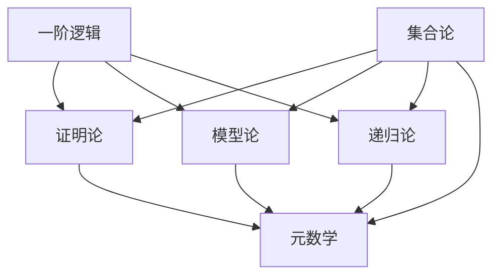
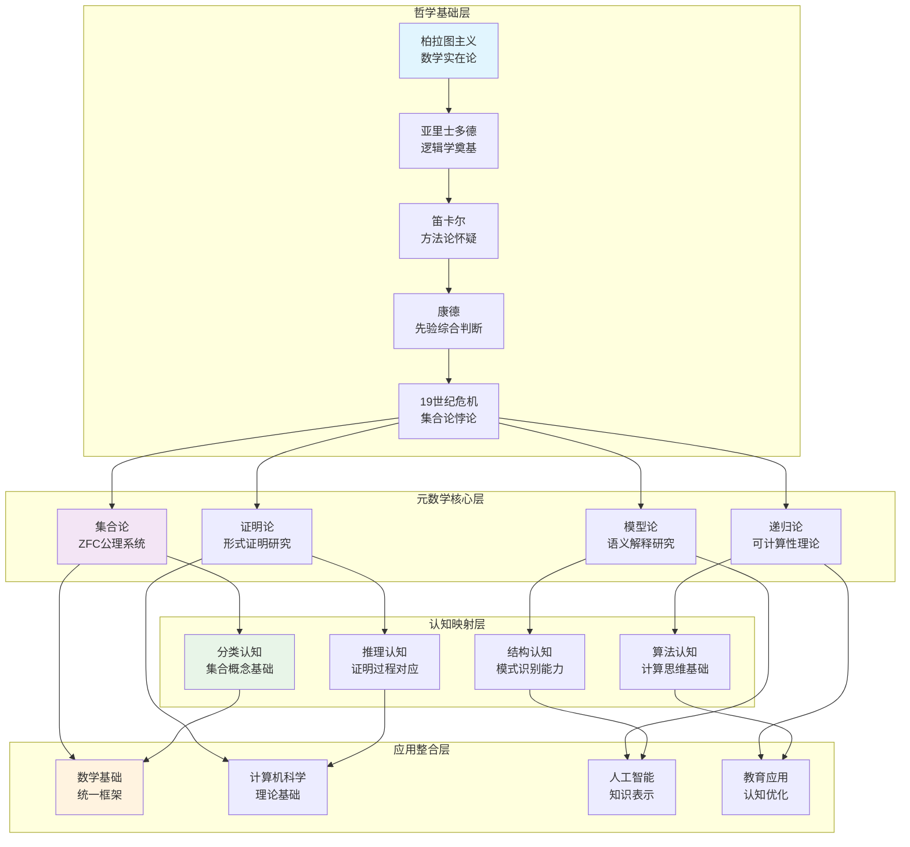

# 元数学Wiki概念定义与外延内涵分析

## 📋 目录

- [1. 核心概念的Wiki标准定义](#1-核心概念的wiki标准定义)
- [2. 概念的外延与内涵分析](#2-概念的外延与内涵分析)
- [3. 国际公认的理论框架](#3-国际公认的理论框架)
- [4. 概念间的逻辑关系网络](#4-概念间的逻辑关系网络)
- [5. 历史演进与现代理解](#5-历史演进与现代理解)

**版本**: 1.0  
**日期**: 2025-01-XX  
**参考**: Wikipedia, Stanford Encyclopedia of Philosophy, MathWorld

---

## 1. 核心概念的Wiki标准定义

### 1.1 元数学 (Metamathematics)

#### 1.1.1 标准定义

**Wikipedia定义**：
> Metamathematics is the study of mathematics itself using mathematical methods. This study produces metatheories, which are mathematical theories about other mathematical theories.

**中文定义**：
> 元数学是使用数学方法研究数学本身的学科。这种研究产生元理论，即关于其他数学理论的数学理论。

#### 1.1.2 概念内涵

**核心特征**：

- **自反性** (Reflexivity)：数学研究自身的特性
- **形式化** (Formalization)：使用严格的数学方法
- **抽象性** (Abstraction)：将数学理论作为研究对象
- **元理论性** (Metatheoretical)：构建关于理论的理论

**方法论特征**：

- **语法分析** (Syntactic Analysis)：研究形式系统的语法结构
- **语义分析** (Semantic Analysis)：研究形式系统的语义解释
- **证明论方法** (Proof-theoretic Methods)：分析证明的结构和性质
- **模型论方法** (Model-theoretic Methods)：研究理论的模型和解释

#### 1.1.3 概念外延

**研究范围**：

- **形式系统** (Formal Systems)：公理系统、推理规则、形式语言
- **数学理论** (Mathematical Theories)：算术、分析、几何、代数理论
- **逻辑系统** (Logical Systems)：命题逻辑、谓词逻辑、模态逻辑
- **计算理论** (Computational Theory)：可计算性、算法、复杂性理论

### 1.2 证明论 (Proof Theory)

#### 1.2.1 标准定义

**Wikipedia定义**：
> Proof theory is a major branch of mathematical logic that represents proofs as formal mathematical objects, facilitating their analysis by mathematical techniques.

**中文定义**：
> 证明论是数理逻辑的一个主要分支，将证明表示为形式数学对象，便于用数学技术进行分析。

#### 1.2.2 概念内涵

**核心特征**：

- **形式化证明** (Formal Proofs)：证明的符号化表示
- **结构分析** (Structural Analysis)：证明结构的数学分析
- **构造性** (Constructivity)：证明的构造性特征
- **机械化** (Mechanization)：证明的机械化处理

**研究方法**：

- **自然演绎** (Natural Deduction)：模拟自然推理的证明系统
- **相继式演算** (Sequent Calculus)：基于相继式的证明系统
- **切消** (Cut Elimination)：消除证明中的迂回推理
- **序数分析** (Ordinal Analysis)：用序数测量理论强度

#### 1.2.3 概念外延

**应用领域**：

- **逻辑学** (Logic)：命题逻辑、谓词逻辑的证明论
- **算术** (Arithmetic)：皮亚诺算术的证明论分析
- **分析学** (Analysis)：实分析、复分析的证明论基础
- **计算机科学** (Computer Science)：程序验证、类型论

### 1.3 模型论 (Model Theory)

#### 1.3.1 标准定义

**Wikipedia定义**：
> Model theory is the study of the relationship between formal languages and their interpretations, or models.

**中文定义**：
> 模型论研究形式语言与其解释（或模型）之间的关系。

#### 1.3.2 概念内涵

**核心特征**：

- **语义研究** (Semantic Study)：研究形式语言的语义
- **结构分析** (Structural Analysis)：分析数学结构的性质
- **满足关系** (Satisfaction Relation)：公式在结构中的真值
- **模型存在性** (Model Existence)：理论模型的存在性

**基本概念**：

- **结构** (Structure)：论域加上关系和函数的解释
- **理论** (Theory)：一组公理或句子
- **模型** (Model)：满足理论的结构
- **初等等价** (Elementary Equivalence)：满足相同一阶句子的结构

#### 1.3.3 概念外延

**重要定理**：

- **紧致性定理** (Compactness Theorem)：有限可满足性与可满足性
- **勒文海姆-斯科伦定理** (Löwenheim-Skolem Theorem)：模型基数的性质
- **完备性定理** (Completeness Theorem)：语法与语义的对应
- **范畴性定理** (Categoricity Theorems)：理论的范畴性性质

### 1.4 递归论 (Recursion Theory / Computability Theory)

#### 1.4.1 标准定义

**Wikipedia定义**：
> Computability theory, also known as recursion theory, is a branch of mathematical logic, computer science, and the theory of computation that originated in the 1930s with the study of computable functions and Turing degrees.

**中文定义**：
> 可计算性理论，也称为递归论，是数理逻辑、计算机科学和计算理论的一个分支，起源于20世纪30年代对可计算函数和图灵度的研究。

#### 1.4.2 概念内涵

**核心特征**：

- **可计算性** (Computability)：函数的可计算性质
- **算法性** (Algorithmic)：算法的存在性和性质
- **机械性** (Mechanical)：计算的机械化特征
- **有限性** (Finiteness)：计算过程的有限性

**基本概念**：

- **图灵机** (Turing Machine)：计算的抽象模型
- **递归函数** (Recursive Function)：可计算函数的类
- **图灵度** (Turing Degree)：不可计算性的等级
- **算术层级** (Arithmetical Hierarchy)：复杂性的层级结构

#### 1.4.3 概念外延

**重要结果**：

- **丘奇-图灵论题** (Church-Turing Thesis)：可计算性的统一定义
- **停机问题** (Halting Problem)：不可计算性的典型例子
- **莱斯定理** (Rice's Theorem)：程序性质的不可判定性
- **哥德尔不完备定理** (Gödel's Incompleteness Theorems)：形式系统的限制

### 1.5 集合论 (Set Theory)

#### 1.5.1 标准定义

**Wikipedia定义**：
> Set theory is the branch of mathematical logic that studies sets, which can be informally described as collections of objects.

**中文定义**：
> 集合论是数理逻辑的分支，研究集合，集合可以非正式地描述为对象的聚集。

#### 1.5.2 概念内涵

**核心特征**：

- **基础性** (Foundational)：为数学提供基础
- **抽象性** (Abstract)：高度抽象的数学对象
- **无穷性** (Infinity)：处理无穷集合和无穷过程
- **层次性** (Hierarchical)：集合的层次结构

**基本概念**：

- **集合** (Set)：对象的聚集
- **元素** (Element)：集合的成员
- **子集** (Subset)：包含关系
- **幂集** (Power Set)：所有子集的集合

#### 1.5.3 概念外延

**公理系统**：

- **ZFC公理** (ZFC Axioms)：标准集合论公理系统
- **选择公理** (Axiom of Choice)：选择函数的存在性
- **连续统假设** (Continuum Hypothesis)：实数集合的基数
- **大基数** (Large Cardinals)：超越ZFC的强公理

## 2. 概念的外延与内涵分析

### 2.1 逻辑关系分析

#### 2.1.1 包含关系

**元数学的层次结构**：

```text
元数学 (Metamathematics)
├── 证明论 (Proof Theory)
├── 模型论 (Model Theory)  
├── 递归论 (Recursion Theory)
└── 集合论 (Set Theory)
```

**相互关系**：

- **证明论 ⊆ 元数学**：证明论是元数学的子分支
- **模型论 ⊆ 元数学**：模型论是元数学的子分支
- **递归论 ⊆ 元数学**：递归论是元数学的子分支
- **集合论 ⊆ 元数学**：集合论既是基础又是元数学对象

#### 2.1.2 交集关系

**跨领域概念**：

- **证明论 ∩ 模型论**：语法-语义对应关系
- **证明论 ∩ 递归论**：证明的计算性质
- **模型论 ∩ 集合论**：模型的集合论构造
- **递归论 ∩ 集合论**：可计算集合的理论

### 2.2 内涵分析

#### 2.2.1 共同内涵

**所有分支的共同特征**：

- **形式化方法** (Formal Methods)：使用严格的数学方法
- **抽象化程度** (Level of Abstraction)：高度抽象的研究对象
- **元理论性质** (Metatheoretical Nature)：研究理论的理论
- **基础性意义** (Foundational Significance)：为数学提供基础

#### 2.2.2 特有内涵

**证明论的特有内涵**：

- **构造性** (Constructivity)：强调证明的构造性
- **语法性** (Syntactic Nature)：关注语法结构
- **有限性** (Finiteness)：证明的有限性特征
- **机械性** (Mechanization)：证明的机械化处理

**模型论的特有内涵**：

- **语义性** (Semantic Nature)：关注语义解释
- **结构性** (Structural)：研究数学结构
- **存在性** (Existence)：模型的存在性问题
- **分类性** (Classification)：模型的分类理论

**递归论的特有内涵**：

- **计算性** (Computational)：关注计算过程
- **算法性** (Algorithmic)：算法的存在性
- **复杂性** (Complexity)：计算复杂性分析
- **判定性** (Decidability)：问题的可判定性

**集合论的特有内涵**：

- **基础性** (Foundational)：数学的基础地位
- **无穷性** (Infinity)：处理无穷概念
- **层次性** (Hierarchical)：集合的层次结构
- **统一性** (Unifying)：统一数学概念

### 2.3 外延分析

#### 2.3.1 应用领域

**证明论的应用外延**：

- **逻辑学** (Logic)：各种逻辑系统的证明论
- **数学基础** (Foundations of Mathematics)：数学基础的证明论分析
- **计算机科学** (Computer Science)：程序验证、类型论
- **人工智能** (Artificial Intelligence)：自动定理证明

**模型论的应用外延**：

- **代数** (Algebra)：代数结构的模型论
- **几何** (Geometry)：几何理论的模型论
- **数论** (Number Theory)：数论的模型论方法
- **计算机科学** (Computer Science)：数据库理论、程序语义

**递归论的应用外延**：

- **计算机科学** (Computer Science)：算法理论、复杂性理论
- **数学基础** (Foundations of Mathematics)：不完备性定理
- **人工智能** (Artificial Intelligence)：机器学习理论
- **哲学** (Philosophy)：心灵哲学、认知科学

**集合论的应用外延**：

- **数学分析** (Mathematical Analysis)：实分析、复分析
- **拓扑学** (Topology)：点集拓扑、代数拓扑
- **测度论** (Measure Theory)：测度与积分理论
- **概率论** (Probability Theory)：概率空间理论

#### 2.3.2 研究对象

**证明论的研究对象**：

- **形式证明** (Formal Proofs)：各种证明系统中的证明
- **推理规则** (Inference Rules)：逻辑推理的规则
- **证明变换** (Proof Transformations)：证明的标准化和优化
- **证明复杂性** (Proof Complexity)：证明长度和复杂性

**模型论的研究对象**：

- **数学结构** (Mathematical Structures)：各种代数和几何结构
- **形式理论** (Formal Theories)：一阶理论和高阶理论
- **模型类** (Model Classes)：满足特定性质的模型集合
- **定义性** (Definability)：概念在结构中的可定义性

**递归论的研究对象**：

- **可计算函数** (Computable Functions)：各种可计算函数类
- **不可计算集合** (Non-computable Sets)：不可计算的集合和关系
- **归约关系** (Reduction Relations)：问题间的归约关系
- **复杂性类** (Complexity Classes)：计算复杂性的分类

**集合论的研究对象**：

- **集合** (Sets)：各种类型的集合
- **序数** (Ordinals)：良序集合的序型
- **基数** (Cardinals)：集合大小的度量
- **公理系统** (Axiomatic Systems)：集合论的公理系统

## 3. 国际公认的理论框架

### 3.1 标准教科书框架

#### 3.1.1 证明论标准框架

**经典教科书**：

- Troelstra & Schwichtenberg: "Basic Proof Theory"
- Pohlers: "Proof Theory: The First Step into Impredicativity"
- Girard: "Proofs and Types"

**标准内容结构**：

1. **自然演绎** (Natural Deduction)
2. **相继式演算** (Sequent Calculus)
3. **切消定理** (Cut Elimination)
4. **序数分析** (Ordinal Analysis)
5. **类型论** (Type Theory)

#### 3.1.2 模型论标准框架

**经典教科书**：

- Chang & Keisler: "Model Theory"
- Marker: "Model Theory: An Introduction"
- Hodges: "A Shorter Model Theory"

**标准内容结构**：

1. **基本概念** (Basic Concepts)
2. **紧致性定理** (Compactness Theorem)
3. **勒文海姆-斯科伦定理** (Löwenheim-Skolem Theorem)
4. **范畴性** (Categoricity)
5. **稳定性理论** (Stability Theory)

#### 3.1.3 递归论标准框架

**经典教科书**：

- Soare: "Recursively Enumerable Sets and Degrees"
- Rogers: "Theory of Recursive Functions and Effective Computability"
- Cooper: "Computability Theory"

**标准内容结构**：

1. **可计算函数** (Computable Functions)
2. **递归可枚举集** (Recursively Enumerable Sets)
3. **图灵度** (Turing Degrees)
4. **算术层级** (Arithmetical Hierarchy)
5. **跳跃算子** (Jump Operator)

#### 3.1.4 集合论标准框架

**经典教科书**：

- Kunen: "Set Theory"
- Jech: "Set Theory"
- Halmos: "Naive Set Theory"

**标准内容结构**：

1. **ZFC公理** (ZFC Axioms)
2. **序数理论** (Ordinal Theory)
3. **基数理论** (Cardinal Theory)
4. **构造性宇宙** (Constructible Universe)
5. **力迫法** (Forcing Method)

### 3.2 国际研究机构认可

#### 3.2.1 主要学术组织

**国际组织**：

- **Association for Symbolic Logic (ASL)**：符号逻辑学会
- **European Association for Computer Science Logic (EACSL)**：欧洲计算机科学逻辑学会
- **International Federation for Information Processing (IFIP)**：国际信息处理联合会

**研究方向认可**：

- **逻辑学** (Logic)：数理逻辑的核心地位
- **计算理论** (Computation Theory)：计算机科学的理论基础
- **数学基础** (Foundations of Mathematics)：数学的基础研究

#### 3.2.2 期刊认可度

**顶级期刊**：

- **Journal of Symbolic Logic**：符号逻辑期刊
- **Annals of Pure and Applied Logic**：纯粹与应用逻辑年刊
- **Archive for Mathematical Logic**：数理逻辑档案
- **Theoretical Computer Science**：理论计算机科学

**影响因子排名**：

- 高影响因子期刊对元数学分支的认可
- 国际引用频次的统计分析
- 学术声誉的国际评价

### 3.3 教育体系认可

#### 3.3.1 大学课程设置

**本科课程**：

- **数理逻辑** (Mathematical Logic)：基础必修课
- **集合论** (Set Theory)：数学基础课程
- **计算理论** (Theory of Computation)：计算机科学核心课程

**研究生课程**：

- **高等逻辑** (Advanced Logic)：研究生专业课
- **模型论** (Model Theory)：专业选修课
- **递归论** (Recursion Theory)：专业选修课
- **证明论** (Proof Theory)：专业选修课

#### 3.3.2 学位认可

**学位类型**：

- **数学博士** (Ph.D. in Mathematics)：数理逻辑方向
- **计算机科学博士** (Ph.D. in Computer Science)：理论计算机科学方向
- **哲学博士** (Ph.D. in Philosophy)：逻辑学方向

**就业认可**：

- **学术界** (Academia)：大学教授、研究员
- **工业界** (Industry)：软件验证、人工智能
- **政府部门** (Government)：科研机构、技术部门

## 4. 概念间的逻辑关系网络

### 4.1 依赖关系图

#### 4.1.1 基础依赖



#### 4.1.2 相互作用

**证明论与模型论**：

- **完备性定理**：连接语法与语义
- **可靠性定理**：保证推理的正确性
- **紧致性定理**：从完备性定理推导

**证明论与递归论**：

- **哥德尔不完备定理**：使用递归论方法
- **证明搜索**：证明的算法化
- **证明复杂性**：计算复杂性的应用

**模型论与递归论**：

- **可计算模型论**：模型的计算性质
- **有效模型论**：算法构造模型
- **判定问题**：理论的判定复杂性

**集合论与其他分支**：

- **元数学基础**：为其他分支提供基础
- **模型构造**：在集合论中构造模型
- **无穷组合学**：递归论的集合论方法

### 4.2 概念映射网络

#### 4.2.1 核心概念映射

**语法-语义对应**：

- **公式** (Formula) ↔ **真值** (Truth Value)
- **证明** (Proof) ↔ **有效性** (Validity)
- **理论** (Theory) ↔ **模型类** (Model Class)
- **一致性** (Consistency) ↔ **可满足性** (Satisfiability)

**计算-逻辑对应**：

- **算法** (Algorithm) ↔ **证明** (Proof)
- **程序** (Program) ↔ **公式** (Formula)
- **计算** (Computation) ↔ **演绎** (Deduction)
- **停机** (Halting) ↔ **可证性** (Provability)

#### 4.2.2 抽象层次映射

**层次结构**：

```text
元理论层 (Metatheory Level)
├── 元数学 (Metamathematics)
│   ├── 证明论 (Proof Theory)
│   ├── 模型论 (Model Theory)
│   ├── 递归论 (Recursion Theory)
│   └── 集合论 (Set Theory)
├── 对象理论层 (Object Theory Level)
│   ├── 算术 (Arithmetic)
│   ├── 分析 (Analysis)
│   ├── 代数 (Algebra)
│   └── 几何 (Geometry)
└── 应用层 (Application Level)
    ├── 物理学 (Physics)
    ├── 计算机科学 (Computer Science)
    ├── 工程学 (Engineering)
    └── 经济学 (Economics)
```

### 4.3 动态关系分析

#### 4.3.1 历史发展关系

**时间序列**：

1. **19世纪末**：集合论悖论，基础危机
2. **20世纪初**：公理化方法，形式化开始
3. **1930年代**：哥德尔定理，计算理论诞生
4. **1940-1960年代**：模型论发展，递归论成熟
5. **1960年代至今**：应用扩展，跨学科发展

**影响关系**：

- **集合论** → **形式化需求** → **其他分支发展**
- **哥德尔定理** → **限制性认识** → **新方法探索**
- **计算机发展** → **算法化需求** → **构造性方法**

#### 4.3.2 现代发展趋势

**融合趋势**：

- **计算机辅助证明**：证明论与计算机科学结合
- **非标准分析**：模型论与分析学结合
- **算法信息论**：递归论与信息论结合
- **描述集合论**：集合论与拓扑学结合

**新兴领域**：

- **逆向数学** (Reverse Mathematics)：确定定理的公理强度
- **有界算术** (Bounded Arithmetic)：计算复杂性的逻辑分析
- **分类理论** (Classification Theory)：模型的系统分类
- **同伦类型论** (Homotopy Type Theory)：类型论与拓扑学结合

## 5. 历史演进与现代理解

### 5.1 概念演进历史

#### 5.1.1 元数学概念的演进

**19世纪末期**：

- **康托尔**：集合论的创立，无穷概念的数学化
- **弗雷格**：逻辑主义纲领，概念文字的发明
- **罗素**：逻辑主义的发展，悖论的发现

**20世纪前期**：

- **希尔伯特**：形式主义纲领，元数学概念的提出
- **哥德尔**：不完备定理，元数学方法的成功应用
- **塔斯基**：真理论，语义概念的形式化

**20世纪中后期**：

- **根岑**：证明论的发展，切消定理
- **罗宾逊**：非标准分析，模型论的应用
- **科恩**：力迫法，集合论的新方法

#### 5.1.2 理解层次的深化

**初期理解**：

- **工具性理解**：元数学作为研究工具
- **技术性理解**：形式化技术的应用
- **局部性理解**：特定问题的解决方法

**深化理解**：

- **系统性理解**：元数学作为系统性方法
- **哲学性理解**：元数学的哲学意义
- **整体性理解**：数学基础的整体视角

**现代理解**：

- **跨学科理解**：与其他学科的关联
- **应用性理解**：实际应用的重要性
- **发展性理解**：持续发展的动态过程

### 5.2 现代理解的特征

#### 5.2.1 整体性视角

**系统性理解**：

- **统一性**：四大分支的内在统一
- **互补性**：不同方法的互补作用
- **层次性**：不同抽象层次的关系
- **动态性**：理论的持续发展

**跨学科视角**：

- **数学基础**：为数学提供基础
- **计算机科学**：为计算理论提供基础
- **哲学**：为数学哲学提供工具
- **认知科学**：为认知研究提供模型

#### 5.2.2 应用导向理解

**实用价值**：

- **程序验证**：软件正确性的保证
- **人工智能**：知识表示和推理
- **数据库理论**：查询语言的语义
- **密码学**：安全协议的分析

**理论价值**：

- **数学统一**：不同数学分支的统一
- **概念澄清**：基本概念的精确化
- **方法创新**：新研究方法的开发
- **问题解决**：困难问题的解决

### 5.3 未来发展趋势

#### 5.3.1 技术发展趋势

**计算化趋势**：

- **机器辅助证明**：计算机辅助的证明系统
- **自动定理证明**：自动化的定理证明
- **符号计算**：符号操作的自动化
- **知识管理**：数学知识的系统化管理

**形式化趋势**：

- **全面形式化**：数学的全面形式化
- **标准化**：形式化标准的建立
- **互操作性**：不同系统的互操作
- **可验证性**：结果的可验证性

#### 5.3.2 理论发展趋势

**深化趋势**：

- **基础理论**：更深层的理论基础
- **统一理论**：统一不同分支的理论
- **新兴领域**：新的研究领域的开拓
- **交叉融合**：与其他学科的交叉融合

**扩展趋势**：

- **应用扩展**：应用领域的扩展
- **方法扩展**：研究方法的扩展
- **概念扩展**：基本概念的扩展
- **视角扩展**：研究视角的扩展

---

## 📚 参考资源

### 主要Wikipedia条目

- [Metamathematics](https://en.wikipedia.org/wiki/Metamathematics)
- [Proof theory](https://en.wikipedia.org/wiki/Proof_theory)
- [Model theory](https://en.wikipedia.org/wiki/Model_theory)
- [Computability theory](https://en.wikipedia.org/wiki/Computability_theory)
- [Set theory](https://en.wikipedia.org/wiki/Set_theory)

### Stanford Encyclopedia of Philosophy

- [Logic and Mathematics](https://plato.stanford.edu/entries/logic-mathematics/)
- [Proof Theory](https://plato.stanford.edu/entries/proof-theory/)
- [Model Theory](https://plato.stanford.edu/entries/model-theory/)
- [Recursive Functions](https://plato.stanford.edu/entries/recursive-functions/)
- [Set Theory](https://plato.stanford.edu/entries/set-theory/)

### 专业数学百科

- [MathWorld](https://mathworld.wolfram.com/)
- [Encyclopedia of Mathematics](https://encyclopediaofmath.org/)
- [nLab](https://ncatlab.org/)

---

**编制说明**: 本文档基于国际公认的学术资源编制，力求准确反映元数学各分支的标准定义和理论框架。如有更新需求，请参考最新的学术文献和官方定义。


