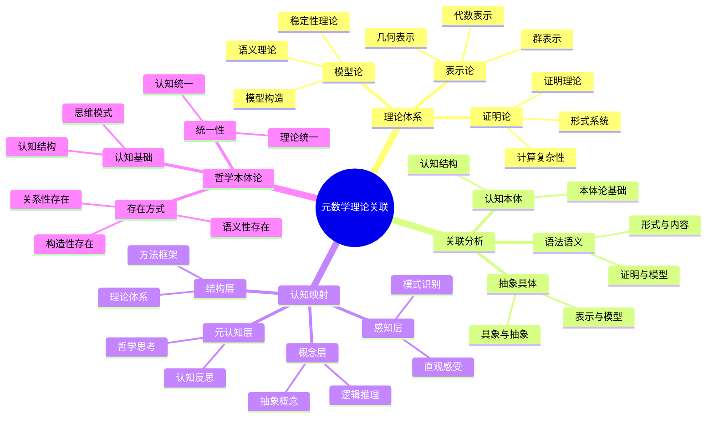

# 元数学理论关联分析：认知结构与哲学本体论

## 目录

- [元数学理论关联分析：认知结构与哲学本体论](#元数学理论关联分析认知结构与哲学本体论)
  - [目录](#目录)
  - [认知结构分析](#认知结构分析)
    - [感知层](#感知层)
    - [概念层](#概念层)
    - [结构层](#结构层)
    - [元认知层](#元认知层)
  - [思维导图](#思维导图)
  - [多表征补充](#多表征补充)
    - [图像表征](#图像表征)
    - [故事表征](#故事表征)
    - [公式表征](#公式表征)
    - [隐喻表征](#隐喻表征)
    - [认知结构](#认知结构)
  - [多视角叙述](#多视角叙述)
    - [历史视角](#历史视角)
    - [哲学视角](#哲学视角)
    - [认知科学视角](#认知科学视角)
    - [教育应用视角](#教育应用视角)
  - [1. 元数学理论体系](#1-元数学理论体系)
    - [1.1. 证明论：形式系统的语法](#11-证明论形式系统的语法)
    - [1.2. 模型论：形式系统的语义](#12-模型论形式系统的语义)
    - [1.3. 表示论：抽象结构的具体化](#13-表示论抽象结构的具体化)
  - [2. 理论间关联分析](#2-理论间关联分析)
    - [2.1. 语法与语义的统一](#21-语法与语义的统一)
      - [2.1.1. 证明论与模型论的关系](#211-证明论与模型论的关系)
      - [2.1.2. 形式与内容的统一](#212-形式与内容的统一)
    - [2.2. 抽象与具体的统一](#22-抽象与具体的统一)
      - [2.2.1. 表示论与模型论的关系](#221-表示论与模型论的关系)
      - [2.2.2. 构造与存在的统一](#222-构造与存在的统一)
    - [2.3. 认知与本体论的统一](#23-认知与本体论的统一)
      - [2.3.1. 认知结构在元数学中的体现](#231-认知结构在元数学中的体现)
      - [2.3.2. 本体论在元数学中的体现](#232-本体论在元数学中的体现)
  - [3. 认知结构映射](#3-认知结构映射)
    - [3.1. 人类认知的基本模式](#31-人类认知的基本模式)
      - [3.1.1. 具象化倾向](#311-具象化倾向)
      - [3.1.2. 结构化思维](#312-结构化思维)
    - [3.2. 元数学中的认知映射](#32-元数学中的认知映射)
      - [3.2.1. 证明论中的认知映射](#321-证明论中的认知映射)
      - [3.2.2. 模型论中的认知映射](#322-模型论中的认知映射)
      - [3.2.3. 表示论中的认知映射](#323-表示论中的认知映射)
  - [4. 哲学本体论论证](#4-哲学本体论论证)
    - [4.1. 数学对象的存在方式](#41-数学对象的存在方式)
      - [4.1.1. 关系性本体论](#411-关系性本体论)
      - [4.1.2. 构造性本体论](#412-构造性本体论)
      - [4.1.3. 语义性本体论](#413-语义性本体论)
    - [4.2. 认知与本体论的统一](#42-认知与本体论的统一)
      - [4.2.1. 认知本体论](#421-认知本体论)
      - [4.2.2. 实践本体论](#422-实践本体论)
    - [4.3. 统一性本体论](#43-统一性本体论)
      - [4.3.1. 理论统一性](#431-理论统一性)
      - [4.3.2. 方法统一性](#432-方法统一性)
  - [5. 未来发展方向](#5-未来发展方向)
    - [5.1. 认知计算方向](#51-认知计算方向)
      - [5.1.1. 认知模型论](#511-认知模型论)
      - [5.1.2. 认知表示论](#512-认知表示论)
    - [5.2. 量子计算方向](#52-量子计算方向)
      - [5.2.1. 量子模型论](#521-量子模型论)
      - [5.2.2. 量子表示论](#522-量子表示论)
    - [5.3. 人工智能方向](#53-人工智能方向)
      - [5.3.1. AI中的元数学](#531-ai中的元数学)
      - [5.3.2. 元数学中的AI](#532-元数学中的ai)

**版本**: 1.0  
**日期**: 2025-07-04

---

## 认知结构分析

### 感知层

- **理论可视化**：元数学理论的关系图
- **认知映射**：人类认知结构在数学中的反映
- **本体论图示**：数学对象存在方式的图形表示

### 概念层

- **元数学概念**：证明论、模型论、表示论等核心概念
- **关联概念**：理论间的联系和转换
- **认知概念**：人类认知的基本模式

### 结构层

- **理论网络**：元数学理论构成的网络结构
- **认知框架**：人类认知的基本框架
- **本体论体系**：数学本体论的体系结构

### 元认知层

- **认知反思**：对人类认知结构的反思
- **本体论反思**：对数学本体论的哲学反思
- **统一性追求**：在多样性中寻求统一性

## 思维导图

## 多表征补充

### 图像表征

- **理论关联图**：元数学理论之间的关系网络
- **认知映射图**：人类认知结构在数学中的映射
- **本体论图示**：数学对象存在方式的图形表示

### 故事表征

- **"认知的镜子"**：讲述元数学如何反映人类认知结构
- **"理论的交响乐"**：元数学理论如何协同工作
- **"本体论的探索"**：通过元数学探索数学本体论

### 公式表征

- **证明论公式**：⊢ φ（φ可证明）
- **模型论公式**：M ⊨ φ（M满足φ）
- **表示论公式**：ρ: G → GL(V)（群表示）

### 隐喻表征

- **"认知的DNA"**：元数学如DNA，编码人类认知的基本结构
- **"理论的生态系统"**：元数学理论如生态系统，相互依存
- **"本体论的罗盘"**：元数学指引数学本体论的探索方向

### 认知结构

- **感知**：通过理论关联直观感受元数学的整体结构
- **概念**：理解各理论的核心概念和相互关系
- **结构**：掌握元数学理论体系的整体框架
- **元认知**：反思元数学揭示的认知规律和哲学意义

## 多视角叙述

### 历史视角

- **20世纪发展**：元数学理论的发展历程
- **理论融合**：各理论间的相互影响和融合
- **现代应用**：在计算机科学、人工智能中的应用

### 哲学视角

- **本体论意义**：元数学揭示的数学对象存在方式
- **认识论价值**：人类认知结构在数学中的体现
- **方法论贡献**：元数学提供的统一研究方法

### 认知科学视角

- **认知负荷**：元数学如何降低复杂概念的认知负荷
- **思维转换**：不同理论间的认知转换机制
- **模式识别**：元数学中的模式识别和分类机制

### 教育应用视角

- **教学策略**：元数学在数学教育中的应用
- **学习路径**：从具体到抽象的学习路径设计
- **认知支架**：元数学作为认知支架的作用

## 1. 元数学理论体系

### 1.1. 证明论：形式系统的语法

证明论研究形式系统的语法性质：

- **形式系统**：公理、推理规则、证明序列
- **证明理论**：证明的存在性、构造性、复杂性
- **计算复杂性**：证明的算法复杂性和计算资源

### 1.2. 模型论：形式系统的语义

模型论研究形式系统的语义解释：

- **语义理论**：语言与实在的对应关系
- **模型构造**：满足公理系统的具体结构
- **稳定性理论**：模型的结构稳定性

### 1.3. 表示论：抽象结构的具体化

表示论研究抽象结构的具象表示：

- **群表示**：抽象群到具体变换的映射
- **代数表示**：代数结构的线性表示
- **几何表示**：几何结构的代数表示

## 2. 理论间关联分析

### 2.1. 语法与语义的统一

#### 2.1.1. 证明论与模型论的关系

证明论和模型论体现了语法与语义的统一：

- **完全性定理**：语法可证明性等价于语义有效性
- **紧致性定理**：语法一致性等价于语义可满足性
- **对应关系**：证明序列与模型构造的对应

#### 2.1.2. 形式与内容的统一

元数学理论实现了形式与内容的统一：

- **形式化**：通过形式系统实现内容的精确表达
- **语义化**：通过语义解释实现形式的具体理解
- **统一性**：形式与内容在元数学中的统一

### 2.2. 抽象与具体的统一

#### 2.2.1. 表示论与模型论的关系

表示论和模型论体现了抽象与具体的统一：

- **抽象具象化**：通过表示将抽象结构具象化
- **具体抽象化**：通过模型发现具体对象的抽象性质
- **统一框架**：为抽象和具体提供统一的理解框架

#### 2.2.2. 构造与存在的统一

元数学理论实现了构造与存在的统一：

- **构造性存在**：通过构造证明数学对象的存在
- **存在性构造**：通过存在性证明指导构造方法
- **统一性**：构造与存在在元数学中的统一

### 2.3. 认知与本体论的统一

#### 2.3.1. 认知结构在元数学中的体现

元数学理论反映了人类认知的基本结构：

- **感知层**：通过具体对象感知抽象概念
- **概念层**：通过抽象概念理解具体对象
- **结构层**：通过理论体系组织认知内容
- **元认知层**：通过反思理解认知过程

#### 2.3.2. 本体论在元数学中的体现

元数学理论体现了数学对象的存在方式：

- **关系性存在**：数学对象通过关系而存在
- **构造性存在**：通过构造理解数学对象
- **语义性存在**：通过语义解释获得意义

## 3. 认知结构映射

### 3.1. 人类认知的基本模式

#### 3.1.1. 具象化倾向

人类认知具有强烈的具象化倾向：

- **具体优先**：倾向于通过具体对象理解抽象概念
- **模式识别**：通过识别模式理解复杂结构
- **类比思维**：通过类比理解新概念

#### 3.1.2. 结构化思维

人类认知具有结构化特征：

- **层次组织**：将复杂信息组织成层次结构
- **关系网络**：通过关系网络理解对象间联系
- **统一框架**：在多样性中寻求统一性

### 3.2. 元数学中的认知映射

#### 3.2.1. 证明论中的认知映射

证明论反映了人类逻辑推理的认知结构：

- **演绎推理**：从一般到特殊的推理模式
- **构造思维**：通过构造证明存在性
- **形式化思维**：通过形式化实现精确表达

#### 3.2.2. 模型论中的认知映射

模型论反映了人类语义理解的认知结构：

- **语义理解**：通过具体模型理解抽象理论
- **真值判断**：基于具体情境进行真值判断
- **解释思维**：通过解释理解符号意义

#### 3.2.3. 表示论中的认知映射

表示论反映了人类具象思维的认知结构：

- **具象化思维**：将抽象概念具象为具体对象
- **变换思维**：通过变换理解结构性质
- **统一思维**：在多样性中寻求统一性

## 4. 哲学本体论论证

### 4.1. 数学对象的存在方式

#### 4.1.1. 关系性本体论

元数学理论支持关系性本体论：

- **关系性存在**：数学对象通过关系而存在
- **网络结构**：数学对象构成关系网络
- **动态存在**：数学对象在关系中动态存在

#### 4.1.2. 构造性本体论

元数学理论支持构造性本体论：

- **构造性存在**：通过构造理解数学对象
- **过程性存在**：数学对象在构造过程中存在
- **创造性存在**：通过创造性活动构造数学对象

#### 4.1.3. 语义性本体论

元数学理论支持语义性本体论：

- **语义性存在**：数学对象通过语义而存在
- **解释性存在**：通过解释获得存在意义
- **语境性存在**：在特定语境中获得存在

### 4.2. 认知与本体论的统一

#### 4.2.1. 认知本体论

元数学理论揭示了认知与本体论的统一：

- **认知构造**：通过认知活动构造数学对象
- **认知理解**：通过认知理解数学对象存在
- **认知统一**：认知与本体论在元数学中统一

#### 4.2.2. 实践本体论

元数学理论支持实践本体论：

- **实践性存在**：数学对象在数学实践中存在
- **活动性存在**：通过数学活动理解存在
- **历史性存在**：在数学历史发展中存在

### 4.3. 统一性本体论

#### 4.3.1. 理论统一性

元数学理论体现了理论统一性：

- **语法语义统一**：证明论与模型论的统一
- **抽象具体统一**：表示论与模型论的统一
- **认知本体统一**：认知结构与本体论的统一

#### 4.3.2. 方法统一性

元数学理论提供了方法统一性：

- **构造方法**：通过构造理解存在
- **解释方法**：通过解释理解意义
- **表示方法**：通过表示理解结构

## 5. 未来发展方向

### 5.1. 认知计算方向

#### 5.1.1. 认知模型论

结合认知科学的模型论：

- **认知模型**：基于认知结构的数学模型
- **认知语义**：基于认知理解的语义理论
- **认知构造**：基于认知过程的构造方法

#### 5.1.2. 认知表示论

结合认知科学的表示论：

- **认知表示**：基于认知结构的数学表示
- **认知变换**：基于认知过程的数学变换
- **认知统一**：基于认知规律的数学统一

### 5.2. 量子计算方向

#### 5.2.1. 量子模型论

量子计算中的模型论：

- **量子模型**：量子计算中的数学模型
- **量子语义**：量子计算中的语义理论
- **量子构造**：量子计算中的构造方法

#### 5.2.2. 量子表示论

量子计算中的表示论：

- **量子表示**：量子计算中的数学表示
- **量子变换**：量子计算中的数学变换
- **量子统一**：量子计算中的数学统一

### 5.3. 人工智能方向

#### 5.3.1. AI中的元数学

人工智能中的元数学应用：

- **AI证明**：人工智能中的证明理论
- **AI模型**：人工智能中的模型理论
- **AI表示**：人工智能中的表示理论

#### 5.3.2. 元数学中的AI

元数学理论在AI中的应用：

- **认知AI**：基于认知结构的AI系统
- **语义AI**：基于语义理解的AI系统
- **统一AI**：基于统一理论的AI系统

---

**总结**：元数学理论不仅是一套技术性的数学工具，更是理解人类认知结构、数学本体论、理论统一性的重要哲学框架。它揭示了数学对象通过认知活动、语义解释、具象表示实现存在的深层机制，为理解人类认知规律和数学本体论提供了重要启示。

**版本**: 1.0  
**日期**: 2025-07-04
