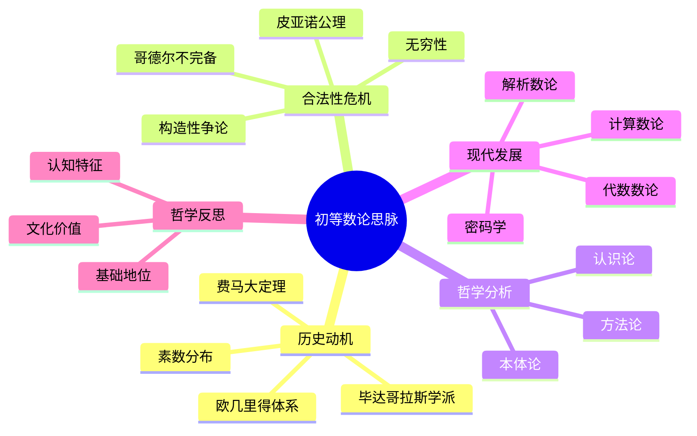

# 初等数论思脉：从素数之谜到现代密码学

## 目录

- [初等数论思脉：从素数之谜到现代密码学](#初等数论思脉从素数之谜到现代密码学)
  - [目录](#目录)
  - [认知结构分析](#认知结构分析)
  - [思维导图](#思维导图)
  - [多表征补充](#多表征补充)
  - [多视角叙述](#多视角叙述)
  - [1. 历史动机](#1-历史动机)
  - [2. 合法性危机](#2-合法性危机)
  - [3. 哲学分析](#3-哲学分析)
  - [4. 现代发展](#4-现代发展)
  - [5. 哲学反思](#5-哲学反思)

**版本**: 1.0  
**日期**: 2025-07-04

---

## 认知结构分析

- 感知层：数表、直观分解、素数筛法。
- 概念层：整除、素数、最大公因数、同余。
- 结构层：算术基本定理、同余理论、数论函数。
- 元认知层：素数分布的不可预测性、数论与密码学的联系。

## 思维导图

## 多表征补充

- 图像：素数分布的数轴图、素数间隔的可视化。
- 故事：素数像宇宙星辰，分布无序却又有规律。
- 公式：素数判别公式、欧拉积公式。
- 隐喻：素数是"数的原子"，构成所有整数。
- 认知结构：
  - 感知：通过数表直观感受素数稀疏性
  - 概念：素数定义
  - 结构：素数定理、黎曼猜想
  - 元认知：素数分布的不可预测性与人类认知的边界

## 多视角叙述

- 历史：素数观念的演变与数论发展。
- 哲学：素数的存在方式与认识论问题。
- 认知科学：人脑如何加工抽象的数论概念。
- 教育与应用：素数在密码学、信息安全中的应用，多表征提升教学效果。

## 1. 历史动机

### 1.1. 素数的神秘性

素数自古以来就吸引着数学家的注意，它们的分布规律至今仍是数学中最深奥的问题之一。

### 1.2. 费马大定理

费马大定理的证明历程体现了数论研究的深度和复杂性。

## 2. 合法性危机

### 2.1. 无穷性的挑战

数论中的无穷概念挑战了人类的直觉认知。

### 2.2. 构造性问题

数论中的存在性证明与构造性证明的张力。

## 3. 哲学分析

### 3.1. 数论的本体论

数论研究对象的本质和存在方式。

### 3.2. 数论的认识论

人类如何认识和理解数论概念。

## 4. 现代发展

### 4.1. 代数数论

将代数方法引入数论研究。

### 4.2. 解析数论

利用分析方法研究数论问题。

## 5. 哲学反思

### 5.1. 数论的基础地位

数论作为数学基础的重要地位。

### 5.2. 数论的认知特征

数论学习中的认知特征和挑战。

---

**版本**: 1.0  
**日期**: 2025-07-04
