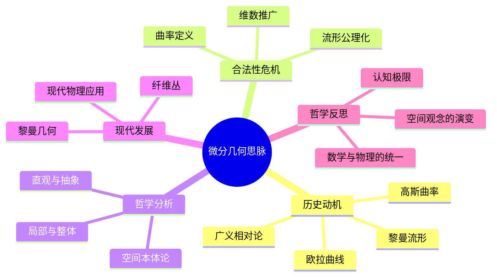

# 微分几何思脉深化：从曲线曲面到现代几何分析

## 目录

- [微分几何思脉深化：从曲线曲面到现代几何分析](#微分几何思脉深化从曲线曲面到现代几何分析)
  - [目录](#目录)
  - [认知结构分析](#认知结构分析)
  - [思维导图](#思维导图)
  - [多表征补充](#多表征补充)
  - [多视角叙述](#多视角叙述)
  - [1. 历史动机：几何直觉的数学化](#1-历史动机几何直觉的数学化)
    - [1.1. 古典微分几何的起源](#11-古典微分几何的起源)
      - [1.1.1. 欧拉的微分几何贡献](#111-欧拉的微分几何贡献)
      - [1.1.2. 蒙日的微分几何方法](#112-蒙日的微分几何方法)
    - [1.2. 高斯的内在几何学](#12-高斯的内在几何学)
      - [1.2.1. 高斯曲率的概念](#121-高斯曲率的概念)
      - [1.2.2. 高斯-博内定理](#122-高斯-博内定理)
    - [1.3. 黎曼几何的革命](#13-黎曼几何的革命)
      - [1.3.1. 黎曼的几何思想](#131-黎曼的几何思想)
      - [1.3.2. 黎曼几何的物理意义](#132-黎曼几何的物理意义)
  - [2. 合法性危机：几何基础的哲学反思](#2-合法性危机几何基础的哲学反思)
    - [2.1. 欧几里得几何的危机](#21-欧几里得几何的危机)
      - [2.1.1. 平行公理的争议](#211-平行公理的争议)
      - [2.1.2. 非欧几何的发现](#212-非欧几何的发现)
    - [2.2. 非欧几何的哲学挑战](#22-非欧几何的哲学挑战)
      - [2.2.1. 几何真理的重新定义](#221-几何真理的重新定义)
      - [2.2.2. 几何空间的本质](#222-几何空间的本质)
    - [2.3. 几何空间的本质](#23-几何空间的本质)
      - [2.3.1. 空间的数学化](#231-空间的数学化)
      - [2.3.2. 几何与代数的融合](#232-几何与代数的融合)
  - [3. 哲学分析：微分几何的多重维度](#3-哲学分析微分几何的多重维度)
    - [3.1. 本体论维度：几何对象的本质](#31-本体论维度几何对象的本质)
      - [3.1.1. 柏拉图主义观点](#311-柏拉图主义观点)
      - [3.1.2. 构造主义观点](#312-构造主义观点)
    - [3.2. 认识论维度：几何知识的性质](#32-认识论维度几何知识的性质)
      - [3.2.1. 先验知识论](#321-先验知识论)
      - [3.2.2. 经验主义观点](#322-经验主义观点)
    - [3.3. 方法论维度：几何研究的方法](#33-方法论维度几何研究的方法)
      - [3.3.1. 公理化方法](#331-公理化方法)
      - [3.3.2. 分析化方法](#332-分析化方法)
  - [4. 现代发展：从局部到整体](#4-现代发展从局部到整体)
    - [4.1. 现代微分几何的理论发展](#41-现代微分几何的理论发展)
      - [4.1.1. 纤维丛理论](#411-纤维丛理论)
      - [4.1.2. 李群与李代数](#412-李群与李代数)
    - [4.2. 几何分析的兴起](#42-几何分析的兴起)
      - [4.2.1. 偏微分方程与几何](#421-偏微分方程与几何)
      - [4.2.2. 几何测度论](#422-几何测度论)
    - [4.3. 几何拓扑的融合](#43-几何拓扑的融合)
      - [4.3.1. 低维拓扑](#431-低维拓扑)
      - [4.3.2. 高维拓扑](#432-高维拓扑)
  - [5. 哲学反思：微分几何的深层意义](#5-哲学反思微分几何的深层意义)
    - [5.1. 微分几何与物理世界](#51-微分几何与物理世界)
      - [5.1.1. 广义相对论](#511-广义相对论)
      - [5.1.2. 规范场论](#512-规范场论)
    - [5.2. 微分几何与人类认知](#52-微分几何与人类认知)
      - [5.2.1. 几何直觉](#521-几何直觉)
      - [5.2.2. 几何思维](#522-几何思维)
    - [5.3. 微分几何的统一性](#53-微分几何的统一性)
      - [5.3.1. 数学统一性](#531-数学统一性)
      - [5.3.2. 科学统一性](#532-科学统一性)

## 认知结构分析

- 感知层：曲线、曲面、空间想象。
- 概念层：切线、法线、曲率、参数方程。
- 结构层：流形、联络、度量、曲率张量。
- 元认知层：空间直观与抽象结构的张力、几何与物理的深层联系。

## 思维导图

## 多表征补充

- 图像：曲线、曲面、流形的三维可视化。
- 故事：高斯"测地线的发现"、黎曼"空间的抽象化"。
- 公式：高斯曲率公式、流形的局部坐标表示。
- 隐喻：流形如"弯曲的地毯"，局部平坦但整体弯曲。
- 认知结构：
  - 感知：空间想象、动手画图
  - 概念：切线、曲率
  - 结构：流形、联络
  - 元认知：空间直观与抽象结构的张力

## 多视角叙述

- 历史：从欧拉、高斯到黎曼的空间观念演变。
- 哲学：空间本体论与局部-整体关系。
- 认知科学：空间想象力与抽象结构的认知障碍。
- 教育与应用：微分几何在物理、工程中的应用，多表征教学建议。

**版本**: 1.0  
**日期**: 2025-07-04

---

## 1. 历史动机：几何直觉的数学化

### 1.1. 古典微分几何的起源

#### 1.1.1. 欧拉的微分几何贡献

**历史背景**：

- **时间**：18世纪
- **背景**：微积分发展，分析学兴起
- **社会环境**：启蒙运动，科学理性主义

**欧拉的原话**：
> "几何学是分析学的眼睛，分析学是几何学的手。"
> —— 欧拉，《微分几何学原理》(1760)

**主要贡献**：

- **曲线理论**：平面曲线的微分几何
- **曲面理论**：空间曲面的微分几何
- **变分法**：几何变分问题的数学处理

**哲学意义**：

- **分析化**：几何问题的分析化处理
- **工具性**：微积分作为几何研究的工具
- **统一性**：几何与分析学的统一

#### 1.1.2. 蒙日的微分几何方法

**历史背景**：

- **时间**：18-19世纪
- **背景**：法国数学学派，画法几何发展
- **社会环境**：法国大革命，工程应用需求

**蒙日的贡献**：

- **画法几何**：几何图形的投影方法
- **微分几何**：曲面的微分性质研究
- **应用几何**：几何在工程中的应用

**哲学意义**：

- **直观性**：几何直观在数学中的作用
- **应用性**：几何理论的实际应用
- **工程性**：几何与工程技术的结合

### 1.2. 高斯的内在几何学

#### 1.2.1. 高斯曲率的概念

**历史背景**：

- **时间**：19世纪初
- **背景**：德国数学学派，几何学发展
- **社会环境**：德国统一，科学现代化

**高斯的原话**：
> "几何学应该研究曲面的内在性质，而不依赖于它在空间中的位置。"
> —— 高斯，《曲面的一般研究》(1827)

**核心概念**：

- **高斯曲率**：曲面的内在几何量
- **测地线**：曲面上的最短路径
- **等距变换**：保持距离的几何变换

**哲学意义**：

- **内在性**：几何性质的内在性
- **不变性**：几何量的不变性
- **抽象性**：从具体到抽象的几何思维

#### 1.2.2. 高斯-博内定理

**定理内容**：

- **局部性质**：高斯曲率的局部性质
- **整体性质**：曲面的整体拓扑性质
- **积分关系**：局部与整体的积分关系

**哲学意义**：

- **局部与整体**：局部性质与整体性质的关系
- **积分几何**：积分在几何中的作用
- **拓扑联系**：几何与拓扑的深层联系

### 1.3. 黎曼几何的革命

#### 1.3.1. 黎曼的几何思想

**历史背景**：

- **时间**：19世纪中叶
- **背景**：德国数学学派，抽象几何发展
- **社会环境**：工业革命，科学理论化

**黎曼的原话**：
> "几何学的基础问题在于，空间在多大程度上是独立于我们对其性质的认知而存在的。"
> —— 黎曼，《关于几何学基础的假设》(1854)

**革命性贡献**：

- **黎曼度量**：抽象度量空间的概念
- **曲率张量**：高维空间的曲率概念
- **流形理论**：抽象流形的几何理论

**哲学意义**：

- **抽象化**：从具体空间到抽象流形
- **高维性**：高维几何的数学处理
- **统一性**：几何理论的统一框架

#### 1.3.2. 黎曼几何的物理意义

**爱因斯坦的应用**：

- **广义相对论**：时空的几何描述
- **引力理论**：引力作为几何效应
- **宇宙模型**：宇宙的几何结构

**哲学意义**：

- **物理几何化**：物理现象的几何描述
- **时空统一**：时间与空间的几何统一
- **宇宙观**：宇宙的几何本质

## 2. 合法性危机：几何基础的哲学反思

### 2.1. 欧几里得几何的危机

#### 2.1.1. 平行公理的争议

**历史背景**：

- **时间**：18-19世纪
- **背景**：几何基础研究，公理化方法
- **社会环境**：科学革命，理性主义

**问题本质**：

- **公理独立性**：平行公理是否独立于其他公理？
- **几何真理性**：欧几里得几何是否唯一正确？
- **空间本质**：物理空间是否欧几里得？

**哲学意义**：

- **公理选择**：几何公理的选择标准
- **几何多样性**：不同几何体系的可能性
- **物理几何**：物理空间与数学几何的关系

#### 2.1.2. 非欧几何的发现

**罗巴切夫斯基的贡献**：

- **双曲几何**：负曲率空间的几何
- **平行公理**：通过一点可引多条平行线
- **几何一致性**：非欧几何的一致性

**哲学意义**：

- **几何相对性**：几何真理的相对性
- **公理自由**：几何公理选择的自由性
- **数学创新**：数学理论的创新性

### 2.2. 非欧几何的哲学挑战

#### 2.2.1. 几何真理的重新定义

**历史争论**：

- **绝对真理**：几何是否具有绝对真理？
- **相对真理**：几何真理是否相对？
- **实用真理**：几何真理是否实用？

**哲学分析**：

- **康德观点**：几何是先验综合判断
- **经验主义**：几何基于经验观察
- **约定主义**：几何是约定的系统

#### 2.2.2. 几何空间的本质

**空间概念**：

- **物理空间**：物质存在的空间
- **数学空间**：抽象的空间概念
- **感知空间**：人类感知的空间

**哲学问题**：

- **空间实在性**：空间是否客观存在？
- **空间构造**：空间如何被构造？
- **空间认知**：人类如何认知空间？

### 2.3. 几何空间的本质

#### 2.3.1. 空间的数学化

**历史进程**：

- **欧几里得空间**：经典的空间概念
- **黎曼空间**：弯曲的空间概念
- **抽象空间**：现代抽象空间概念

**哲学意义**：

- **抽象化过程**：空间概念的抽象化
- **数学化趋势**：几何的数学化发展
- **统一性追求**：空间理论的统一性

#### 2.3.2. 几何与代数的融合

**现代发展**：

- **代数几何**：几何的代数化处理
- **微分几何**：几何的微分方法
- **拓扑几何**：几何的拓扑方法

**哲学意义**：

- **方法融合**：不同数学方法的融合
- **理论统一**：几何理论的统一
- **认知整合**：几何认知的整合

## 3. 哲学分析：微分几何的多重维度

### 3.1. 本体论维度：几何对象的本质

#### 3.1.1. 柏拉图主义观点

**核心主张**：

- **几何实在性**：几何对象是客观存在的
- **完美性**：几何对象具有完美性质
- **永恒性**：几何真理是永恒不变的

**对微分几何的意义**：

- **几何真理**：微分几何真理的客观性
- **几何美**：微分几何的审美价值
- **几何发现**：微分几何是发现而非发明

#### 3.1.2. 构造主义观点

**核心主张**：

- **几何构造性**：几何对象通过构造产生
- **心智依赖性**：几何依赖于人类心智
- **历史性**：几何具有历史发展性

**对微分几何的意义**：

- **构造方法**：微分几何的构造性方法
- **直觉基础**：微分几何的直觉基础
- **发展性**：微分几何的发展性

### 3.2. 认识论维度：几何知识的性质

#### 3.2.1. 先验知识论

**康德的观点**：

- **空间直觉**：空间是纯直觉形式
- **几何先验性**：几何知识具有先验性
- **综合判断**：几何是先验综合判断

**对微分几何的意义**：

- **直觉基础**：微分几何的直觉基础
- **先验结构**：微分几何的先验结构
- **必然性**：微分几何真理的必然性

#### 3.2.2. 经验主义观点

**密尔的主张**：

- **经验基础**：几何知识基于经验
- **归纳方法**：几何使用归纳方法
- **可修正性**：几何知识是可修正的

**对微分几何的意义**：

- **经验验证**：微分几何的经验验证
- **应用价值**：微分几何的应用价值
- **发展性**：微分几何知识的发展性

### 3.3. 方法论维度：几何研究的方法

#### 3.3.1. 公理化方法

**方法特征**：

- **公理系统**：从公理出发的演绎系统
- **严格性**：严格的逻辑推理
- **形式化**：完全形式化的处理

**在微分几何中的应用**：

- **流形公理**：流形的公理化定义
- **度量公理**：度量空间的公理化
- **曲率公理**：曲率的公理化处理

#### 3.3.2. 分析化方法

**方法特征**：

- **微积分工具**：使用微积分工具
- **局部分析**：局部性质的微分分析
- **整体积分**：整体性质的积分处理

**在微分几何中的应用**：

- **切空间**：切空间的微分分析
- **曲率张量**：曲率张量的微分计算
- **测地线**：测地线的微分方程

## 4. 现代发展：从局部到整体

### 4.1. 现代微分几何的理论发展

#### 4.1.1. 纤维丛理论

**历史背景**：

- **时间**：20世纪中叶
- **背景**：拓扑学发展，代数拓扑兴起
- **社会环境**：现代数学发展，跨学科融合

**主要概念**：

- **纤维丛**：局部平凡化的空间
- **联络**：纤维丛上的微分结构
- **曲率**：联络的曲率形式

**哲学意义**：

- **局部平凡化**：复杂结构的局部简化
- **整体性质**：整体拓扑性质的研究
- **几何统一**：几何理论的统一框架

#### 4.1.2. 李群与李代数

**历史发展**：

- **李群**：连续变换群的概念
- **李代数**：李群的无穷小结构
- **表示论**：李群的表示理论

**哲学意义**：

- **对称性**：几何中的对称性研究
- **无穷小**：无穷小变换的作用
- **代数几何**：代数与几何的结合

### 4.2. 几何分析的兴起

#### 4.2.1. 偏微分方程与几何

**发展背景**：

- **时间**：20世纪后半叶
- **背景**：分析学发展，非线性分析兴起
- **社会环境**：应用数学发展，跨学科需求

**主要领域**：

- **调和映射**：流形间的调和映射
- **极小曲面**：极小曲面的存在性
- **几何流**：几何结构的演化方程

**哲学意义**：

- **几何演化**：几何结构的动态演化
- **分析工具**：分析工具在几何中的应用
- **非线性**：非线性现象在几何中的体现

#### 4.2.2. 几何测度论

**理论框架**：

- **测度理论**：几何测度的数学理论
- **变分法**：几何变分问题的处理
- **正则性**：几何对象的正则性

**哲学意义**：

- **测度几何**：测度在几何中的作用
- **变分原理**：几何中的变分原理
- **正则性理论**：几何对象的正则性

### 4.3. 几何拓扑的融合

#### 4.3.1. 低维拓扑

**发展背景**：

- **时间**：20世纪后半叶
- **背景**：拓扑学发展，几何方法应用
- **社会环境**：数学理论发展，跨领域融合

**主要成果**：

- **三维流形**：三维流形的分类
- **纽结理论**：纽结的几何拓扑性质
- **几何化猜想**：三维流形的几何化

**哲学意义**：

- **几何拓扑**：几何与拓扑的融合
- **分类理论**：几何对象的分类
- **猜想验证**：几何猜想的验证

#### 4.3.2. 高维拓扑

**理论发展**：

- **同伦论**：高维空间的同伦理论
- **同调论**：高维空间的同调理论
- **配边理论**：高维流形的配边理论

**哲学意义**：

- **高维几何**：高维几何的数学处理
- **代数拓扑**：代数方法在拓扑中的应用
- **几何不变量**：几何对象的拓扑不变量

## 5. 哲学反思：微分几何的深层意义

### 5.1. 微分几何与物理世界

#### 5.1.1. 广义相对论

**爱因斯坦的贡献**：

- **时空几何**：时空的几何描述
- **引力几何化**：引力作为几何效应
- **宇宙模型**：宇宙的几何结构

**哲学意义**：

- **物理几何化**：物理现象的几何描述
- **时空统一**：时间与空间的几何统一
- **宇宙观**：宇宙的几何本质

#### 5.1.2. 规范场论

**现代发展**：

- **纤维丛**：规范场的几何描述
- **联络理论**：规范场的联络理论
- **几何量子化**：量子理论的几何方法

**哲学意义**：

- **几何量子化**：量子理论的几何化
- **统一场论**：物理理论的几何统一
- **数学物理**：数学与物理的深层联系

### 5.2. 微分几何与人类认知

#### 5.2.1. 几何直觉

**认知特征**：

- **空间直觉**：人类的空间直觉能力
- **几何想象**：几何对象的想象能力
- **几何推理**：几何问题的推理能力

**认知意义**：

- **认知能力**：几何对人类认知能力的体现
- **认知发展**：几何对人类认知发展的贡献
- **认知边界**：几何对人类认知边界的探索

#### 5.2.2. 几何思维

**思维特征**：

- **直观思维**：几何的直观思维特征
- **抽象思维**：几何的抽象思维特征
- **逻辑思维**：几何的逻辑思维特征

**思维意义**：

- **思维训练**：几何对思维的训练作用
- **创造力培养**：几何对创造力的培养
- **文化传承**：几何对文化的传承作用

### 5.3. 微分几何的统一性

#### 5.3.1. 数学统一性

**统一特征**：

- **代数几何**：代数与几何的统一
- **分析几何**：分析与几何的统一
- **拓扑几何**：拓扑与几何的统一

**统一意义**：

- **理论统一**：数学理论的统一性
- **方法统一**：数学方法的统一性
- **思想统一**：数学思想的统一性

#### 5.3.2. 科学统一性

**科学联系**：

- **物理几何**：物理与几何的联系
- **生物几何**：生物与几何的联系
- **信息几何**：信息与几何的联系

**统一意义**：

- **跨学科统一**：不同学科的统一性
- **方法统一**：科学方法的统一性
- **思想统一**：科学思想的统一性

---

**总结**：微分几何思脉展现了从古典微分几何到现代几何分析的完整发展脉络，体现了微分几何在数学基础、物理应用和人类认知方面的重要地位。微分几何不仅连接了古典几何与现代数学，也为理解物理世界和人类认知提供了重要的数学工具和哲学视角。
