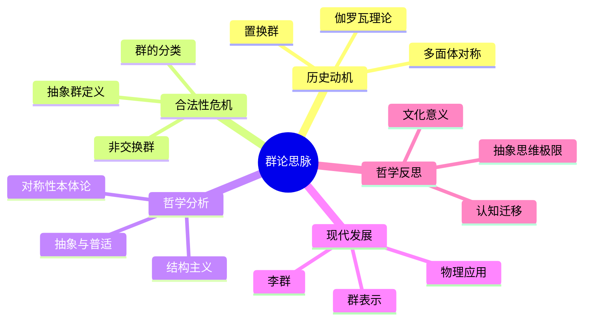

# 思脉体系多表征与认知结构补充说明

## 一、统一补充结构

1. **认知结构分析**  
   - 梳理该分支知识在大脑中的认知层级（感知→概念→结构→元认知）。
   - 指出该领域常见的认知障碍与理解难点。

2. **思维导图**  
   - 用Mermaid思维导图，展示该分支的核心内容、历史脉络、理论结构、哲学反思等。

3. **多表征补充**  
   - 文字、图像、公式、故事、隐喻等多种方式并列呈现核心概念。
   - 适当插入结构图、流程图、直观例子等。

4. **多视角叙述**  
   - 历史视角：发展脉络与动机。
   - 哲学视角：本体论、认识论、方法论。
   - 认知科学视角：人脑如何加工、理解该领域知识。
   - 教育与应用视角：教学建议、现实应用、文化价值。

---

## 二、示例：以"群论思脉"为例

### 认知结构分析

- 感知层：对称图形、实物操作（如魔方、拼图）。
- 概念层：群的定义、运算、单位元、逆元。
- 结构层：子群、陪集、同态、正规子群。
- 元认知层：群论的抽象性、对称思想的普适性、与物理/化学/信息的联系。

### 思维导图

### 多表征补充

- 图像：展示正方体、二十面体的对称操作动画或示意图。
- 故事：讲述"伽罗瓦用群论破解方程解的秘密"。
- 公式：群的四条公理、置换群的表示。
- 隐喻：群如"变换的魔法盒"，输入一个对象，输出其对称变换结果。
- 认知结构：
  - 感知：动手操作、观察对称
  - 概念：抽象定义
  - 结构：群的分解与分类
  - 元认知：对称思想的迁移与升华

### 多视角叙述

- 历史：从多面体对称到伽罗瓦理论的诞生。
- 哲学：对称性与抽象结构的本体论意义。
- 认知科学：人脑如何识别和抽象对称性，群论学习的认知障碍。
- 教育与应用：群论在物理、化学、密码学中的应用，教学中如何用多表征降低抽象门槛。

---

## 三、其他分支补充要点

- **初等数论思脉**：素数分布的直观图像、数论故事、公式与隐喻、认知误区（如"素数无规律"）。
- **微分几何思脉**：曲线曲面的直观动画、历史故事（高斯、黎曼）、公式与几何直观、空间想象的认知分析。
- **代数几何思脉**：代数方程与几何图形的多重表征、历史发展、抽象与直观的认知张力。
- **随机过程思脉**：随机漫步动画、概率树图、生活中的随机现象故事、概率直觉的认知误区。
- **分析学、测度论、泛函分析等**：极限、连续、可测性的多表征，历史与哲学反思，认知负荷分析。
- **图论、组合数学**：图的可视化、组合问题的故事化、公式与直观结合、认知策略建议。

---

## 四、统一补充说明

- 每个分支思脉文档均将新增"认知结构分析""思维导图""多表征补充""多视角叙述"四大板块。
- 所有思维导图均采用Mermaid格式，便于后续可视化。
- 多表征内容将以"图+文+公式+故事+隐喻"并列方式呈现，提升可读性与认知友好度。
- 多视角叙述将帮助读者从历史、哲学、认知、教育等多维度理解该领域。

---

如需具体某一分支的详细补充内容，请随时指定，我可逐一生成详细文本与思维导图。
如需批量生成所有分支的补充内容，也可分批输出。
