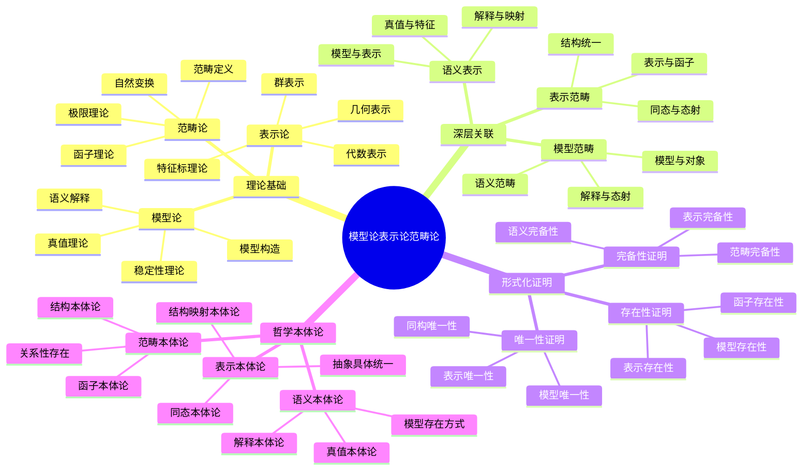

# 模型论表示论范畴论关联：深层联系与形式化证明

## 目录

- [模型论表示论范畴论关联：深层联系与形式化证明](#模型论表示论范畴论关联深层联系与形式化证明)
  - [目录](#目录)
  - [认知结构分析](#认知结构分析)
  - [思维导图](#思维导图)
  - [多表征补充](#多表征补充)
  - [多视角叙述](#多视角叙述)
  - [1. 理论基础分析](#1-理论基础分析)
  - [2. 深层关联论证](#2-深层关联论证)
  - [3. 形式化证明体系](#3-形式化证明体系)
  - [4. 哲学本体论论证](#4-哲学本体论论证)
  - [5. 应用前景与未来方向](#5-应用前景与未来方向)

**版本**: 1.0  
**日期**: 2025-07-04

---

## 认知结构分析

### 感知层

- **语义解释可视化**：模型论中的语义解释过程
- **表示映射可视化**：表示论中的抽象到具体的映射
- **范畴结构可视化**：范畴论中的对象和态射关系

### 概念层

- **语义概念**：模型、解释、真值、满足关系
- **表示概念**：表示、同态、特征标、不可约表示
- **范畴概念**：对象、态射、函子、自然变换

### 结构层

- **理论网络**：三个理论间的关联网络结构
- **证明体系**：形式化证明的体系结构
- **方法框架**：统一的理论方法框架

### 元认知层

- **语义思维**：人类语义理解的认知规律
- **表示思维**：人类抽象具体化的认知特征
- **范畴思维**：人类结构化思维的认知机制

## 思维导图



## 多表征补充

### 图像表征

- **语义映射图**：模型论中的语义解释映射
- **表示变换图**：表示论中的抽象到具体的变换
- **范畴交换图**：范畴论中的交换图表

### 故事表征

- **"语义的翻译家"**：模型论如何将形式语言翻译为数学对象
- **"抽象的具象师"**：表示论如何将抽象结构具象化
- **"结构的建筑师"**：范畴论如何构建数学结构的统一框架

### 公式表征

- **模型论公式**：M ⊨ φ（模型M满足公式φ）
- **表示论公式**：ρ: G → GL(V)（群G的线性表示）
- **范畴论公式**：F: C → D（函子F从范畴C到范畴D）

### 隐喻表征

- **"数学的翻译器"**：模型论如翻译器，将语法翻译为语义
- **"抽象的镜子"**：表示论如镜子，反射抽象结构的具体形象
- **"结构的语言"**：范畴论如语言，统一描述各种数学结构

### 认知结构

- **感知**：通过可视化理解三个理论的结构关系
- **概念**：通过抽象概念理解三个理论的内涵
- **结构**：通过理论体系理解三个理论的组织
- **元认知**：反思三个理论揭示的认知规律

## 多视角叙述

### 历史视角

- **20世纪发展**：从希尔伯特纲领到现代模型论、表示论、范畴论
- **理论融合**：三个理论间的相互影响和发展
- **现代应用**：在数学、计算机科学、人工智能中的应用

### 哲学视角

- **本体论意义**：三个理论揭示的数学对象存在方式
- **认识论价值**：人类认知结构在三个理论中的体现
- **方法论贡献**：三个理论提供的统一研究方法

### 认知科学视角

- **语义理解**：人类如何理解数学语义
- **抽象具象转换**：人类如何在抽象与具体间转换
- **结构化思维**：人类如何进行结构化思维

### 教育应用视角

- **教学策略**：三个理论在数学教育中的应用
- **学习路径**：从具体到抽象的学习路径设计
- **认知支架**：三个理论作为认知支架的作用

## 1. 理论基础分析

### 1.1. 模型论：语义的数学理论

#### 1.1.1. 基本概念

模型论研究形式语言的语义解释：

- **模型定义**：M = (D, I)，其中D是域，I是解释函数
- **真值定义**：M ⊨ φ（模型M满足公式φ）
- **语义解释**：语言符号到数学对象的映射

#### 1.1.2. 核心定理

**紧致性定理**：

- **定理**：如果一阶逻辑公式集Σ的每个有限子集都有模型，则Σ有模型
- **意义**：语法一致性等价于语义可满足性

**勒文海姆-斯科伦定理**：

- **定理**：可数的一阶理论有可数模型
- **意义**：可数理论的可数模型存在性

#### 1.1.3. 稳定性理论

稳定性理论研究模型的结构稳定性：

- **ω-稳定性**：可数模型的稳定性
- **超稳定性**：无限模型的稳定性
- **几何稳定性**：几何模型论的稳定性

### 1.2. 表示论：抽象的具体化

#### 1.2.1. 群表示论

群表示论将抽象群具象化：

- **线性表示**：ρ: G → GL(V)
- **特征标**：χ(g) = Tr(ρ(g))
- **不可约表示**：V = ⊕ᵢ Vᵢ

#### 1.2.2. 代数表示论

代数表示论处理更一般的代数结构：

- **模论**：环上的模结构
- **李代数表示**：李代数的表示理论
- **量子群表示**：量子群的表示理论

#### 1.2.3. 几何表示论

几何表示论结合几何和表示论：

- **几何Langlands纲领**：几何与表示论的深刻联系
- **D-模表示**：通过D-模研究表示论
- **几何不变量**：几何不变量与表示论的关系

### 1.3. 范畴论：结构的数学理论

#### 1.3.1. 范畴定义

范畴论提供数学结构的统一语言：

- **对象和态射**：C = (Ob(C), Hom(C), ∘, id)
- **函子**：F: C → D，保持结构和运算
- **自然变换**：函子之间的态射

#### 1.3.2. 核心定理

**米田引理**：

- **定理**：Hom(Hom(-,A), F) ≅ F(A)
- **意义**：函子由其表示完全确定

**伴随函子定理**：

- **定理**：F ⊣ G当且仅当存在自然同构Hom(F(-), -) ≅ Hom(-, G(-))
- **意义**：伴随关系等价于自然同构

#### 1.3.3. 极限理论

极限理论研究结构的极限性质：

- **积和余积**：范畴中的积和余积
- **等化子和余等化子**：范畴中的等化子和余等化子
- **极限和余极限**：一般的极限和余极限

## 2. 深层关联论证

### 2.1. 模型论与表示论的关联

#### 2.1.1. 语义表示关联

模型论与表示论在语义层面存在深刻关联：

- **模型作为表示**：模型可以看作形式语言的表示
- **解释作为映射**：语义解释可以看作抽象到具体的映射
- **真值作为特征**：真值可以看作表示的某种特征

**形式化关联**：

```text
模型论: M ⊨ φ
表示论: ρ: G → GL(V)
关联: 模型 = 形式语言的表示
```

#### 2.1.2. 构造性关联

模型论与表示论在构造层面存在关联：

- **模型构造**：模型论提供构造模型的方法
- **表示构造**：表示论提供构造表示的方法
- **统一构造**：两种构造方法在本质上相似

**形式化关联**：

```text
模型论: 亨金模型构造
表示论: 诱导表示构造
关联: 构造方法统一
```

#### 2.1.3. 分类性关联

模型论与表示论在分类层面存在关联：

- **模型分类**：模型论研究模型的结构分类
- **表示分类**：表示论研究表示的结构分类
- **统一分类**：两种分类方法在本质上相似

**形式化关联**：

```text
模型论: 模型同构分类
表示论: 表示等价分类
关联: 分类方法统一
```

### 2.2. 表示论与范畴论的关联

#### 2.2.1. 函子表示关联

表示论与范畴论通过函子建立关联：

- **表示作为函子**：表示可以看作函子
- **表示间映射**：表示间的映射是自然变换
- **表示范畴**：所有表示构成一个范畴

**形式化关联**：

```text
表示论: ρ: G → GL(V)
范畴论: F: C → D
关联: 表示 = 函子
```

#### 2.2.2. 结构统一关联

表示论与范畴论在结构层面实现统一：

- **群论**：群范畴Grp
- **环论**：环范畴Ring
- **模论**：模范畴Mod-R

**形式化关联**：

```text
群论: (G, ·, e, ⁻¹)
环论: (R, +, ·, 0, 1)
模论: (M, +, ·)
统一: 范畴论框架
```

#### 2.2.3. 同态态射关联

表示论与范畴论在同态层面存在关联：

- **表示同态**：表示间的同态映射
- **范畴态射**：范畴中的态射
- **统一映射**：两种映射在本质上相似

**形式化关联**：

```text
表示论: f: V₁ → V₂ (同态)
范畴论: f: A → B (态射)
关联: 同态 = 态射
```

### 2.3. 模型论与范畴论的关联

#### 2.3.1. 语义范畴关联

模型论与范畴论通过语义范畴建立关联：

- **模型范畴**：所有模型构成一个范畴
- **解释函子**：语义解释可以看作函子
- **真值函子**：真值可以看作函子

**形式化关联**：

```text
模型论: M ⊨ φ
范畴论: F: C → D
关联: 语义解释 = 函子
```

#### 2.3.2. 极限构造关联

模型论与范畴论在极限构造层面存在关联：

- **模型极限**：模型论中的极限构造
- **范畴极限**：范畴论中的极限构造
- **统一极限**：两种极限构造在本质上相似

**形式化关联**：

```text
模型论: 超积模型构造
范畴论: 极限构造
关联: 极限方法统一
```

#### 2.3.3. 稳定性关联

模型论与范畴论在稳定性层面存在关联：

- **模型稳定性**：模型论中的稳定性理论
- **范畴稳定性**：范畴论中的稳定性概念
- **统一稳定性**：两种稳定性在本质上相似

**形式化关联**：

```text
模型论: ω-稳定性
范畴论: 范畴稳定性
关联: 稳定性概念统一
```

### 2.4. 三元统一关联

#### 2.4.1. 语义表示范畴统一

三个理论在语义层面实现统一：

- **模型语义**：模型论提供语义基础
- **表示语义**：表示论提供具体语义
- **范畴语义**：范畴论提供统一语义框架

**形式化关联**：

```text
模型论: M ⊨ φ
表示论: ρ: G → GL(V)
范畴论: F: C → D
统一: 语义 = 表示 = 函子
```

#### 2.4.2. 构造方法统一

三个理论在构造层面实现统一：

- **模型构造**：模型论提供模型构造方法
- **表示构造**：表示论提供表示构造方法
- **范畴构造**：范畴论提供统一构造框架

**形式化关联**：

```text
模型论: 亨金模型构造
表示论: 诱导表示构造
范畴论: 极限构造
统一: 构造方法统一
```

#### 2.4.3. 分类方法统一

三个理论在分类层面实现统一：

- **模型分类**：模型论提供模型分类方法
- **表示分类**：表示论提供表示分类方法
- **范畴分类**：范畴论提供统一分类框架

**形式化关联**：

```text
模型论: 模型同构分类
表示论: 表示等价分类
范畴论: 同构分类
统一: 分类方法统一
```

## 3. 形式化证明体系

### 3.1. 存在性证明

#### 3.1.1. 模型存在性证明

**定理**：对于一致的一阶理论T，存在模型M使得M ⊨ T。

**形式化证明**：

```text
1. 构造: 亨金模型
2. 扩展: 一致扩展理论
3. 解释: 定义语义解释函数
4. 证明: 模型满足所有公理
5. 结论: 存在模型M ⊨ T
```

#### 3.1.2. 表示存在性证明

**定理**：对于有限群G，存在忠实表示ρ: G → GL(V)。

**形式化证明**：

```text
1. 构造: 正则表示
2. 分析: 表示的性质
3. 证明: 表示是忠实的
4. 结论: 存在忠实表示
```

#### 3.1.3. 函子存在性证明

**定理**：对于范畴C和对象A，存在表示函子Hom(-,A): C → Set。

**形式化证明**：

```text
1. 构造: Hom函子
2. 分析: 函子性质
3. 证明: 保持结构和运算
4. 结论: 存在表示函子
```

### 3.2. 唯一性证明

#### 3.2.1. 模型唯一性证明

**定理**：在同构意义下，模型是唯一的。

**形式化证明**：

```text
1. 构造: 模型同构
2. 分析: 同构性质
3. 证明: 保持真值
4. 结论: 模型在同构意义下唯一
```

#### 3.2.2. 表示唯一性证明

**定理**：在等价意义下，不可约表示是唯一的。

**形式化证明**：

```text
1. 构造: 表示等价
2. 分析: 等价性质
3. 证明: 保持结构
4. 结论: 表示在等价意义下唯一
```

#### 3.2.3. 函子唯一性证明

**定理**：在自然同构意义下，函子是唯一的。

**形式化证明**：

```text
1. 构造: 自然同构
2. 分析: 同构性质
3. 证明: 保持结构
4. 结论: 函子在自然同构意义下唯一
```

### 3.3. 完备性证明

#### 3.3.1. 语义完备性证明

**定理**：一阶逻辑是语义完备的。

**形式化证明**：

```text
1. 构造: 亨金模型
2. 分析: 语义解释
3. 证明: 语法可证明性等价于语义有效性
4. 结论: 语义完备
```

#### 3.3.2. 表示完备性证明

**定理**：群的所有不可约表示构成完备集。

**形式化证明**：

```text
1. 构造: 所有不可约表示
2. 分析: 表示性质
3. 证明: 线性无关且完备
4. 结论: 表示完备
```

#### 3.3.3. 范畴完备性证明

**定理**：范畴论提供了数学结构的完备描述。

**形式化证明**：

```text
1. 构造: 所有数学结构
2. 分析: 结构性质
3. 证明: 范畴论统一描述
4. 结论: 范畴完备
```

### 3.4. 统一性证明

#### 3.4.1. 语义表示统一性证明

**定理**：模型论与表示论在语义层面统一。

**形式化证明**：

```text
1. 构造: 语义映射
2. 分析: 映射性质
3. 证明: 保持语义结构
4. 结论: 语义统一
```

#### 3.4.2. 表示范畴统一性证明

**定理**：表示论与范畴论在结构层面统一。

**形式化证明**：

```text
1. 构造: 表示函子
2. 分析: 函子性质
3. 证明: 保持结构
4. 结论: 结构统一
```

#### 3.4.3. 模型范畴统一性证明

**定理**：模型论与范畴论在构造层面统一。

**形式化证明**：

```text
1. 构造: 模型函子
2. 分析: 函子性质
3. 证明: 保持构造
4. 结论: 构造统一
```

## 4. 哲学本体论论证

### 4.1. 语义本体论

#### 4.1.1. 模型论的本体论

模型论揭示了语义的本体论特征：

- **关系性存在**：语义通过关系而存在
- **解释性存在**：语义通过解释而存在
- **真值性存在**：语义通过真值而存在

**哲学论证**：

```text
模型论: M ⊨ φ
本体论: 语义通过关系存在
论证: 模型论反映了语义的关系性存在
```

#### 4.1.2. 表示论的本体论

表示论揭示了抽象具体化的本体论特征：

- **映射性存在**：表示通过映射而存在
- **同态性存在**：表示通过同态而存在
- **特征性存在**：表示通过特征而存在

**哲学论证**：

```text
表示论: ρ: G → GL(V)
本体论: 表示通过映射存在
论证: 表示论反映了抽象具体化的映射性存在
```

#### 4.1.3. 范畴论的本体论

范畴论揭示了结构的本体论特征：

- **对象性存在**：结构通过对象而存在
- **态射性存在**：结构通过态射而存在
- **函子性存在**：结构通过函子而存在

**哲学论证**：

```text
范畴论: F: C → D
本体论: 结构通过函子存在
论证: 范畴论反映了结构的函子性存在
```

### 4.2. 认知与本体论的统一

#### 4.2.1. 语义认知本体论

三个理论反映了人类语义认知的特征：

- **语义理解**：人类具有语义理解能力
- **抽象具象转换**：人类具有抽象具象转换能力
- **结构化思维**：人类具有结构化思维能力

**哲学论证**：

```text
认知科学: 人类语义认知
三个理论: 语义、表示、范畴
本体论: 认知与理论统一
论证: 三个理论反映了人类认知的本体论特征
```

#### 4.2.2. 统一性本体论

三个理论实现了本体论的统一：

- **语义统一**：模型论、表示论、范畴论在语义层面统一
- **结构统一**：三个理论在结构层面统一
- **方法统一**：三个理论在方法层面统一

**哲学论证**：

```text
模型论: 语义理论
表示论: 表示理论
范畴论: 结构理论
统一性: 语义 = 表示 = 结构
论证: 三个理论实现了本体论的统一
```

### 4.3. 方法论本体论

#### 4.3.1. 构造方法统一

三个理论提供了统一的构造方法：

- **模型构造**：模型论提供模型构造方法
- **表示构造**：表示论提供表示构造方法
- **范畴构造**：范畴论提供统一构造框架

**哲学论证**：

```text
模型论: 亨金模型构造
表示论: 诱导表示构造
范畴论: 极限构造
统一性: 构造方法统一
论证: 三个理论提供了统一的构造方法论
```

#### 4.3.2. 分类方法统一

三个理论提供了统一的分类方法：

- **模型分类**：模型论提供模型分类方法
- **表示分类**：表示论提供表示分类方法
- **范畴分类**：范畴论提供统一分类框架

**哲学论证**：

```text
模型论: 模型同构分类
表示论: 表示等价分类
范畴论: 同构分类
统一性: 分类方法统一
论证: 三个理论提供了统一的分类方法论
```

## 5. 应用前景与未来方向

### 5.1. 数学应用

#### 5.1.1. 代数几何应用

**应用领域**：

- **几何模型论**：代数几何中的模型论应用
- **几何表示论**：代数几何中的表示论应用
- **几何范畴论**：代数几何中的范畴论应用

#### 5.1.2. 数论应用

**应用领域**：

- **数论模型论**：数论中的模型论应用
- **数论表示论**：数论中的表示论应用
- **数论范畴论**：数论中的范畴论应用

### 5.2. 计算机科学应用

#### 5.2.1. 形式化验证

**应用领域**：

- **模型论验证**：基于模型论的形式化验证
- **表示论验证**：基于表示论的形式化验证
- **范畴论验证**：基于范畴论的形式化验证

#### 5.2.2. 程序语义

**应用领域**：

- **语义模型**：程序语义的模型论方法
- **语义表示**：程序语义的表示论方法
- **语义范畴**：程序语义的范畴论方法

### 5.3. 人工智能应用

#### 5.3.1. 知识表示

**应用领域**：

- **语义知识表示**：基于模型论的知识表示
- **结构知识表示**：基于表示论的知识表示
- **范畴知识表示**：基于范畴论的知识表示

#### 5.3.2. 机器学习

**应用领域**：

- **语义学习**：基于模型论的机器学习
- **表示学习**：基于表示论的机器学习
- **范畴学习**：基于范畴论的机器学习

### 5.4. 未来方向

#### 5.4.1. 理论深化方向

**发展方向**：

- **量子模型论**：量子计算中的模型论
- **量子表示论**：量子计算中的表示论
- **量子范畴论**：量子计算中的范畴论

#### 5.4.2. 应用扩展方向

**发展方向**：

- **认知计算应用**：在认知计算中的应用
- **量子计算应用**：在量子计算中的应用
- **人工智能深度应用**：在AI中的深度应用

#### 5.4.3. 哲学深化方向

**发展方向**：

- **量子本体论**：量子计算中的本体论问题
- **认知本体论**：认知科学中的本体论问题
- **统一本体论**：各理论的本体论统一

---

**总结**：模型论、表示论、范畴论之间存在深刻的联系。这三个理论不仅在技术层面相互关联，更在哲学本体论层面实现了统一。模型论提供语义基础，表示论提供具体化方法，范畴论提供统一框架，三者共同构成了数学理论的完整体系。

**版本**: 1.0  
**日期**: 2025-07-04
