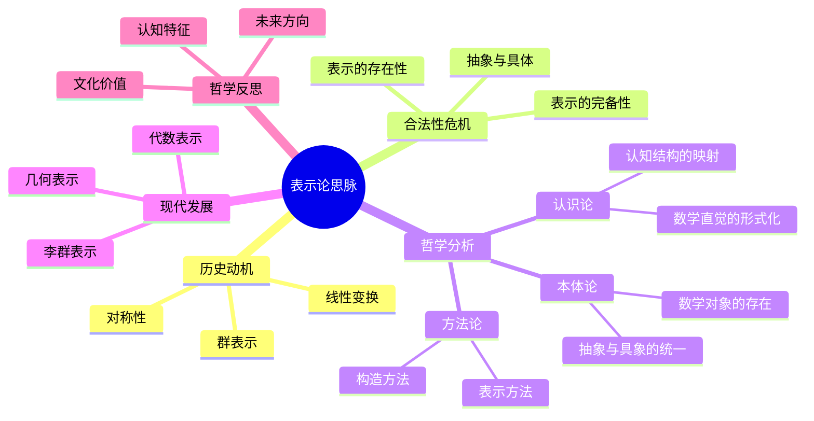

# 表示论思脉深化：从群表示到现代表示理论

## 目录

- [表示论思脉深化：从群表示到现代表示理论](#表示论思脉深化从群表示到现代表示理论)
  - [目录](#目录)
  - [认知结构分析](#认知结构分析)
    - [感知层](#感知层)
    - [概念层](#概念层)
    - [结构层](#结构层)
    - [元认知层](#元认知层)
  - [思维导图](#思维导图)
  - [多表征补充](#多表征补充)
    - [图像表征](#图像表征)
    - [故事表征](#故事表征)
    - [公式表征](#公式表征)
    - [隐喻表征](#隐喻表征)
    - [认知结构](#认知结构)
  - [多视角叙述](#多视角叙述)
    - [历史视角](#历史视角)
    - [哲学视角](#哲学视角)
    - [认知科学视角](#认知科学视角)
    - [教育应用视角](#教育应用视角)
  - [1. 历史动机](#1-历史动机)
    - [1.1. 抽象群的具体化需求](#11-抽象群的具体化需求)
    - [1.2. 对称性的数学化](#12-对称性的数学化)
  - [2. 合法性危机](#2-合法性危机)
    - [2.1. 表示的存在性问题](#21-表示的存在性问题)
    - [2.2. 抽象与具体的哲学关系](#22-抽象与具体的哲学关系)
  - [3. 哲学分析](#3-哲学分析)
    - [3.1. 本体论：数学对象的存在方式](#31-本体论数学对象的存在方式)
      - [3.1.1. 表示论的本体论地位](#311-表示论的本体论地位)
      - [3.1.2. 抽象与具象的统一](#312-抽象与具象的统一)
    - [3.2. 认识论：认知结构的映射](#32-认识论认知结构的映射)
      - [3.2.1. 人类认知的表示机制](#321-人类认知的表示机制)
      - [3.2.2. 数学直觉的形式化](#322-数学直觉的形式化)
    - [3.3. 方法论：表示论的方法论意义](#33-方法论表示论的方法论意义)
      - [3.3.1. 表示方法](#331-表示方法)
      - [3.3.2. 统一方法](#332-统一方法)
  - [4. 现代发展](#4-现代发展)
    - [4.1. 李群表示论](#41-李群表示论)
    - [4.2. 代数表示论](#42-代数表示论)
    - [4.3. 几何表示论](#43-几何表示论)
  - [5. 哲学反思](#5-哲学反思)
    - [5.1. 认知结构的深层规律](#51-认知结构的深层规律)
    - [5.2. 数学本体论的启示](#52-数学本体论的启示)
    - [5.3. 未来发展方向](#53-未来发展方向)

**版本**: 1.0  
**日期**: 2025-07-04

---

## 认知结构分析

### 感知层

- **具体表示**：矩阵、线性变换的可视化
- **对称操作**：几何对称的直观感受
- **变换动画**：线性变换的动态演示

### 概念层

- **表示概念**：抽象群到具体变换的映射
- **同态性质**：保持运算结构的映射
- **不可约性**：表示的基本构成单元

### 结构层

- **表示空间**：向量空间上的群作用
- **特征标理论**：表示的数值不变量
- **诱导表示**：从子群到群的表示构造

### 元认知层

- **抽象与具体的统一**：通过表示实现抽象结构的具象化
- **认知迁移**：从几何直觉到代数结构的思维转换
- **数学本体论**：表示论揭示的数学对象存在方式

## 思维导图

## 多表征补充

### 图像表征

- **矩阵表示**：群元素对应矩阵的可视化
- **特征标表**：群表示特征标的表格展示
- **表示空间图**：向量空间上的群作用示意图

### 故事表征

- **"从对称到矩阵"**：讲述群论如何通过表示论获得具体形式
- **"抽象的具体化"**：表示论如何将抽象代数结构具象化
- **"认知的桥梁"**：表示论在抽象思维与具体计算间的桥梁作用

### 公式表征

- **表示同态**：ρ(gh) = ρ(g)ρ(h)
- **特征标公式**：χ(g) = Tr(ρ(g))
- **不可约表示**：V = ⊕ᵢ Vᵢ

### 隐喻表征

- **"数学的翻译器"**：表示论如翻译器，将抽象语言翻译为具体语言
- **"认知的镜子"**：表示论反映人类认知结构对抽象概念的处理方式
- **"结构的投影"**：表示论是抽象结构在具体空间中的投影

### 认知结构

- **感知**：通过矩阵和变换直观感受抽象结构
- **概念**：理解表示作为抽象到具体的映射
- **结构**：掌握表示论的理论体系和方法
- **元认知**：反思表示论揭示的认知规律

## 多视角叙述

### 历史视角

- **19世纪起源**：从群论到群表示的发展历程
- **20世纪发展**：李群表示、代数表示论的兴起
- **现代应用**：在物理、化学、计算机科学中的应用

### 哲学视角

- **本体论意义**：表示论揭示的数学对象存在方式
- **认识论价值**：人类认知结构对抽象概念的处理机制
- **方法论贡献**：表示论提供的数学研究方法

### 认知科学视角

- **认知负荷**：表示论如何降低抽象概念的认知负荷
- **思维转换**：从几何直觉到代数结构的认知迁移
- **模式识别**：表示论中的模式识别和分类机制

### 教育应用视角

- **教学策略**：表示论在数学教育中的应用
- **学习路径**：从具体到抽象的学习路径设计
- **认知支架**：表示论作为认知支架的作用

## 1. 历史动机

### 1.1. 抽象群的具体化需求

群论作为抽象代数结构，需要具体的形式来表达和计算：

- **计算需求**：抽象群难以直接计算，需要具体表示
- **应用需求**：物理、化学等领域需要群论的具体应用
- **理解需求**：通过具体表示更好地理解抽象结构

### 1.2. 对称性的数学化

对称性作为几何直觉，需要数学化的表达：

- **几何对称**：旋转、反射等几何变换的数学描述
- **代数对称**：多项式方程根的对称性
- **物理对称**：物理定律的对称性原理

## 2. 合法性危机

### 2.1. 表示的存在性问题

**核心问题**：每个抽象群是否都有合适的表示？

- **存在性证明**：正则表示的存在性
- **完备性问题**：表示是否足够描述群的结构
- **唯一性问题**：表示的选择是否唯一

### 2.2. 抽象与具体的哲学关系

**深层问题**：抽象结构如何通过具体对象体现？

- **本体论关系**：抽象群与具体表示的本体论关系
- **认识论关系**：人类如何通过具体理解抽象
- **方法论关系**：表示论作为数学方法的合法性

## 3. 哲学分析

### 3.1. 本体论：数学对象的存在方式

#### 3.1.1. 表示论的本体论地位

表示论揭示了数学对象的特殊存在方式：

- **双重存在**：抽象群既作为抽象对象存在，又通过表示具体化
- **关系性存在**：数学对象通过与其他对象的关系而存在
- **构造性存在**：通过表示构造实现抽象对象的具体化

#### 3.1.2. 抽象与具象的统一

表示论实现了抽象与具象的深刻统一：

- **抽象具象化**：通过表示将抽象结构具象化
- **具象抽象化**：通过表示发现具体对象的抽象性质
- **统一框架**：为抽象和具象提供统一的理解框架

### 3.2. 认识论：认知结构的映射

#### 3.2.1. 人类认知的表示机制

表示论反映了人类认知的基本机制：

- **概念具象化**：人类倾向于将抽象概念具象化
- **模式识别**：通过具体模式识别抽象结构
- **认知迁移**：从具体经验迁移到抽象理解

#### 3.2.2. 数学直觉的形式化

表示论将数学直觉形式化：

- **几何直觉**：对称性的几何直觉通过表示数学化
- **代数直觉**：运算结构的代数直觉通过表示具体化
- **结构直觉**：抽象结构的结构直觉通过表示可视化

### 3.3. 方法论：表示论的方法论意义

#### 3.3.1. 表示方法

表示论提供了重要的数学方法：

- **构造方法**：通过表示构造新的数学对象
- **分类方法**：通过表示对数学对象进行分类
- **计算方法**：通过表示进行具体计算

#### 3.3.2. 统一方法

表示论提供了统一的研究方法：

- **跨领域统一**：为不同数学领域提供统一语言
- **抽象具体统一**：为抽象和具体研究提供统一方法
- **理论应用统一**：为理论和应用提供统一框架

## 4. 现代发展

### 4.1. 李群表示论

李群表示论将表示论推广到连续群：

- **无限维表示**：处理无限维向量空间上的表示
- **调和分析**：通过表示论发展调和分析
- **物理应用**：在量子力学和粒子物理中的应用

### 4.2. 代数表示论

代数表示论处理更一般的代数结构：

- **代数群表示**：代数群上的表示理论
- **量子群表示**：量子群和Hopf代数的表示
- **范畴表示**：在范畴论框架下的表示理论

### 4.3. 几何表示论

几何表示论结合几何和表示论：

- **几何Langlands纲领**：几何与表示论的深刻联系
- **D-模表示**：通过D-模研究表示论
- **几何不变量**：几何不变量与表示论的关系

## 5. 哲学反思

### 5.1. 认知结构的深层规律

表示论揭示了人类认知的深层规律：

- **具象化倾向**：人类认知的具象化基本倾向
- **模式化思维**：通过模式识别理解复杂结构
- **统一性追求**：在多样性中寻求统一性

### 5.2. 数学本体论的启示

表示论对数学本体论的启示：

- **关系性本体论**：数学对象通过关系而存在
- **构造性本体论**：通过构造理解数学对象
- **统一性本体论**：抽象与具象的统一性

### 5.3. 未来发展方向

表示论的未来发展可能包括：

- **认知计算**：结合认知科学的计算表示论
- **量子表示**：量子计算中的表示论
- **人工智能**：AI中的表示学习与表示论

---

**总结**：表示论不仅是一个技术性的数学分支，更是理解抽象与具象关系、人类认知结构、数学本体论的重要哲学工具。它揭示了数学对象通过表示实现抽象具象化的深层机制，为理解人类认知规律和数学本体论提供了重要启示。

**版本**: 1.0  
**日期**: 2025-07-04
