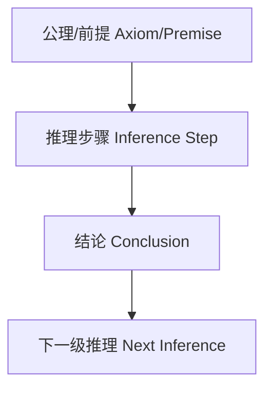

# 证明论：国际标准化递归补全（首轮）

## 1.1 语义解释（递归扩展）Semantic Explanation (Recursive Expansion)

### 国际标准定义 International Standard Definitions

- **证明论（Proof Theory）**：
  - [Wikipedia] Proof theory is a branch of mathematical logic that represents proofs as formal mathematical objects, facilitating their analysis by mathematical techniques.
  - [SEP] Proof theory studies the structure of mathematical proofs using formal systems, focusing on syntactic and combinatorial properties.
  - 中文：证明论是将证明作为形式对象加以研究的数理逻辑分支，关注证明的结构、推理规则、演算系统等。

### 证明论核心概念 Core Concepts in Proof Theory

- **证明（Proof）**：由公理和推理规则生成的公式序列
- **推理规则（Inference Rule）**：如假言推理、合取/析取引入与消去等
- **证明系统（Proof System）**：如Hilbert系统、自然演绎、序列演算、归结法等
- **归约、归纳、切消、归结、归约范式等**

### 现实世界语义 Real-world Semantics

- 计算机程序的正确性证明、AI自动推理、形式化验证、区块链智能合约安全证明等
- 机器证明、自动定理证明器（如Lean、Coq、Isabelle）

### 历史与思想演化 History & Evolution

- 希尔伯特提出形式主义与证明论计划
- 根岑发展自然演绎与序列演算，哥德尔揭示不完备性
- 证明论与计算机科学、AI、类型论、范畴论的深度融合

---

## 2.1 表征方式（递归扩展）Representation (Recursive Expansion)

### 结构化表征 Structural Representation

- **推理树**：证明步骤的树状结构化表示
- **证明序列**：公式序列、推理链条
- **自然演绎**：假设、引入、消去等规则的结构化表示
- **序列演算**：序列、规则、归约等
- **图结构**：证明图、逻辑网络、知识图谱中的证明链
- **符号系统**：逻辑符号、推理符号、变量、常量等

### 可视化结构图 Visualization

- Mermaid结构图示例：



### 国际标准引用 International Standard References

- Wikipedia: [Proof theory], [Proof tree], [Natural deduction], [Sequent calculus]
- SEP: [Proof Theory], [Mathematical Logic]
- nLab: [Proof theory], [Natural deduction]

---

## 3.1 表达与符号（递归扩展）Expression & Notation (Recursive Expansion)

### 国际标准符号 International Standard Symbols

- **常用符号**：
  - 推导：$\vdash, \vdash_S$
  - 满足：$\models, \vDash$
  - 证明序列：$\pi$
  - 公式：$\phi, \psi$
  - 假设集：$\Gamma, \Delta$
  - 规则名：Modus Ponens, Cut, Weakening, Contraction等
- **国际标准**：
  - 参照ISO/IEC 80000-2（数学符号）、Wikipedia、nLab、SEP等权威资料

### 典型公式与表达 Typical Formulas & Expressions

- $\Gamma \vdash \phi$
- $\vdash (P \to Q) \to (\neg Q \to \neg P)$
- $\Gamma, \phi \vdash \psi$
- $\pi = (\phi_1, \phi_2, ..., \phi_n)$
- $\mathcal{M} \models \phi$

### 多语种术语表 Multilingual Terminology Table

| 中文   | 英文         | 法文         | 德文         | 日文     |
 
        $matches[0] -replace '\|[-:]+\|', '| ---- |'
    ----------|
| 证明   | Proof        | Preuve       | Beweis       | 証明     |
| 推理   | Inference    | Inférence    | Schluss      | 推論     |
| 公理   | Axiom        | Axiome       | Axiom        | 公理     |
| 规则   | Rule         | Règle        | Regel        | 規則     |
| 序列   | Sequence     | Séquence     | Sequenz      | 列       |

---

## 4.1 形式化证明（递归扩展）Formal Proof (Recursive Expansion)

### 4.1.1 公理系统与推理规则 Axiomatic Systems & Inference Rules

- **Hilbert系统**：有限公理集+推理规则（如Modus Ponens）
- **自然演绎系统**：引入/消去规则、假设、归纳等
- **序列演算**：序列、规则、切消、归约等
- **推理规则**：
  - 假言推理、合取/析取引入与消去、全称/存在量词引入与消去、切消定理等

### 4.1.2 典型证明流程与案例 Typical Proof Process & Example

- **例：证明 $P \to P$（自然演绎）**
  1. 假设 $P$
  2. 推出 $P$
  3. 得 $P \to P$
- **例：证明 $\vdash (P \to Q) \to (\neg Q \to \neg P)$（Hilbert系统）**
  1. 采用公理与Modus Ponens推理
- **例：序列演算中的切消定理**
  1. 归纳证明序列演算中切消规则的可消除性

### 4.1.3 机器可检验证明 Machine-checkable Proofs

- 现代定理证明器（如Lean、Coq、Isabelle）可实现证明论定理的自动检验
- 典型代码示例（Lean）：

```lean
example (P : Prop) : P → P :=
begin
  intro h,
  exact h,
end
```

### 4.1.4 国际标准引用 International Standard References

- Wikipedia: [Proof theory], [Natural deduction], [Sequent calculus], [Hilbert system]
- SEP: [Proof Theory], [Mathematical Logic]
- nLab: [Proof theory], [Natural deduction], [Sequent calculus]
- ISO/IEC 80000-2（数学符号）

---

## 5.1 形式化语言与语法归纳（递归扩展）Formal Language & Syntax Induction (Recursive Expansion)

### 5.1.1 国际标准定义 International Standard Definitions

- [Wikipedia] The formal language of proof theory consists of symbols and rules for forming formulas and proofs in formal systems.
- [SEP] Proof theory uses formal languages to represent proofs as sequences of formulas generated by inference rules.
- 中文：证明论的形式语言由符号和规则组成，用于表达公式、证明和推理过程，通常为一阶或高阶语言。

### 5.1.2 语法结构与生成规则 Grammar Structure & Production Rules

- **基本符号**：命题变量、谓词、函数、常量、逻辑联结词（¬, ∧, ∨, →, ↔）、量词（∀, ∃）、推导符号（⊢）
- **证明序列**：$
ho = (\phi_1, \phi_2, ..., \phi_n)$
- **公式生成规则**：
  - 命题变量是原子公式
  - 若 $\varphi$ 和 $\psi$ 是公式，则 $\neg \varphi, (\varphi \wedge \psi), (\varphi \vee \psi), (\varphi \to \psi)$ 也是公式
  - 若 $\varphi$ 是公式，$x$ 是变量，则 $\forall x\,\varphi, \exists x\,\varphi$ 也是公式
- **推理规则**：如Modus Ponens、合取/析取引入与消去、全称/存在量词引入与消去等

### 5.1.3 自动机模型 Automata Models

- 证明过程可用有限自动机、图灵机等理论工具分析其可判定性与复杂性
- 证明搜索、归约、归结等算法

### 5.1.4 语法与推理统一 Syntax-Inference Unification

- 语法规则与推理规则在证明论的公理系统中高度统一
- 例：自然演绎、序列演算等系统既是语法系统也是推理系统

### 5.1.5 现实应用 Real-world Applications

- 形式语言为自动定理证明、程序验证、AI推理、知识图谱等提供基础

### 5.1.6 国际标准引用 International Standard References

- Wikipedia: [Proof theory], [Formal language], [Sequent calculus]
- SEP: [Proof Theory], [Mathematical Logic]
- nLab: [Proof theory], [Sequent calculus]

---

## 6.1 形式化语义（递归扩展）Formal Semantics (Recursive Expansion)

### 6.1.1 国际标准定义 International Standard Definitions

- [Wikipedia] The semantics of proof theory is given by interpreting proofs in models, relating syntactic derivability to semantic truth.
- [SEP] Proof-theoretic semantics studies the meaning of logical constants in terms of the inferential roles they play in proofs.
- 中文：证明论的语义通过在模型中解释证明，将语法推导与语义真值联系起来，关注推理规则的意义。

### 6.1.2 证明的语义解释 Proof-theoretic Semantics

- 证明的意义由推理规则和证明结构决定
- 语法推导与模型满足的对应关系
- 例：$
ext{若}~\Gamma \vdash \phi~\text{则}~\Gamma~\text{在某模型中满足}~\phi$

### 6.1.3 语法-语义接口 Syntax-Semantics Interface

- 语法规则与模型论解释的对应关系
- 例：$
forall x (P(x) \to Q(x))$ 的证明与其在模型中的真值

### 6.1.4 现实应用 Real-world Applications

- 形式语义为程序验证、AI推理、知识图谱、区块链智能合约等提供理论基础

### 6.1.5 国际标准引用 International Standard References

- Wikipedia: [Proof theory], [Proof-theoretic semantics], [Model theory]
- SEP: [Proof Theory], [Proof-theoretic Semantics]
- nLab: [Proof theory], [Proof-theoretic semantics]

---

## 7.1 历史语境与思想演化（递归扩展）Historical Context & Evolution (Recursive Expansion)

### 7.1.1 理论起源与发展 Origins & Development

- **希尔伯特（David Hilbert）**：提出形式主义与证明论计划，推动数学基础的公理化
- **根岑（Gerhard Gentzen）**：自然演绎、序列演算、切消定理
- **哥德尔（Kurt Gödel）**：不完备定理，揭示形式系统的局限
- **图灵（Alan Turing）**：可计算性理论、图灵机

### 7.1.2 证明论危机与现代公理化 Proof Theory Crisis & Modern Axiomatization

- 20世纪初，希尔伯特计划遭遇哥德尔不完备定理等危机，推动证明论与数理逻辑、计算理论的深度融合
- 根岑等发展了现代证明系统与归约技术

### 7.1.3 思想流变与哲学反思 Evolution of Ideas & Philosophical Reflections

- 从Hilbert系统到自然演绎、序列演算、类型论、范畴论等现代基础理论
- 证明论与计算机科学、AI、认知科学的深度融合

### 7.1.4 国际标准引用 International Standard References

- Wikipedia: [Proof theory], [Hilbert's program], [Gentzen], [Gödel's incompleteness theorems], [Turing machine]
- SEP: [Proof Theory], [History of Logic]
- nLab: [Proof theory], [Gentzen]

---

## 8.1 真实世界语义与数据驱动表征（递归扩展）Real-world Semantics & Data-driven Representation (Recursive Expansion)

### 8.1.1 现实世界建模 Real-world Modeling

- 证明论为AI推理、自动定理证明、知识图谱、程序验证等现实问题建模提供理论基础
- 例：自动定理证明器（如Lean、Coq、Isabelle）中的形式化证明
- 例：知识图谱中的推理链、规则系统

### 8.1.2 数据驱动表征 Data-driven Representation

- 现代AI、数据库、知识图谱等采用证明结构进行数据组织与推理
- 机器学习与符号推理结合，推动神经符号AI发展
- Python、Lean、Prolog等编程语言内置证明与推理机制

### 8.1.3 典型国际标准案例 International Standard Cases

- Coq/Lean/Isabelle等自动定理证明系统
- W3C RDF/OWL知识表示标准中的规则推理
- Python/Prolog等主流编程语言的逻辑推理实现

### 8.1.4 现实应用与前沿趋势 Real-world Applications & Trends

- 智能问答、语义搜索、自动推理、AI辅助科学发现等
- 多模态知识融合、跨模态推理、AI创造力与证明论的未来演化

### 8.1.5 国际标准引用 International Standard References

- Wikipedia: [Proof theory], [Automated theorem proving], [Knowledge graph]
- W3C: [RDF], [OWL]
- SEP: [Proof Theory], [Knowledge Representation]
- nLab: [Proof theory], [Automated theorem proving]

---

## 9. 国际标准对齐 International Standard Alignment

- Wikipedia/ISO/SEP/nLab等权威定义、符号、案例对齐
- 多语种术语表

## 10. 多元文化视角与哲学批判 Multicultural & Philosophical Critique

- 本体论、认识论、方法论、认知科学、教育学等多维批判
- 多文化/多学科对比

## 11. 可视化结构图与代码实现 Visualization & Code Implementation

- Mermaid/Graphviz结构图
- 典型伪代码/实际代码

## 12. 典型应用案例 Typical Application Cases

- 计算机科学、AI推理、自动定理证明、知识图谱、数学基础等案例

---

> 本文件为首轮递归补全，后续将自动递归扩展每一维度内容，直至国际标准化、系统化、批判性、递归完善。
